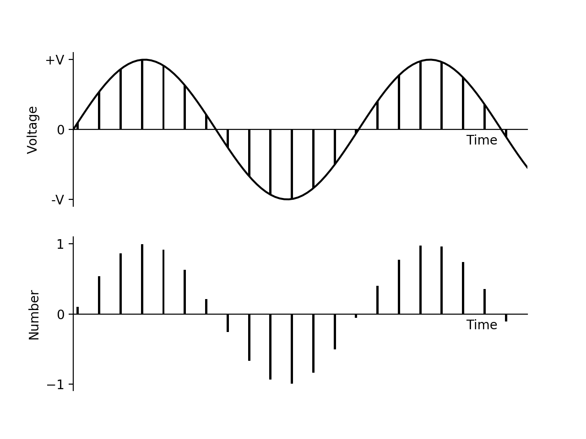
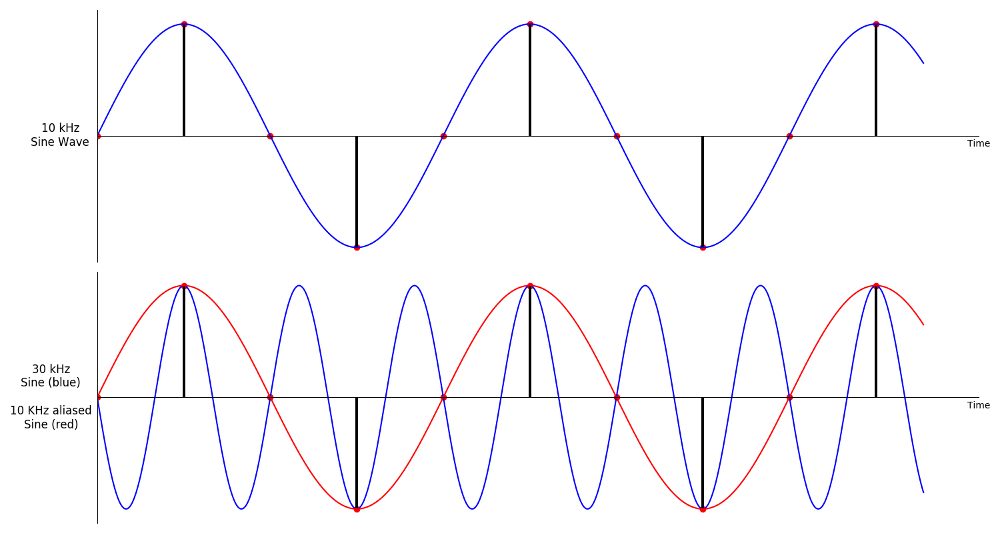
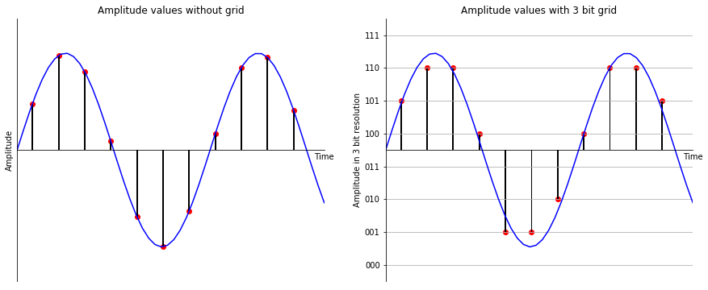

01 A. DIGITAL AUDIO
===================

At a purely physical level, sound is simply a mechanical disturbance of
a medium. The medium in question may be air, solid, liquid, gas or a
combination of several of these. This disturbance in the medium causes
molecules to move back and forth in a spring-like manner. As one
molecule hits the next, the disturbance moves through the medium causing
sound to travel. These so called compressions and rarefactions in the
medium can be described as sound waves. The simplest type of waveform,
describing what is referred to as *simple harmonic motion*, is a sine
wave.

Each time the waveform signal goes above 0 the molecules are in a state
of compression meaning that each molecule within the waveform
disturbance is pushing into its neighbour. Each time the waveform signal
drops below 0 the molecules are in a state of rarefaction meaning the
molecules are pulling away from thier neighbours. When a waveform shows
a clear repeating pattern, as in the case above, it is said to be
periodic. Periodic sounds give rise to the sensation of pitch.

Elements of a Sound Wave
------------------------

Periodic waves have four common parameters, and each of the four
parameters affects the way we perceive sound.

-   **Period**: This is the length of time it takes for a waveform to
    complete one cycle. This amount of time is referred to as *t*

-   **Wavelength**: the distance it takes for a wave to complete one
    full period. This is usually measured in meters.

-   **Frequency**: the number of cycles or periods per second. Frequency
    is measured in Hertz. If a sound has a frequency of 440Hz it
    completes 440 cycles every second. Given a frequency, one can easily
    calculate the period of any sound. Mathematically, the period is the
    reciprocal of the frequency (and vice versa). In equation form this
    is expressed as follows.

         Frequency = 1/Period
         Period = 1/Frequency

Therefore the frequency is the inverse of the period, so a wave of 100
Hz frequency has a period of 1/100 or 0.01 secs, likewise a frequency of
256Hz has a period of 1/256, or 0.004 secs. To calculate the wavelength
of a sound in any given medium we can use the following equation:

     Wavelength = Velocity/Frequency

Humans can hear frequencies from 20Hz to 20000Hz (although this can
differ dramatically from individual to individual and the upper limit
will decay with age). You can read more about frequency in the [next
chapter](01-b-pitch-and-frequency.md).

-   **Phase:** This is the starting point of a waveform. The starting
    point along the Y-axis of our plotted waveform is not always zero.
    This can be expressed in degrees or in radians. A complete cycle of
    a waveform will cover 360 degrees or (2 x pi) radians.

-   **Amplitude:** Amplitude is represented by the y-axis of a plotted
    pressure wave. The strength at which the molecules pull or push away
    from each other, which will also depend upon the resistance offered
    by the medium, will determine how far above and below zero - the
    point of equilibrium - the wave fluctuates. The greater the y-value
    the greater the amplitude of our wave. The greater the compressions
    and rarefactions, the greater the amplitude.

Transduction
------------

The analogue sound waves we hear in the world around us need to be
converted into an electrical signal in order to be amplified or sent to
a soundcard for recording. The process of converting acoustical energy
in the form of pressure waves into an electrical signal is carried out
by a device known as a a transducer.

A transducer, which is usually found in microphones, produces a changing
electrical voltage that mirrors the changing compression and rarefaction
of the air molecules caused by the sound wave. The continuous variation
of pressure is therefore *transduced* into continuous variation of
voltage. The greater the variation of pressure the greater the variation
of voltage that is sent to the computer.

Ideally the transduction process should be as transparent as possible:
whatever goes in should come out as a perfect analogue in a voltage
representation. In reality however this will not be the case, noise and
distortion are always incorporated into the signal. Every time sound
passes through a transducer or is transmitted electrically a change in
signal quality will result. When we talk of *noise* we are talking
specifically about any unwanted signal captured during the transduction
process. This normally manifests itself as an unwanted *hiss*.

Sampling
--------

The analogue voltage that corresponds to an acoustic signal changes
continuously so that at each instant in time it will have a different
value. It is not possible for a computer to receive the value of the
voltage for every instant because of the physical limitations of both
the computer and the data converters (remember also that there are an
infinite number of instances between every two instances!).

What the soundcard can do, however, is to measure the power of the
analogue voltage at intervals of equal duration. This is how all digital
recording works and this is known as *sampling*. The result of this
sampling process is a discrete, or digital, signal which is no more than
a sequence of numbers corresponding to the voltage at each successive
moment of sampling.

Below is a diagram showing a sinusoidal waveform. The vertical lines
that run through the diagram represent the points in time when a
snapshot is taken of the signal. After the sampling has taken place we
are left with what is known as a discrete signal consisting of a
collection of audio samples, as illustrated in the bottom half of the
diagram. If one is recording using a typical audio editor the incoming
samples will be stored in the computer's RAM (Random Access Memory). In
Csound one can process the incoming audio samples in real time and
output a new stream of samples or write them to disk in the form of a
sound file.

It is important to remember that each sample represents the amount of
voltage, positive or negative, that was present in the signal at the
point in time at which the sample or snapshot was taken.

The same principle applies to recording of live video: a video camera
takes a sequence of pictures of motion and most video cameras will take
between 30 and 60 still pictures a second. Each picture is called a
frame and when these frames are played in sequence at a rate
corresponding to that at which they were taken we no longer perceive
them as individual pictures, we perceive them instead as a continuous
moving image.

Analogue versus Digital
-----------------------

In general, analogue systems can be quite unreliable when it comes to
noise and distortion. Each time something is copied or transmitted some
noise and distortion is introduced into the process. If this is repeated
many times, the cumulative effect can deteriorate a signal quite
considerably. It is for this reason that the music industry has almost
entirely turned to digital technology. One particular advantage of
storing a signal digitally is that once the changing signal has been
converted to a discrete series of values, it can effectively be
*cloned* as clones can be made of that clone with no loss or
distortion of data. Mathematical routines can be applied to prevent
errors in transmission, which could otherwise introduce noise into the
signal.

Sample Rate and the Sampling Theorem
------------------------------------

The sample rate describes the number of samples (pictures/snapshots)
taken each second. To sample an audio signal correctly it is important
to pay attention to the sampling theorem:

*To represent digitally a signal containing frequencies up to X Hz, it
is necessary to use a sampling rate of at least 2X samples per second.*

According to this theorem, a soundcard or any other digital recording
device will not be able to represent any frequency above 1/2 the
sampling rate. Half the sampling rate is also referred to as the Nyquist
frequency, after the Swedish physicist Harry Nyquist who formalized the
theory in the 1920s. What it all means is that any signal with
frequencies above the Nyquist frequency will be misrepresented and will
actually produce a frequency lower than the one being sampled. When this
happens it results in what is known as *aliasing* or *foldover*.

Aliasing
--------

Here is a graphical representation of aliasing.

{width=50%}

The sinusoidal waveform in blue is being sampled at the vertical black
lines. The line that joins the red circles together is the captured
waveform. As you can see, the captured waveform and the original
waveform express different frequencies.

Here is another example:

{width=80%}

We can see that if the sample rate is 40,000 there is no problem with
sampling a signal that is 10KHz. On the other hand, in the second
example it can be seen that a 30kHz waveform is not going to be
correctly sampled. In fact we end up with a waveform that is 10kHz,
rather than 30kHz. This may seem like an academic proposition in that we
will never be able to hear a 30KHz waveform anyway but some synthesis
and DSP techniques procedures will produce these frequencies as
unavoidable by-products and we need to ensure that they do not result in
unwanted artifacts.

The following Csound instrument plays a 1000 Hz tone first directly, and
then because the frequency is 1000 Hz lower than the sample rate of
44100 Hz:

***EXAMPLE 01A01\_Aliasing.csd***

~~~
<CsoundSynthesizer>
<CsOptions>
-odac
</CsOptions>
<CsInstruments>
sr = 44100
ksmps = 32
nchnls = 2
0dbfs = 1

instr 1
 asig poscil .2, p4
 out asig, asig
endin

</CsInstruments>
<CsScore>
i 1 0 2 1000 ;1000 Hz tone
i 1 3 2 43100 ;43100 Hz tone sounds like 1000 Hz because of aliasing
</CsScore>
</CsoundSynthesizer>
;example by joachim heintz
~~~

The same phenomenon takes places in film and video too. You may recall
having seen wagon wheels apparently turn at the wrong speed in old
Westerns. Let us say for example that a camera is taking 60 frames per
second of a wheel moving. In one example, if the wheel is completing one
rotation in exactly 1/60th of a second, then every picture looks the
same and as a result the wheel appears to be motionless. If the wheel
speeds up, i.e. it increases its rotational frequency, it will appear as
if the wheel is slowly turning backwards. This is because the wheel will
complete more than a full rotation between each snapshot.

As an aside, it is worth observing that a lot of modern \'glitch\' music
intentionally makes a feature of the spectral distortion that aliasing
induces in digital audio. Csound is perfectly capable of imitating the
effects of aliasing while being run at any sample rate - if that is what
you desire.

Audio-CD Quality uses a sample rate of 44100Kz (44.1 kHz). This means
that CD quality can only represent frequencies up to 22050Hz. Humans
typically have an absolute upper limit of hearing of about 20Khz thus
making 44.1KHz a reasonable standard sampling rate.

Bits, Bytes and Words. Understanding Binary.
--------------------------------------------

All digital computers represent data as a collection of bits (short for
binary digit). A bit is the smallest possible unit of information. One
bit can only be in one of two states - off or on, 0 or 1. The meaning of
the bit - which can represent almost anything - is unimportant at this
point, the thing to remember is that all computer data - a text file on
disk, a program in memory, a packet on a network - is ultimately a
collection of bits.

Bits in groups of eight are called bytes, and one byte usually
represents a single character of data in the computer. It\'s a little
used term, but you might be interested in knowing that a nibble is half
a byte (usually 4 bits).

The Binary System
-----------------

All digital computers work in a environment that has only two variables,
0 and 1. All numbers in our decimal system therefore must be translated
into 0's and 1's in the binary system. If you think of binary numbers
in terms of switches. With one switch you can represent up to two
different numbers.

    0 (OFF) = Decimal 0
    1 (ON) = Decimal 1

Thus, a single bit represents 2 numbers, two bits can represent 4
numbers, three bits represent 8 numbers, four bits represent 16 numbers,
and so on up to a byte, or eight bits, which represents 256 numbers.
Therefore each added bit doubles the amount of possible numbers that can
be represented. Put simply, the more bits you have at your disposal the
more information you can store.

Bit-depth Resolution
--------------------

Apart from the sample rate, another important attribute that can affect
the fidelity of a digital signal is the accuracy with which each sample
is known, its resolution or granularity. Every sample obtained is set to
a specific amplitude (the measure of strength for each voltage) level.
Each voltage measurement will probably have to be rounded up or down to
the nearest digital value available. The number of levels available
depends on the precision of the measurement in bits, i.e. how many
binary digits are used to store the samples. The number of bits that a
system can use is normally referred to as the bit-depth resolution.

If the bit-depth resolution is 3 then there are 8 possible levels of
amplitude that we can use for each sample. We can see this in the
diagram below. At each sampling period the soundcard plots an amplitude.
As we are only using a 3-bit system the resolution is not good enough to
plot the correct amplitude of each sample. We can see in the diagram
that some vertical lines stop above or below the real signal. For a
signal with lower amplitude the distortion would even be stronger.

The standard resolution for CDs is 16 bit, which allows for 65536
different possible amplitude levels, 32767 either side of the zero axis.
Using bit rates lower than 16 is not a good idea as it will result in
noise being added to the signal. This is referred to as quantization
noise and is a result of amplitude values being excessively rounded up
or down when being digitized. Quantization noise becomes most apparent
when trying to represent low amplitude (quiet) sounds. Frequently a tiny
amount of noise, known as a dither signal, will be added to digital
audio before conversion back into an analogue signal. Adding this dither
signal will actually reduce the more noticeable noise created by
quantization. As higher bit depth resolutions are employed in the
digitizing process the need for dithering is reduced. A general rule is
to use the highest bit rate available.

Many electronic musicians make use of deliberately low bit depth
quantization in order to add noise to a signal. The effect is commonly
known as *bit-crunching* and is relatively easy to implement in
Csound.

ADC / DAC
---------

The entire process, as described above, of taking an analogue signal and
converting it to a digital signal is referred to as analogue to digital
conversion, or ADC. Of course digital to analogue conversion, DAC, is
also possible. This is how we get to hear our music through our PC\'s
headphones or speakers. For example, if one plays a sound from Media
Player or iTunes the software will send a series of numbers to the
computer soundcard. In fact it will most likely send 44100 numbers a
second. If the audio that is playing is 16 bit then these numbers will
range from -32768 to +32767.

When the sound card receives these numbers from the audio stream it will
output corresponding voltages to a loudspeaker. When the voltages reach
the loudspeaker they cause the loudspeaker's magnet to move inwards and
outwards. This causes a disturbance in the air around the speaker - the
compressions and rarefactions introduced at the beginning of this
chapter - resulting in what we perceive as sound.
