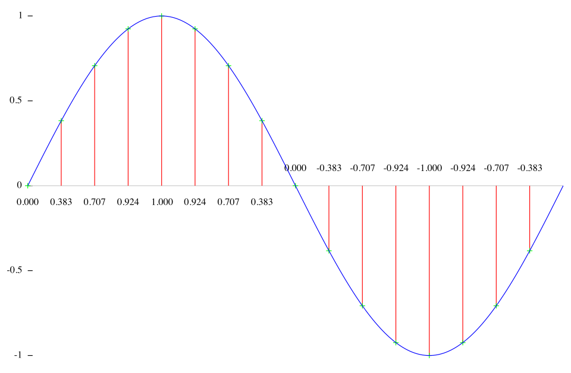
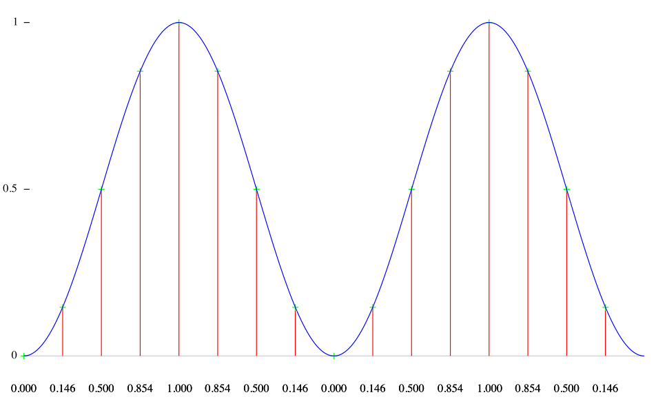
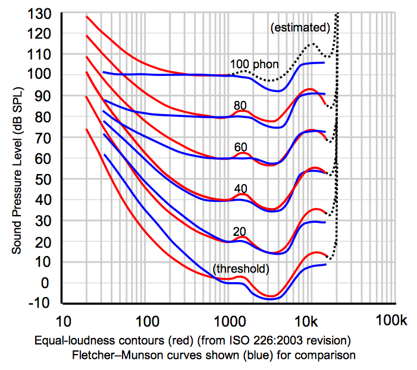

C. INTENSITIES
==============

Real World Intensities and Amplitudes
-------------------------------------

There are many ways to describe a sound physically. One of the most
common is the sound intensity level (SIL). It describes the amount of
power on a certain surface, so its unit is Watts per square meter W/m².

The range of human hearing is about 10⁻¹² W/m²
at the threshold of hearing to 10⁰ W/m²
at the threshold of pain. For ordering this immense range, and to
facilitate the measurement of one sound intensity based upon its ratio
with another, a logarithmic scale is used. The unit *Bel* describes the
relation of one intensity I to a reference
intensity I_0 as follows:

log_(10)I/I_0  
*Sound Intensity Level in Bel*

If, for example, the ratio I/I_0 is 10, this is 1 Bel. If the ratio is 100, this is 2 Bel.

For real world sounds, it makes sense to set the reference value I_0
to the threshold of hearing which has been fixed as 10^-12 W//m^2
at 1000 Hertz. So the range of human hearing covers about 12 Bel.
Usually 1 Bel is divided into 10 decibel, so the common formula for
measuring a sound intensity is:
10*log_10 I/I_0  
*sound intensity level (SIL) in decibel (dB)* with
I_0=10^-12 W/m^2
 

While the sound intensity level is useful in describing the way in which
human hearing works, the measurement of sound is more closely related to
the sound pressure deviations. Sound waves compress and expand the air
particles and by this they increase and decrease the localized air
pressure. These deviations are measured and transformed by a microphone.
The question arises: what is the relationship between the sound pressure
deviations and the sound intensity? The answer is: sound intensity
changes I
are proportional to the *square* of the sound pressure changes P.
As a formula:  
I~~P^2  
*Relation between Sound Intensity and Sound Pressure*

Let us take an example to see what this means. The sound pressure at the
threshold of hearing can be fixed at 2*10^-5 Pa. 
This value is the reference value of the Sound Pressure Level (SPL).
If we now have a value of 
2*10^-4 Pa, 
the corresponding sound intensity relationship can be calculated as:
((2*10^4)/(2*10^5))^2 = 10^2 = 100

Therefore a factor of 10 in a pressure relationship yields a factor of
100 in the intensity relationship. In general, the dB scale for the
pressure related to the pressure P_0 is:

10 * log_10 (P/P_0)^2 = 2 * 10 * log_10 P/P_0 = 20 * log_10 P/P_0  
*Sound pressure level (SPL) in decibels (dB)*
with
P_0=2*10^-5 Pa

Working with digital audio means working with *amplitudes*. Any audio
signal is a sequence of amplitudes. What you generate in Csound and write
either to the DAC in realtime or to a sound file, are again nothing but
a sequence of amplitudes. As amplitudes are directly related to the
sound pressure deviations, all the relationships between sound intensity
and sound pressure can be transferred to relationships between sound
intensity and amplitudes:

I~~A^2  
*Relationship between intensity and amplitudes*

20*log_10 A/A_0  
*Decibel (dB) scale of amplitudes*  
with any amplitude A related to another amplitude A_0

If you drive an oscillator with an amplitude of 1, and another
oscillator with an amplitude of 0.5 and you want to know the difference
in dB, you can calculate this as follows:

20*log_10 1/0.5 = 20 * log_10 2 = 20 * 0.30103 = 6.0206 dB  

The most useful thing to bear in mind is that when you double an
amplitude this will provide a change of +6 dB, or when you have halve an
amplitude this will provide a change in of -6 dB.

 

What is 0 dB?
-------------

As described in the last section, any dB scale - for intensities,
pressures or amplitudes - is just a way to describe a *relationship*. To
have any sort of quantitative measurement you will need to know the
reference value referred to as *0 dB*. For real world sounds, it makes
sense to set this level to the threshold of hearing. This is done, as we
saw, by setting the SIL to 10^-12 W//m^2, and the SPL to 2*10^-5 Pa.

When working with digital sound within a computer, this method for
defining 0dB will not make any sense. The loudness of the sound produced
in the computer will ultimately depend on the amplification and the
speakers, and the amplitude level set in your audio editor or in Csound
will only apply an additional, and not an absolute, sound level control.
Nevertheless, there *is* a rational reference level for the amplitudes.
In a digital system, there is a strict limit for the maximum number you
can store as amplitude. This maximum possible level is normally used as
the reference point for 0 dB.

Each program connects this maximum possible amplitude with a number.
Usually it is 1 which is a good choice, because you know that
everything above 1 is clipping, and you have a handy relation for lower
values. But actually this value is nothing but a setting, and in Csound
you are free to set it to any value you like via the
`[0dbfs](https://csound.com/docs/manual/Zerodbfs.html)` opcode.
Usually you should use this statement in the orchestra header:

    0dbfs = 1

This means: "Set the level for zero dB as full scale to 1 as reference
value." Note that for historical reasons the default value in Csound is
not 1 but 32768. So you must have this *0dbfs=1* statement in your
header if you want to use the amplitude convention used by most modern
audio programming environments.

 

dB Scale Versus Linear Amplitude
--------------------------------

Now we will consider some practical consequences of what we have
discussed so far. One major point is that for achieving perceivably
smooth changes across intensity levels you must not use a simple linear
transition of the amplitudes, but a linear transition of the dB
equivalent. The following example shows a linear rise of the amplitudes
from 0 to 1, and then a linear rise of the dB's from -80 to 0 dB, both
over 10 seconds.

   ***EXAMPLE 01C01\_db\_vs\_linear.csd*** 

    <CsoundSynthesizer>
    <CsOptions>
    -odac
    </CsOptions>
    <CsInstruments>
    sr = 44100
    ksmps = 32
    nchnls = 2
    0dbfs = 1

    instr 1 ;linear amplitude rise
    kamp      line    0, p3, 1     ;amp rise 0->1
    asig      poscil  1, 1000      ;1000 Hz sine
    aout      =       asig * kamp
              outs    aout, aout
    endin

    instr 2 ;linear rise of dB
    kdb       line    -80, p3, 0   ;dB rise -80 -> 0
    asig      poscil  1, 1000      ;1000 Hz sine
    kamp      =       ampdb(kdb)   ;transformation db -> amp
    aout      =       asig * kamp
              outs    aout, aout
    endin

    </CsInstruments>
    <CsScore>
    i 1 0 10
    i 2 11 10
    </CsScore>
    </CsoundSynthesizer>
    ;example by joachim heintz

The first note, which employs a linear rise in amplitude, is perceived
as rising quickly in intensity with the rate of increase slowing
quickly. The second note, which employs a linear rise in decibels, is
perceived as a more constant rise in intensity.

 

RMS Measurement
---------------

Sound intensity depends on many factors. One of the most important is
the effective mean of the amplitudes in a certain time span. This is
called the Root Mean Square (RMS) value. To calculate it, you have (1)
to calculate the squared amplitudes of number N samples. Then you (2)
divide the result by N to calculate the mean of it. Finally (3) take the
square root.

Let us consider a simple example and then look how to derive rms values
within Csound. Assuming we have a sine wave which consists of 16
samples, we get these amplitudes:

These are the squared amplitudes:

The mean of these values is:

0+0.146+0.5+0.854+1+0.854+0.5+0.146+0+0.146+0.5+0.854+1+0.854+0.5+0.146)/16=8/16=0.5

And the resulting RMS value is sqrt([0.5) = 0.707. 

The [rms](http://www.csounds.com/manual/html/rms.html) opcode in Csound
calculates the RMS power in a certain time span, and smoothes the values
in time according to the *ihp* parameter: the higher this value is (the
default is 10 Hz), the quicker this measurement will respond to changes,
and vice versa. This opcode can be used to implement a self-regulating
system, in which the rms opcode prevents the system from exploding. Each
time the rms value exceeds a certain value, the amount of feedback is
reduced. This is an example^1^ :

   ***EXAMPLE 01C02\_rms\_feedback\_system.csd***  

    <CsoundSynthesizer>
    <CsOptions>
    -odac
    </CsOptions>
    <CsInstruments>
    sr = 44100
    ksmps = 32
    nchnls = 2
    0dbfs = 1

    giSine    ftgen     0, 0, 2^10, 10, 1 ;table with a sine wave

    instr 1
     a3        init      0
     kamp      linseg    0, 1.5, 0.2, 1.5, 0        ;envelope for initial input
     asnd      poscil    kamp, 440, giSine          ;initial input
     if p4 == 1 then                                ;choose between two sines ...
      adel1     poscil    0.0523, 0.023, giSine
      adel2     poscil    0.073, 0.023, giSine,.5
     else                                           ;or a random movement for the delay lines
      adel1     randi     0.05, 0.1, 2
      adel2     randi     0.08, 0.2, 2
     endif
     a0        delayr    1                          ;delay line of 1 second
     a1        deltapi   adel1 + 0.1                ;first reading
     a2        deltapi   adel2 + 0.1                ;second reading
     krms      rms       a3                         ;rms measurement
               delayw    asnd + exp(-krms) * a3     ;feedback depending on rms
     a3        reson     -(a1+a2), 3000, 7000, 2    ;calculate a3
     aout      linen     a1/3, 1, p3, 1             ;apply fade in and fade out
               outs      aout, aout
    endin
    </CsInstruments>
    <CsScore>
    i 1 0 60 1          ;two sine movements of delay with feedback
    i 1 61 . 2          ;two random movements of delay with feedback
    </CsScore>
    </CsoundSynthesizer>
    ;example by Martin Neukom, adapted by Joachim Heintz

 

 

Fletcher-Munson Curves
----------------------

The range of human hearing is roughly from 20 to 20000 Hz, but within
this range, the hearing is not equally sensitive to intensity. The most
sensitive region is around 3000 Hz. If a sound is operating in the upper
or lower limits of this range, it will need greater intensity in order
to be perceived as equally loud. 

These curves of equal loudness are mostly called *Fletcher-Munson
Curves* because of the paper of H. Fletcher and W. A. Munson in 1933.
They look like this:

Try the following test. During the first 5 seconds you will hear a tone
of 3000 Hz. Adjust the level of your amplifier to the lowest possible
level at which you still can hear the tone. Next you hear a tone whose
frequency starts at 20 Hertz and ends at 20000 Hertz, over 20 seconds.
Try to move the fader or knob of your amplification exactly in a way
that you still can hear anything, but as soft as possible. The movement
of your fader should roughly be similar to the lowest
Fletcher-Munson-Curve: starting relatively high, going down and down
until 3000 Hertz, and then up again. Of course, this effectiveness of
this test will also depend upon the quality of your speaker hardware. If
your speakers do not provide adequate low frequency response, you will
not hear anything in the bass region.

   ***EXAMPLE 01C03\_FletcherMunson.csd***   

    <CsoundSynthesizer>
    <CsOptions>
    -odac
    </CsOptions>
    <CsInstruments>
    sr = 44100
    ksmps = 32
    nchnls = 2
    0dbfs = 1

    instr 1
     kfreq     expseg    p4, p3, p5
               printk    1, kfreq ;prints the frequencies once a second
     asin      poscil    .2, kfreq
     aout      linen     asin, .01, p3, .01
               outs      aout, aout
    endin
    </CsInstruments>
    <CsScore>
    i 1 0 5 1000 1000
    i 1 6 20 20  20000
    </CsScore>
    </CsoundSynthesizer>
    ;example by joachim heintz

It is very important to bear in mind when designing instruments that the
perceived loudness of a sound will depend upon its frequency content.
You must remain aware that projecting a 30 Hz sine at a certain
amplitude will be perceived differently to a 3000 Hz sine at the same
amplitude; the latter will sound much louder.  

 

1.  [cf Martin Neukom, Signale Systeme Klangsynthese, Zürich 2003, p.
    383]
