01 D. RANDOM
============

This chapter is in three parts. Part I provides a general introduction
to the concepts behind random numbers and how to work with them in
Csound. Part II focusses on a more mathematical approach. Part III
introduces a number of opcodes for generating random numbers, functions
and distributions and demonstrates their use in musical examples.

## I. GENERAL INTRODUCTION

### Random is Different

The term *random* derives from the idea of a horse that is running so
fast it becomes *out of control* or *beyond predictability*.[^1]  Yet
there are different ways in which to run fast and to be out of control;
therefore there are different types of randomness.

We can divide types of randomness into two classes. The first contains
random events that are independent of previous events. The most common
example for this is throwing a die. Even if you have just thrown three
One's in a row, when thrown again, a One has the same probability as
before (and as any other number). The second class of random number
involves random events which depend in some way upon previous numbers or
states. Examples here are Markov chains and random walks.

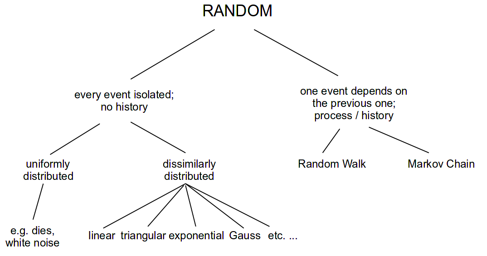

The use of randomness in electronic music is widespread. In this
chapter, we shall try to explain how the different random horses are
moving, and how you can create and modify them on your own. Moreover,
there are many pre-built random opcodes in Csound which can be used out
of the box (see the
[overview](http://wwws.csound.com/docs/manual/SiggenNoise.html) in the
Csound Manual). The final section of this chapter introduces some
musically interesting applications of them.

### Random Without History

A computer is typically only capable of computation. Computations are
*deterministic* processes: one input will always generate the same
output, but a random event is not predictable. To generate something
which *looks like* a random event, the computer uses a pseudo-random
generator.

The pseudo-random generator takes one number as input, and generates
another number as output. This output is then the input for the next
generation. For a huge amount of numbers, they look as if they are
randomly distributed, although everything depends on the first input:
the *seed*. For one given seed, the next values can be predicted.

### Uniform Distribution

The output of a classical pseudo-random generator is uniformly
distributed: each value in a given range has the same likelihood of
occurence. The first example shows the influence of a fixed seed (using
the same chain of numbers and beginning from the same location in the
chain each time) in contrast to a seed being taken from the system clock
(the usual way of imitating unpredictability). The first three groups of
four notes will always be the same because of the use of the same seed
whereas the last three groups should always have a different pitch.

   ***EXAMPLE 01D01\_different\_seed.csd***

~~~
<CsoundSynthesizer>
<CsOptions>
-odac -m0
</CsOptions>
<CsInstruments>
sr = 44100
ksmps = 32
nchnls = 2
0dbfs = 1

instr generate
 ;get seed: 0 = seeding from system clock
 ;          otherwise = fixed seed
           seed       p4
 ;generate four notes to be played from subinstrument
iNoteCount =          0
 while iNoteCount < 4 do
iFreq      random     400, 800
           schedule   "play", iNoteCount, 2, iFreq
iNoteCount +=         1 ;increase note count
 od
endin

instr play
iFreq      =          p4
           print      iFreq
aImp       mpulse     .5, p3
aMode      mode       aImp, iFreq, 1000
aEnv       linen      aMode, 0.01, p3, p3-0.01
           outs       aEnv, aEnv
endin
</CsInstruments>
<CsScore>
;repeat three times with fixed seed
r 3
i "generate" 0 2 1
;repeat three times with seed from the system clock
r 3
i "generate" 0 1 0
</CsScore>
</CsoundSynthesizer>
;example by joachim heintz
~~~

Note that a pseudo-random generator will repeat its series of numbers
after as many steps as are given by the size of the generator. If a
16-bit number is generated, the series will be repeated after 65536
steps. If you listen carefully to the following example, you will hear a
repetition in the structure of the white noise (which is the result of
uniformly distributed amplitudes) after about 1.5 seconds in the first
note.[^2]  In the second note, there is no perceivable repetition as the
random generator now works with a 31-bit number.

   ***EXAMPLE 01D02\_white\_noises.csd***

~~~
<CsoundSynthesizer>
<CsOptions>
-odac
</CsOptions>
<CsInstruments>
sr = 44100
ksmps = 32
nchnls = 2
0dbfs = 1

instr white_noise
iBit       =          p4 ;0 = 16 bit, 1 = 31 bit
 ;input of rand: amplitude, fixed seed (0.5), bit size
aNoise     rand       .1, 0.5, iBit
           outs       aNoise, aNoise
endin

</CsInstruments>
<CsScore>
i "white_noise" 0 10 0
i "white_noise" 11 10 1
</CsScore>
</CsoundSynthesizer>
;example by joachim heintz
~~~

Two more general notes about this:

1.  The way to set the seed differs from opcode to opcode. There are
    several opcodes such as
    [rand](https://csound.com/docs/manual/rand.html) featured above,
    which offer the choice of setting a seed as input parameter. For
    others, such as the frequently used
    [random](https://csound.com/docs/manual/random.html) family, the
    seed can only be set globally via the
    [seed](https://csound.com/docs/manual/seed.html) statement. This
    is usually done in the header so a typical statement would be:

        <CsInstruments>
        sr = 44100
        ksmps = 32
        nchnls = 2
        0dbfs = 1
        seed = 0 ;seeding from current time

2.  Random number generation in Csound can be done at any rate. The type
    of the output variable tells you whether you are generating random
    values at i-, k- or a-rate. Many random opcodes can work at all
    these rates, for instance random:

        1) ires  random  imin, imax
        2) kres  random  kmin, kmax
        3) ares  random  kmin, kmax

    In the first case, a random value is generated only once, when an
    instrument is called, at initialisation. The generated value is then
    stored in the variable *ires*. In the second case, a random value is
    generated at each k-cycle, and stored in *kres*. In the third case,
    in each k-cycle as many random values are stored as the audio vector
    has in size, and stored in the variable *ares*. Have a look at
    example *03A16\_Random\_at\_ika.csd* to see this at work. Chapter
    03A tries to explain the background of the different rates in depth,
    and how to work with them.

### Other Distributions

The uniform distribution is the one each computer can output via its
pseudo-random generator. But there are many situations you will not want
a uniformly distributed random, but any other shape. Some of these
shapes are quite common, but you can actually build your own shapes
quite easily in Csound. The next examples demonstrate how to do this.
They are based on the chapter in Dodge/Jerse[^3]  which also served as a
model for many random number generator opcodes in Csound.[^4]

#### Linear

A linear distribution means that either lower or higher values in a
given range are more likely:

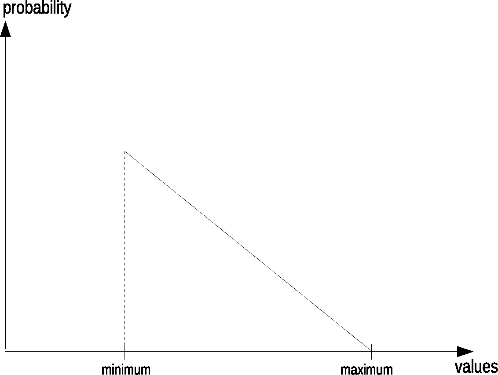{ width=50% }

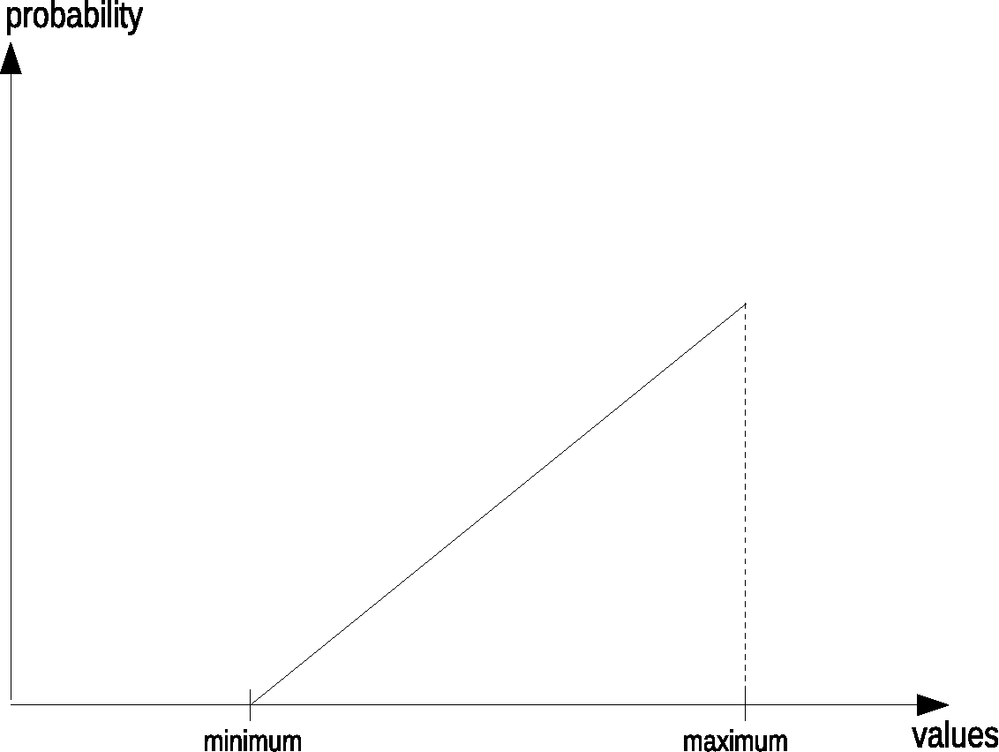{ width=50% }

To get this behaviour, two uniform random numbers are generated, and the
lower is taken for the first shape. If the second shape with the
precedence of higher values is needed, the higher one of the two
generated numbers is taken. The next example implements these random
generators as User Defined Opcodes. First we hear a uniform
distribution, then a linear distribution with precedence of lower
pitches (but longer durations), at least a linear distribution with
precedence of higher pitches (but shorter durations).

   ***EXAMPLE 01D03\_linrand.csd***

~~~
<CsoundSynthesizer>
<CsOptions>
-odac -m0
</CsOptions>
<CsInstruments>
sr = 44100
ksmps = 32
nchnls = 2
0dbfs = 1
seed 0

;****DEFINE OPCODES FOR LINEAR DISTRIBUTION****

opcode linrnd_low, i, ii
 ;linear random with precedence of lower values
iMin, iMax xin
 ;generate two random values with the random opcode
iOne       random     iMin, iMax
iTwo       random     iMin, iMax
 ;compare and get the lower one
iRnd       =          iOne < iTwo ? iOne : iTwo
           xout       iRnd
endop

opcode linrnd_high, i, ii
 ;linear random with precedence of higher values
iMin, iMax xin
 ;generate two random values with the random opcode
iOne       random     iMin, iMax
iTwo       random     iMin, iMax
 ;compare and get the higher one
iRnd       =          iOne > iTwo ? iOne : iTwo
           xout       iRnd
endop

;****INSTRUMENTS FOR THE DIFFERENT DISTRIBUTIONS****

instr notes_uniform
           prints     "... instr notes_uniform playing:\n"
           prints     "EQUAL LIKELINESS OF ALL PITCHES AND DURATIONS\n"
 ;how many notes to be played
iHowMany   =          p4
 ;trigger as many instances of instr play as needed
iThisNote  =          0
iStart     =          0
 until iThisNote == iHowMany do
iMidiPch   random     36, 84 ;midi note
iDur       random     .5, 1 ;duration
           event_i    "i", "play", iStart, iDur, int(iMidiPch)
iStart     +=         iDur ;increase start
iThisNote  +=         1 ;increase counter
 enduntil
 ;reset the duration of this instr to make all events happen
p3         =          iStart + 2
 ;trigger next instrument two seconds after the last note
           event_i    "i", "notes_linrnd_low", p3, 1, iHowMany
endin

instr notes_linrnd_low
           prints     "... instr notes_linrnd_low playing:\n"
           prints     "LOWER NOTES AND LONGER DURATIONS PREFERRED\n"
iHowMany   =          p4
iThisNote  =          0
iStart     =          0
 until iThisNote == iHowMany do
iMidiPch   linrnd_low 36, 84 ;lower pitches preferred
iDur       linrnd_high .5, 1 ;longer durations preferred
           event_i    "i", "play", iStart, iDur, int(iMidiPch)
iStart     +=         iDur
iThisNote  +=         1
 enduntil
 ;reset the duration of this instr to make all events happen
p3         =          iStart + 2
 ;trigger next instrument two seconds after the last note
           event_i    "i", "notes_linrnd_high", p3, 1, iHowMany
endin

instr notes_linrnd_high
           prints     "... instr notes_linrnd_high playing:\n"
           prints     "HIGHER NOTES AND SHORTER DURATIONS PREFERRED\n"
iHowMany   =          p4
iThisNote  =          0
iStart     =          0
 until iThisNote == iHowMany do
iMidiPch   linrnd_high 36, 84 ;higher pitches preferred
iDur       linrnd_low .3, 1.2 ;shorter durations preferred
           event_i    "i", "play", iStart, iDur, int(iMidiPch)
iStart     +=         iDur
iThisNote  +=         1
 enduntil
 ;reset the duration of this instr to make all events happen
p3         =          iStart + 2
 ;call instr to exit csound
           event_i    "i", "exit", p3+1, 1
endin

;****INSTRUMENTS TO PLAY THE SOUNDS AND TO EXIT CSOUND****

instr play
 ;increase duration in random range
iDur       random     p3, p3*1.5
p3         =          iDur
 ;get midi note and convert to frequency
iMidiNote  =          p4
iFreq      cpsmidinn  iMidiNote
 ;generate note with karplus-strong algorithm
aPluck     pluck      .2, iFreq, iFreq, 0, 1
aPluck     linen      aPluck, 0, p3, p3
 ;filter
aFilter    mode       aPluck, iFreq, .1
 ;mix aPluck and aFilter according to MidiNote
 ;(high notes will be filtered more)
aMix       ntrpol     aPluck, aFilter, iMidiNote, 36, 84
 ;panning also according to MidiNote
 ;(low = left, high = right)
iPan       =          (iMidiNote-36) / 48
aL, aR     pan2       aMix, iPan
           outs       aL, aR
endin

instr exit
           exitnow
endin

</CsInstruments>
<CsScore>
i "notes_uniform" 0 1 23 ;set number of notes per instr here
;instruments linrnd_low and linrnd_high are triggered automatically
e 99999 ;make possible to perform long (exit will be automatically)
</CsScore>
</CsoundSynthesizer>
;example by joachim heintz
~~~

#### Triangular

In a triangular distribution the values in the middle of the given range
are more likely than those at the borders. The probability transition
between the middle and the extrema are linear:

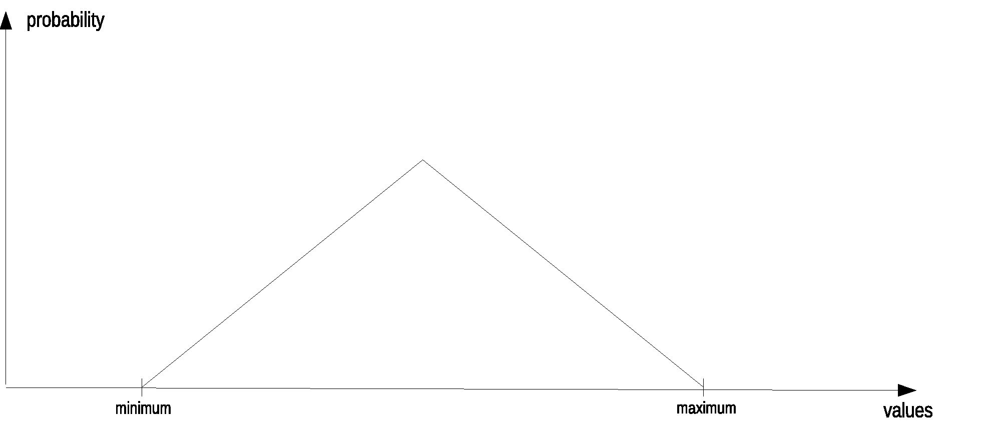

The algorithm for getting this distribution is very simple as well.
Generate two uniform random numbers and take the mean of them. The next
example shows the difference between uniform and triangular distribution
in the same environment as the previous example.

   ***EXAMPLE 01D04\_trirand.csd***

~~~
<CsoundSynthesizer>
<CsOptions>
-odac -m0
</CsOptions>
<CsInstruments>
sr = 44100
ksmps = 32
nchnls = 2
0dbfs = 1
seed 0

;****UDO FOR TRIANGULAR DISTRIBUTION****
opcode trirnd, i, ii
iMin, iMax xin
 ;generate two random values with the random opcode
iOne       random     iMin, iMax
iTwo       random     iMin, iMax
 ;get the mean and output
iRnd       =          (iOne+iTwo) / 2
           xout       iRnd
endop

;****INSTRUMENTS FOR UNIFORM AND TRIANGULAR DISTRIBUTION****

instr notes_uniform
           prints     "... instr notes_uniform playing:\n"
           prints     "EQUAL LIKELINESS OF ALL PITCHES AND DURATIONS\n"
 ;how many notes to be played
iHowMany   =          p4
 ;trigger as many instances of instr play as needed
iThisNote  =          0
iStart     =          0
 until iThisNote == iHowMany do
iMidiPch   random     36, 84 ;midi note
iDur       random     .25, 1.75 ;duration
           event_i    "i", "play", iStart, iDur, int(iMidiPch)
iStart     +=         iDur ;increase start
iThisNote  +=         1 ;increase counter
 enduntil
 ;reset the duration of this instr to make all events happen
p3         =          iStart + 2
 ;trigger next instrument two seconds after the last note
           event_i    "i", "notes_trirnd", p3, 1, iHowMany
endin

instr notes_trirnd
           prints     "... instr notes_trirnd playing:\n"
           prints     "MEDIUM NOTES AND DURATIONS PREFERRED\n"
iHowMany   =          p4
iThisNote  =          0
iStart     =          0
 until iThisNote == iHowMany do
iMidiPch   trirnd     36, 84 ;medium pitches preferred
iDur       trirnd     .25, 1.75 ;medium durations preferred
           event_i    "i", "play", iStart, iDur, int(iMidiPch)
iStart     +=         iDur
iThisNote  +=         1
 enduntil
 ;reset the duration of this instr to make all events happen
p3         =          iStart + 2
 ;call instr to exit csound
           event_i    "i", "exit", p3+1, 1
endin

;****INSTRUMENTS TO PLAY THE SOUNDS AND EXIT CSOUND****

instr play
 ;increase duration in random range
iDur       random     p3, p3*1.5
p3         =          iDur
 ;get midi note and convert to frequency
iMidiNote  =          p4
iFreq      cpsmidinn  iMidiNote
 ;generate note with karplus-strong algorithm
aPluck     pluck      .2, iFreq, iFreq, 0, 1
aPluck     linen      aPluck, 0, p3, p3
 ;filter
aFilter    mode       aPluck, iFreq, .1
 ;mix aPluck and aFilter according to MidiNote
 ;(high notes will be filtered more)
aMix       ntrpol     aPluck, aFilter, iMidiNote, 36, 84
 ;panning also according to MidiNote
 ;(low = left, high = right)
iPan       =          (iMidiNote-36) / 48
aL, aR     pan2       aMix, iPan
           outs       aL, aR
endin

instr exit
           exitnow
endin

</CsInstruments>
<CsScore>
i "notes_uniform" 0 1 23 ;set number of notes per instr here
;instr trirnd will be triggered automatically
e 99999 ;make possible to perform long (exit will be automatically)
</CsScore>
</CsoundSynthesizer>
;example by joachim heintz
~~~

#### More Linear and Triangular

Having written this with some very simple UDOs, it is easy to emphasise
the probability peaks of the distributions by generating more than two
random numbers. If you generate three numbers and choose the smallest of
them, you will get many more numbers near the minimum in total for the
linear distribution. If you generate three random numbers and take the
mean of them, you will end up with more numbers near the middle in total
for the triangular distribution.

If we want to write UDOs with a flexible number of sub-generated
numbers, we have to write the code in a slightly different way. Instead
of having one line of code for each random generator, we will use a
loop, which calls the generator as many times as we wish to have units.
A variable will store the results of the accumulation. Re-writing the
above code for the UDO *trirnd* would lead to this formulation:

    opcode trirnd, i, ii
    iMin, iMax xin
     ;set a counter and a maximum count
    iCount     =          0
    iMaxCount  =          2
     ;set the accumulator to zero as initial value
    iAccum     =          0
     ;perform loop and accumulate
     until iCount == iMaxCount do
    iUniRnd    random     iMin, iMax
    iAccum     +=         iUniRnd
    iCount     +=         1
     enduntil
     ;get the mean and output
    iRnd       =          iAccum / 2
               xout       iRnd
    endop

To get this completely flexible, you only have to get *iMaxCount* as
input argument. The code for the linear distribution UDOs is quite
similar. -- The next example shows these steps:

1.  Uniform distribution.
2.  Linear distribution with the precedence of lower pitches and longer
    durations, generated with two units.
3.  The same but with four units.
4.  Linear distribution with the precedence of higher pitches and
    shorter durations, generated with two units.
5.  The same but with four units.
6.  Triangular distribution with the precedence of both medium pitches
    and durations, generated with two units.
7.  The same but with six units.

Rather than using different instruments for the different distributions,
the next example combines all possibilities in one single instrument.
Inside the loop which generates as many notes as desired by the
*iHowMany* argument, an if-branch calculates the pitch and duration of
one note depending on the distribution type and the number of sub-units
used. The whole sequence (which type first, which next, etc) is stored
in the global array *giSequence*. Each instance of instrument *notes*
increases the pointer giSeqIndx, so that for the next run the next
element in the array is being read. If the pointer has reached the end
of the array, the instrument which exits Csound is called instead of a
new instance of *notes*.

   ***EXAMPLE 01D05\_more\_lin\_tri\_units.csd***

~~~
<CsoundSynthesizer>
<CsOptions>
-odac -m0
</CsOptions>
<CsInstruments>
sr = 44100
ksmps = 32
nchnls = 2
0dbfs = 1
seed 0

;****SEQUENCE OF UNITS AS ARRAY****/
giSequence[] array 0, 1.2, 1.4, 2.2, 2.4, 3.2, 3.6
giSeqIndx = 0 ;startindex

;****UDO DEFINITIONS****
opcode linrnd_low, i, iii
 ;linear random with precedence of lower values
iMin, iMax, iMaxCount xin
 ;set counter and initial (absurd) result
iCount     =          0
iRnd       =          iMax
 ;loop and reset iRnd
 until iCount == iMaxCount do
iUniRnd    random     iMin, iMax
iRnd       =          iUniRnd < iRnd ? iUniRnd : iRnd
iCount     +=         1
 enduntil
           xout       iRnd
endop

opcode linrnd_high, i, iii
 ;linear random with precedence of higher values
iMin, iMax, iMaxCount xin
 ;set counter and initial (absurd) result
iCount     =          0
iRnd       =          iMin
 ;loop and reset iRnd
 until iCount == iMaxCount do
iUniRnd    random     iMin, iMax
iRnd       =          iUniRnd > iRnd ? iUniRnd : iRnd
iCount     +=         1
 enduntil
           xout       iRnd
endop

opcode trirnd, i, iii
iMin, iMax, iMaxCount xin
 ;set a counter and accumulator
iCount     =          0
iAccum     =          0
 ;perform loop and accumulate
 until iCount == iMaxCount do
iUniRnd    random     iMin, iMax
iAccum     +=         iUniRnd
iCount     +=         1
 enduntil
 ;get the mean and output
iRnd       =          iAccum / iMaxCount
           xout       iRnd
endop

;****ONE INSTRUMENT TO PERFORM ALL DISTRIBUTIONS****
;0 = uniform, 1 = linrnd_low, 2 = linrnd_high, 3 = trirnd
;the fractional part denotes the number of units, e.g.
;3.4 = triangular distribution with four sub-units

instr notes
 ;how many notes to be played
iHowMany   =          p4
 ;by which distribution with how many units
iWhich     =          giSequence[giSeqIndx]
iDistrib   =          int(iWhich)
iUnits     =          round(frac(iWhich) * 10)
 ;set min and max duration
iMinDur    =          .1
iMaxDur    =          2
 ;set min and max pitch
iMinPch    =          36
iMaxPch    =          84

 ;trigger as many instances of instr play as needed
iThisNote  =          0
iStart     =          0
iPrint     =          1

 ;for each note to be played
 until iThisNote == iHowMany do

  ;calculate iMidiPch and iDur depending on type
  if iDistrib == 0 then
           printf_i   "%s", iPrint, "... uniform distribution:\n"
           printf_i   "%s", iPrint, "EQUAL LIKELIHOOD OF ALL PITCHES AND DURATIONS\n"
iMidiPch   random     iMinPch, iMaxPch ;midi note
iDur       random     iMinDur, iMaxDur ;duration
  elseif iDistrib == 1 then
           printf_i    "... linear low distribution with %d units:\n", iPrint, iUnits
           printf_i    "%s", iPrint, "LOWER NOTES AND LONGER DURATIONS PREFERRED\n"
iMidiPch   linrnd_low iMinPch, iMaxPch, iUnits
iDur       linrnd_high iMinDur, iMaxDur, iUnits
  elseif iDistrib == 2 then
           printf_i    "... linear high distribution with %d units:\n", iPrint, iUnits
           printf_i    "%s", iPrint, "HIGHER NOTES AND SHORTER DURATIONS PREFERRED\n"
iMidiPch   linrnd_high iMinPch, iMaxPch, iUnits
iDur       linrnd_low iMinDur, iMaxDur, iUnits
  else
           printf_i    "... triangular distribution with %d units:\n", iPrint, iUnits
           printf_i    "%s", iPrint, "MEDIUM NOTES AND DURATIONS PREFERRED\n"
iMidiPch   trirnd     iMinPch, iMaxPch, iUnits
iDur       trirnd     iMinDur, iMaxDur, iUnits
  endif

 ;call subinstrument to play note
           event_i    "i", "play", iStart, iDur, int(iMidiPch)

 ;increase start tim and counter
iStart     +=         iDur
iThisNote  +=         1
 ;avoid continuous printing
iPrint     =          0
 enduntil

 ;reset the duration of this instr to make all events happen
p3         =          iStart + 2

 ;increase index for sequence
giSeqIndx  +=         1
 ;call instr again if sequence has not been ended
 if giSeqIndx < lenarray(giSequence) then
           event_i    "i", "notes", p3, 1, iHowMany
 ;or exit
 else
           event_i    "i", "exit", p3, 1
 endif
endin

;****INSTRUMENTS TO PLAY THE SOUNDS AND EXIT CSOUND****
instr play
 ;increase duration in random range
iDur       random     p3, p3*1.5
p3         =          iDur
 ;get midi note and convert to frequency
iMidiNote  =          p4
iFreq      cpsmidinn  iMidiNote
 ;generate note with karplus-strong algorithm
aPluck     pluck      .2, iFreq, iFreq, 0, 1
aPluck     linen      aPluck, 0, p3, p3
 ;filter
aFilter    mode       aPluck, iFreq, .1
 ;mix aPluck and aFilter according to MidiNote
 ;(high notes will be filtered more)
aMix       ntrpol     aPluck, aFilter, iMidiNote, 36, 84
 ;panning also according to MidiNote
 ;(low = left, high = right)
iPan       =          (iMidiNote-36) / 48
aL, aR     pan2       aMix, iPan
           outs       aL, aR
endin

instr exit
           exitnow
endin

</CsInstruments>
<CsScore>
i "notes" 0 1 23 ;set number of notes per instr here
e 99999 ;make possible to perform long (exit will be automatically)
</CsScore>
</CsoundSynthesizer>
;example by joachim heintz
~~~

With this method we can build probability distributions which are very
similar to exponential or gaussian distributions.[^5]  Their shape can
easily be formed by the number of sub-units used.

### Scalings

Random is a complex and sensible context. There are so many ways to let
the horse go, run, or dance -- the conditions you set for this *way of
moving* are much more important than the fact that one single move is
not predictable. What are the conditions of this randomness?

-   *Which Way.* This is what has already been described: random with or
    without history, which probability distribution, etc.
-   *Which Range.* This is a decision which comes from the
    composer/programmer. In the example above I have chosen pitches from
    Midi Note 36 to 84 (C2 to C6), and durations between 0.1 and 2
    seconds. Imagine how it would have been sounded with pitches from 60
    to 67, and durations from 0.9 to 1.1 seconds, or from 0.1 to 0.2
    seconds. There is no range which is "correct", everything depends
    on the musical idea.
-   *Which Development.* Usually the boundaries will change in the run
    of a piece. The pitch range may move from low to high, or from
    narrow to wide; the durations may become shorter, etc.
-   *Which Scalings.* Let us think about this more in detail.

In the example above we used two implicit scalings. The pitches have
been scaled to the keys of a piano or keyboard. Why? We do not play
piano here obviously ... -- What other possibilities might have been
instead? One would be: no scaling at all. This is the easiest way to go
-- whether it is really the best, or simple laziness, can only be
decided by the composer or the listener.

Instead of using the equal tempered chromatic scale, or no scale at all,
you can use any other ways of selecting or quantising pitches. Be it any
which has been, or is still, used in any part of the world, or be it
your own invention, by whatever fantasy or invention or system.

As regards the durations, the example above has shown no scaling at all.
This was definitely laziness...

The next example is essentially the same as the previous one, but it
uses a pitch scale which represents the overtone scale, starting at the
second partial extending upwards to the 32nd partial. This scale is
written into an array by a statement in instrument 0. The durations have
fixed possible values which are written into an array (from the longest
to the shortest) by hand. The values in both arrays are then called
according to their position in the array.

   ***EXAMPLE 01D06\_scalings.csd***

~~~
<CsoundSynthesizer>
<CsOptions>
-odac -m0
</CsOptions>
<CsInstruments>
sr = 44100
ksmps = 32
nchnls = 2
0dbfs = 1
seed 0

;****POSSIBLE DURATIONS AS ARRAY****
giDurs[]   array      3/2, 1, 2/3, 1/2, 1/3, 1/4
giLenDurs  lenarray   giDurs

;****POSSIBLE PITCHES AS ARRAY****
 ;initialize array with 31 steps
giScale[]  init       31
giLenScale lenarray   giScale
 ;iterate to fill from 65 hz onwards
iStart     =          65
iDenom     =          3 ;start with 3/2
iCnt       =          0
 until iCnt = giLenScale do
giScale[iCnt] =       iStart
iStart     =          iStart * iDenom / (iDenom-1)
iDenom     +=         1 ;next proportion is 4/3 etc
iCnt       +=         1
 enduntil

;****SEQUENCE OF UNITS AS ARRAY****
giSequence[] array    0, 1.2, 1.4, 2.2, 2.4, 3.2, 3.6
giSeqIndx  =          0 ;startindex

;****UDO DEFINITIONS****
opcode linrnd_low, i, iii
 ;linear random with precedence of lower values
iMin, iMax, iMaxCount xin
 ;set counter and initial (absurd) result
iCount     =          0
iRnd       =          iMax
 ;loop and reset iRnd
 until iCount == iMaxCount do
iUniRnd    random     iMin, iMax
iRnd       =          iUniRnd < iRnd ? iUniRnd : iRnd
iCount += 1
enduntil
           xout       iRnd
endop

opcode linrnd_high, i, iii
 ;linear random with precedence of higher values
iMin, iMax, iMaxCount xin
 ;set counter and initial (absurd) result
iCount     =          0
iRnd       =          iMin
 ;loop and reset iRnd
 until iCount == iMaxCount do
iUniRnd    random     iMin, iMax
iRnd       =          iUniRnd > iRnd ? iUniRnd : iRnd
iCount += 1
enduntil
           xout       iRnd
endop

opcode trirnd, i, iii
iMin, iMax, iMaxCount xin
 ;set a counter and accumulator
iCount     =          0
iAccum     =          0
 ;perform loop and accumulate
 until iCount == iMaxCount do
iUniRnd    random     iMin, iMax
iAccum += iUniRnd
iCount += 1
enduntil
 ;get the mean and output
iRnd       =          iAccum / iMaxCount
           xout       iRnd
endop

;****ONE INSTRUMENT TO PERFORM ALL DISTRIBUTIONS****
;0 = uniform, 1 = linrnd_low, 2 = linrnd_high, 3 = trirnd
;the fractional part denotes the number of units, e.g.
;3.4 = triangular distribution with four sub-units

instr notes
 ;how many notes to be played
iHowMany   =          p4
 ;by which distribution with how many units
iWhich     =          giSequence[giSeqIndx]
iDistrib   =          int(iWhich)
iUnits     =          round(frac(iWhich) * 10)

 ;trigger as many instances of instr play as needed
iThisNote  =          0
iStart     =          0
iPrint     =          1

 ;for each note to be played
 until iThisNote == iHowMany do

  ;calculate iMidiPch and iDur depending on type
  if iDistrib == 0 then
           printf_i   "%s", iPrint, "... uniform distribution:\n"
           printf_i   "%s", iPrint, "EQUAL LIKELINESS OF ALL PITCHES AND DURATIONS\n"
iScaleIndx random     0, giLenScale-.0001 ;midi note
iDurIndx   random     0, giLenDurs-.0001 ;duration
  elseif iDistrib == 1 then
           printf_i   "... linear low distribution with %d units:\n", iPrint, iUnits
           printf_i   "%s", iPrint, "LOWER NOTES AND LONGER DURATIONS PREFERRED\n"
iScaleIndx linrnd_low 0, giLenScale-.0001, iUnits
iDurIndx   linrnd_low 0, giLenDurs-.0001, iUnits
  elseif iDistrib == 2 then
           printf_i   "... linear high distribution with %d units:\n", iPrint, iUnits
           printf_i   "%s", iPrint, "HIGHER NOTES AND SHORTER DURATIONS PREFERRED\n"
iScaleIndx linrnd_high 0, giLenScale-.0001, iUnits
iDurIndx   linrnd_high 0, giLenDurs-.0001, iUnits
           else
           printf_i   "... triangular distribution with %d units:\n", iPrint, iUnits
           printf_i   "%s", iPrint, "MEDIUM NOTES AND DURATIONS PREFERRED\n"
iScaleIndx trirnd     0, giLenScale-.0001, iUnits
iDurIndx   trirnd     0, giLenDurs-.0001, iUnits
  endif

 ;call subinstrument to play note
iDur       =          giDurs[int(iDurIndx)]
iPch       =          giScale[int(iScaleIndx)]
           event_i    "i", "play", iStart, iDur, iPch

 ;increase start time and counter
iStart     +=         iDur
iThisNote  +=         1
 ;avoid continuous printing
iPrint     =          0
enduntil

 ;reset the duration of this instr to make all events happen
p3         =          iStart + 2

 ;increase index for sequence
giSeqIndx += 1
 ;call instr again if sequence has not been ended
 if giSeqIndx < lenarray(giSequence) then
           event_i    "i", "notes", p3, 1, iHowMany
 ;or exit
           else
           event_i    "i", "exit", p3, 1
 endif
endin

;****INSTRUMENTS TO PLAY THE SOUNDS AND EXIT CSOUND****
instr play
 ;increase duration in random range
iDur       random     p3*2, p3*5
p3         =          iDur
 ;get frequency
iFreq      =          p4
 ;generate note with karplus-strong algorithm
aPluck     pluck      .2, iFreq, iFreq, 0, 1
aPluck     linen      aPluck, 0, p3, p3
 ;filter
aFilter    mode       aPluck, iFreq, .1
 ;mix aPluck and aFilter according to freq
 ;(high notes will be filtered more)
aMix       ntrpol     aPluck, aFilter, iFreq, 65, 65*16
 ;panning also according to freq
 ;(low = left, high = right)
iPan       =          (iFreq-65) / (65*16)
aL, aR     pan2       aMix, iPan
           outs       aL, aR
endin

instr exit
           exitnow
endin
</CsInstruments>
<CsScore>
i "notes" 0 1 23 ;set number of notes per instr here
e 99999 ;make possible to perform long (exit will be automatically)
</CsScore>
</CsoundSynthesizer>
;example by joachim heintz
~~~

### Random With History

There are many ways a current value in a random number progression can
influence the next. Two of them are used frequently. A Markov chain is
based on a number of possible states, and defines a different
probability for each of these states. A random walk looks at the last
state as a position in a range or field, and allows only certain
deviations from this position.

#### Markov Chains

A typical case for a Markov chain in music is a sequence of certain
pitches or notes. For each note, the probability of the following note
is written in a table like this:

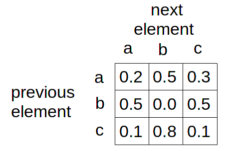{ width=30% }

This means: the probability that element *a* is repeated, is 0.2; the
probability that *b* follows a is 0.5; the probability that *c* follows a is
0.3. The sum of all probabilities must, by convention, add up to 1. The
following example shows the basic algorithm which evaluates the first
line of the Markov table above, in the case, the previous element has
been *a*.

   ***EXAMPLE 01D07\_markov\_basics.csd***

~~~
<CsoundSynthesizer>
<CsOptions>
-ndm0
</CsOptions>
<CsInstruments>
sr = 44100
ksmps = 32
0dbfs = 1
nchnls = 1
seed 0

instr 1
iLine[]    array      .2, .5, .3
iVal       random     0, 1
iAccum     =          iLine[0]
iIndex     =          0
 until iAccum >= iVal do
iIndex     +=         1
iAccum     +=         iLine[iIndex]
 enduntil
           printf_i   "Random number = %.3f, next element = %c!\n", 1, iVal, iIndex+97
endin
</CsInstruments>
<CsScore>
r 10
i 1 0 0
</CsScore>
</CsoundSynthesizer>
;example by joachim heintz
~~~

The probabilities are 0.2 0.5 0.3. First a uniformly distributed random
number between 0 and 1 is generated. An acculumator is set to the first
element of the line (here 0.2). It is interrogated as to whether it is
larger than the random number. If so then the index is returned, if not,
the second element is added (0.2+0.5=0.7), and the process is repeated,
until the accumulator is greater or equal the random value. The output
of the example should show something like this:

    Random number = 0.850, next element = c!
    Random number = 0.010, next element = a!
    Random number = 0.805, next element = c!
    Random number = 0.696, next element = b!
    Random number = 0.626, next element = b!
    Random number = 0.476, next element = b!
    Random number = 0.420, next element = b!
    Random number = 0.627, next element = b!
    Random number = 0.065, next element = a!
    Random number = 0.782, next element = c!

The next example puts this algorithm in an User Defined Opcode. Its
input is a Markov table as a two-dimensional array, and the previous
line as index (starting with 0). Its output is the next element, also as
index. -- There are two Markov chains in this example: seven pitches,
and three durations. Both are defined in two-dimensional arrays:
*giProbNotes* and *giProbDurs*. Both Markov chains are running
independently from each other.

   ***EXAMPLE 01D08\_markov\_music.csd***

~~~
<CsoundSynthesizer>
<CsOptions>
-m128 -odac
</CsOptions>
<CsInstruments>
sr = 44100
ksmps = 32
0dbfs = 1
nchnls = 2
seed 0

;****USER DEFINED OPCODES FOR MARKOV CHAINS****
  opcode Markov, i, i[][]i
iMarkovTable[][], iPrevEl xin
iRandom    random     0, 1
iNextEl    =          0
iAccum     =          iMarkovTable[iPrevEl][iNextEl]
 until iAccum >= iRandom do
iNextEl    +=         1
iAccum     +=         iMarkovTable[iPrevEl][iNextEl]
 enduntil
           xout       iNextEl
  endop
  opcode Markovk, k, k[][]k
kMarkovTable[][], kPrevEl xin
kRandom    random     0, 1
kNextEl    =          0
kAccum     =          kMarkovTable[kPrevEl][kNextEl]
 until kAccum >= kRandom do
kNextEl    +=         1
kAccum     +=         kMarkovTable[kPrevEl][kNextEl]
 enduntil
           xout       kNextEl
  endop

;****DEFINITIONS FOR NOTES****
 ;notes as proportions and a base frequency
giNotes[]  array      1, 9/8, 6/5, 5/4, 4/3, 3/2, 5/3
giBasFreq  =          330
 ;probability of notes as markov matrix:
  ;first -> only to third and fourth
  ;second -> anywhere without self
  ;third -> strong probability for repetitions
  ;fourth -> idem
  ;fifth -> anywhere without third and fourth
  ;sixth -> mostly to seventh
  ;seventh -> mostly to sixth
giProbNotes[][] init  7, 7
giProbNotes fillarray 0.0, 0.0, 0.5, 0.5, 0.0, 0.0, 0.0,
                      0.2, 0.0, 0.2, 0.2, 0.2, 0.1, 0.1,
                      0.1, 0.1, 0.5, 0.1, 0.1, 0.1, 0.0,
                      0.0, 0.1, 0.1, 0.5, 0.1, 0.1, 0.1,
                      0.2, 0.2, 0.0, 0.0, 0.2, 0.2, 0.2,
                      0.1, 0.1, 0.0, 0.0, 0.1, 0.1, 0.6,
                      0.1, 0.1, 0.0, 0.0, 0.1, 0.6, 0.1

;****DEFINITIONS FOR DURATIONS****
 ;possible durations
gkDurs[]    array     1, 1/2, 1/3
 ;probability of durations as markov matrix:
  ;first -> anything
  ;second -> mostly self
  ;third -> mostly second
gkProbDurs[][] init   3, 3
gkProbDurs array      1/3, 1/3, 1/3,
                      0.2, 0.6, 0.3,
                      0.1, 0.5, 0.4

;****SET FIRST NOTE AND DURATION FOR MARKOV PROCESS****
giPrevNote init       1
gkPrevDur  init       1

;****INSTRUMENT FOR DURATIONS****
  instr trigger_note
kTrig      metro      1/gkDurs[gkPrevDur]
 if kTrig == 1 then
           event      "i", "select_note", 0, 1
gkPrevDur  Markovk    gkProbDurs, gkPrevDur
 endif
  endin

;****INSTRUMENT FOR PITCHES****
  instr select_note
 ;choose next note according to markov matrix and previous note
 ;and write it to the global variable for (next) previous note
giPrevNote Markov     giProbNotes, giPrevNote
 ;call instr to play this note
           event_i    "i", "play_note", 0, 2, giPrevNote
 ;turn off this instrument
           turnoff
  endin

;****INSTRUMENT TO PERFORM ONE NOTE****
  instr play_note
 ;get note as index in ginotes array and calculate frequency
iNote      =          p4
iFreq      =          giBasFreq * giNotes[iNote]
 ;random choice for mode filter quality and panning
iQ         random     10, 200
iPan       random     0.1, .9
 ;generate tone and put out
aImp       mpulse     1, p3
aOut       mode       aImp, iFreq, iQ
aL, aR     pan2       aOut, iPan
           outs       aL, aR
  endin

</CsInstruments>
<CsScore>
i "trigger_note" 0 100
</CsScore>
</CsoundSynthesizer>
;example by joachim heintz
~~~

#### Random Walk

In the context of movement between random values, *walk* can be
thought of as the opposite of *jump*. If you jump within the
boundaries A and B, you can end up anywhere between these boundaries,
but if you walk between A and B you will be limited by the extent of
your step - each step applies a deviation to the previous one. If the
deviation range is slightly more positive (say from -0.1 to +0.2), the
general trajectory of your walk will be in the positive direction (but
individual steps will not necessarily be in the positive direction). If
the deviation range is weighted negative (say from -0.2 to 0.1), then
the walk will express a generally negative trajectory.

One way of implementing a random walk will be to take the current state,
derive a random deviation, and derive the next state by adding this
deviation to the current state. The next example shows two ways of doing
this.

The *pitch* random walk starts at pitch 8 in octave notation. The
general pitch deviation *gkPitchDev* is set to 0.2, so that the next
pitch could be between 7.8 and 8.2. But there is also a pitch direction
*gkPitchDir* which is set to 0.1 as initial value. This means that the
upper limit of the next random pitch is 8.3 instead of 8.2, so that the
pitch will move upwards in a greater number of steps. When the upper
limit *giHighestPitch* has been crossed, the *gkPitchDir* variable
changes from +0.1 to -0.1, so after a number of steps, the pitch will
have become lower. Whenever such a direction change happens, the console
reports this with a message printed to the terminal.

The *density* of the notes is defined as notes per second, and is
applied as frequency to the
[metro](http://www.csound.com/docs/manual/metro.html) opcode in
instrument *walk*. The lowest possible density *giLowestDens* is set
to 1, the highest to 8 notes per second, and the first density
*giStartDens* is set to 3. The possible random deviation for the next
density is defined in a range from zero to one: zero means no deviation
at all, one means that the next density can alter the current density in
a range from half the current value to twice the current value. For
instance, if the current density is 4, for *gkDensDev=1* you would get a
density between 2 and 8. The direction of the densities *gkDensDir* in
this random walk follows the same range 0..1. Assumed you have no
deviation of densities at all (*gkDensDev=0*), *gkDensDir=0* will
produce ticks in always the same speed, whilst *gkDensDir=1* will
produce a very rapid increase in speed. Similar to the pitch walk, the
direction parameter changes from plus to minus if the upper border has
crossed, and vice versa.

   ***EXAMPLE 01D09\_random\_walk.csd***

~~~
<CsoundSynthesizer>
<CsOptions>
-m128 -odac
</CsOptions>
<CsInstruments>
sr = 44100
ksmps = 32
0dbfs = 1
nchnls = 2
seed 1 ;change to zero for always changing results

;****SETTINGS FOR PITCHES****
 ;define the pitch street in octave notation
giLowestPitch =     7
giHighestPitch =    9
 ;set pitch startpoint, deviation range and the first direction
giStartPitch =      8
gkPitchDev init     0.2 ;random range for next pitch
gkPitchDir init     0.1 ;positive = upwards

;****SETTINGS FOR DENSITY****
 ;define the maximum and minimum density (notes per second)
giLowestDens =      1
giHighestDens =     8
 ;set first density
giStartDens =       3
 ;set possible deviation in range 0..1
 ;0 = no deviation at all
 ;1 = possible deviation is between half and twice the current density
gkDensDev init      0.5
 ;set direction in the same range 0..1
 ;(positive = more dense, shorter notes)
gkDensDir init      0.1

;****INSTRUMENT FOR RANDOM WALK****
  instr walk
 ;set initial values
kPitch    init      giStartPitch
kDens     init      giStartDens
 ;trigger impulses according to density
kTrig     metro     kDens
 ;if the metro ticks
 if kTrig == 1 then
  ;1) play current note
          event     "i", "play", 0, 1.5/kDens, kPitch
  ;2) calculate next pitch
   ;define boundaries according to direction
kLowPchBound =      gkPitchDir < 0 ? -gkPitchDev+gkPitchDir : -gkPitchDev
kHighPchBound =     gkPitchDir > 0 ? gkPitchDev+gkPitchDir : gkPitchDev
   ;get random value in these boundaries
kPchRnd   random    kLowPchBound, kHighPchBound
   ;add to current pitch
kPitch += kPchRnd
  ;change direction if maxima are crossed, and report
  if kPitch > giHighestPitch && gkPitchDir > 0 then
gkPitchDir =        -gkPitchDir
          printks   " Pitch touched maximum - now moving down.\n", 0
  elseif kPitch < giLowestPitch && gkPitchDir < 0 then
gkPitchDir =        -gkPitchDir
          printks   "Pitch touched minimum - now moving up.\n", 0
  endif
  ;3) calculate next density (= metro frequency)
   ;define boundaries according to direction
kLowDensBound =     gkDensDir < 0 ? -gkDensDev+gkDensDir : -gkDensDev
kHighDensBound =    gkDensDir > 0 ? gkDensDev+gkDensDir : gkDensDev
   ;get random value in these boundaries
kDensRnd  random    kLowDensBound, kHighDensBound
   ;get multiplier (so that kDensRnd=1 yields to 2, and kDens=-1 to 1/2)
kDensMult =         2 ^ kDensRnd
   ;multiply with current duration
kDens *= kDensMult
   ;avoid too high values and too low values
kDens     =         kDens > giHighestDens*1.5 ? giHighestDens*1.5 : kDens
kDens     =         kDens < giLowestDens/1.5 ? giLowestDens/1.5 : kDens
   ;change direction if maxima are crossed
  if (kDens > giHighestDens && gkDensDir > 0) || (kDens < giLowestDens && gkDensDir < 0) then
gkDensDir =         -gkDensDir
   if kDens > giHighestDens then
          printks   " Density touched upper border - now becoming less dense.\n", 0
          else
          printks   " Density touched lower border - now becoming more dense.\n", 0
   endif
  endif
 endif
  endin

;****INSTRUMENT TO PLAY ONE NOTE****
  instr play
 ;get note as octave and calculate frequency and panning
iOct       =          p4
iFreq      =          cpsoct(iOct)
iPan       ntrpol     0, 1, iOct, giLowestPitch, giHighestPitch
 ;calculate mode filter quality according to duration
iQ         ntrpol     10, 400, p3, .15, 1.5
 ;generate tone and throw out
aImp       mpulse     1, p3
aMode      mode       aImp, iFreq, iQ
aOut       linen      aMode, 0, p3, p3/4
aL, aR     pan2       aOut, iPan
           outs       aL, aR
  endin

</CsInstruments>
<CsScore>
i "walk" 0 999
</CsScore>
</CsoundSynthesizer>
;example by joachim heintz
~~~

## II. SOME MATHS PERSPECTIVES ON RANDOM

### Random Processes

The relative frequency of occurrence of a random variable can be
described by a probability function (for discrete random variables) or
by density functions (for continuous random variables).

When two dice are thrown simultaneously, the sum *x* of their numbers
can be 2, 3, ...12. The following figure shows the probability function
*p*(*x*) of these possible outcomes. *p*(*x*) is always less than or
equal to 1. The sum of the probabilities of all possible outcomes is 1.

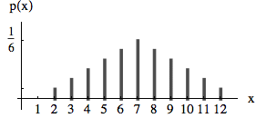

For continuous random variables the probability of getting a specific
value *x* is 0. But the probability of getting a value within a certain
interval can be indicated by an area that corresponds to this
probability. The function *f*(*x*) over these areas is called the
density function. With the following density the chance of getting a
number smaller than 0 is 0, to get a number between 0 and 0.5 is 0.5, to
get a number between 0.5 and 1 is 0.5 etc. Density functions *f*(*x*)
can reach values greater than 1 but the area under the function is 1.

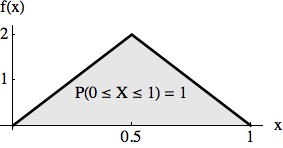

#### Generating Random Numbers With a Given Probability or Density

Csound provides opcodes for some specific densities but no means to
produce random number with user defined probability or density
functions. The opcodes *rand\_density* and *rand\_probability* (see
below) generate random numbers with probabilities or densities given by
tables. They are realized by using the so-called *rejection sampling
method*.

#### Rejection Sampling

The principle of *rejection sampling* is to first generate uniformly
distributed random numbers in the range required and to then accept
these values corresponding to a given density function (or otherwise
reject them). Let us demonstrate this method using the density function
shown in the next figure. (Since the rejection sampling method uses only
the *shape* of the function, the area under the function need not be
1). We first generate uniformly distributed random numbers *rnd1* over
the interval \[0, 1\]. Of these we accept a proportion corresponding to
*f*(*rnd1*). For example, the value 0.32 will only be accepted in the
proportion of *f*(0.32) = 0.82. We do this by generating a new random
number *rand2* between 0 and 1 and accept *rnd1* only if *rand2* \<
*f*(*rnd1*); otherwise we reject it. (see *Signals, Systems and Sound
Synthesis*[^6] chapter 10.1.4.4)

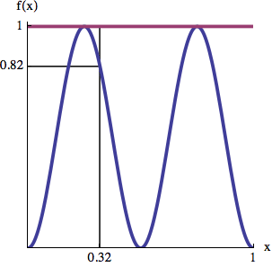

***EXAMPLE 01D10\_Rejection\_Sampling.csd***

~~~
<CsoundSynthesizer>
<CsOptions>
-odac
</CsOptions>
<CsInstruments>
sr = 44100
ksmps = 10
nchnls = 1
0dbfs = 1

; random number generator to a given density function
; kout  random number; k_minimum,k_maximum,i_fn for a density function

opcode  rand_density, k, kki
kmin,kmax,ifn   xin
loop:
krnd1           random          0,1
krnd2           random          0,1
k2              table           krnd1,ifn,1
                if      krnd2 > k2   kgoto loop
                xout            kmin+krnd1*(kmax-kmin)
endop

; random number generator to a given probability function
; kout  random number
; in: i_nr number of possible values
; i_fn1 function for random values
; i_fn2 probability functionExponential: Generate a uniformly distributed
; number between 0 and 1 and take its natural logarithm.

opcode  rand_probability, k, iii
inr,ifn1,ifn2   xin
loop:
krnd1           random          0,inr
krnd2           random          0,1
k2              table           int(krnd1),ifn2,0
                if      krnd2 > k2   kgoto loop
kout            table           krnd1,ifn1,0
                xout            kout
endop

instr 1
krnd            rand_density    400,800,2
aout            poscil          .1,krnd,1
                out             aout
endin

instr 2
krnd            rand_probability p4,p5,p6
aout            poscil          .1,krnd,1
                out             aout
endin

</CsInstruments>
<CsScore>
;sine
f1 0 32768 10 1
;density function
f2 0 1024 6 1 112 0 800 0 112 1
;random values and their relative probability (two dice)
f3 0 16 -2 2 3 4 5 6 7 8 9 10 11 12
f4 0 16  2 1 2 3 4 5 6 5 4  3  2  1
;random values and their relative probability
f5 0 8 -2 400 500 600 800
f6 0 8  2 .3  .8  .3  .1

i1 0 10
i2 0 10 4 5 6
</CsScore>
</CsoundSynthesizer>
;example by martin neukom
~~~

#### Random Walk

In a series of random numbers the single numbers are independent upon
each other. Parameter (left figure) or paths in the room
(two-dimensional trajectory in the right figure) created by random
numbers wildly jump around.

**Example 1 **

    Table[RandomReal[{-1, 1}], {100}];

We get a smoother path, a so-called random walk, by adding at every time
step a random number *r* to the actual position *x* (*x* += *r*).

**Example 2**

    x = 0; walk = Table[x += RandomReal[{-.2, .2}], {300}];

The path becomes even smoother by adding a random number *r* to the
actual velocity *v*.

    v += r
    x += v

The path can be bounded to an area (figure to the right) by inverting
the velocity if the path exceeds the limits (*min*, *max*):

    vif(x < min || x > max) v *= -1

The movement can be damped by decreasing the velocity at every time step
by a small factor *d*

    v *= (1-d)

**Example 3**

    x = 0; v = 0; walk = Table[x += v += RandomReal[{-.01, .01}], {300}];

The path becomes again smoother by adding a random number *r* to the
actual acelleration *a*, the change of the aceleration, etc.

    a += r
    v += a
    x += v

**Example 4**

    x = 0; v = 0; a = 0;
    Table[x += v += a += RandomReal[{-.0001, .0001}], {300}];

(see Martin Neukom, *Signals, Systems and Sound Synthesis* chapter
10.2.3.2)

***EXAMPLE 01D11\_Random\_Walk2.csd***

~~~
<CsoundSynthesizer>
<CsOptions>
-odac
</CsOptions>
<CsInstruments>

sr = 44100
ksmps = 128
nchnls = 1
0dbfs = 1

; random frequency
instr 1
kx      random  -p6, p6
kfreq   =       p5*2^kx
aout    oscil   p4, kfreq, 1
out     aout
endin

; random change of frequency
instr 2
kx      init    .5
kfreq   =       p5*2^kx
kv      random  -p6, p6
kv      =       kv*(1 - p7)
kx      =       kx + kv
aout    oscil   p4, kfreq, 1
out     aout
endin

; random change of change of frequency
instr 3
kv      init    0
kx      init    .5
kfreq   =       p5*2^kx
ka      random  -p7, p7
kv      =       kv + ka
kv      =       kv*(1 - p8)
kx      =       kx + kv
kv      =       (kx < -p6 || kx > p6?-kv : kv)
aout    oscili  p4, kfreq, 1
out     aout

endin

</CsInstruments>
<CsScore>

f1 0 32768 10 1
; i1    p4      p5      p6
; i2    p4      p5      p6      p7
;       amp     c_fr    rand    damp
; i2 0 20       .1      600     0.01    0.001
;       amp     c_fr    d_fr    rand    damp
;       amp     c_fr    rand
; i1 0 20       .1      600     0.5
; i3    p4      p5      p6      p7      p8
i3 0 20         .1      600     1       0.001   0.001
</CsScore>
</CsoundSynthesizer>
;example by martin neukom
~~~

## III. MISCELLANEOUS EXAMPLES

Csound has a range of opcodes and GEN routine for the creation of
various random functions and distributions. Perhaps the simplest of
these is [random](http://www.csound.com/docs/manual/random.html) which
simply generates a random value within user defined minimum and maximum
limit and at i-time, k-rate or a-rate accroding to the variable type of
its output:

    ires random imin, imax
    kres random kmin, kmax
    ares random kmin, kmax

Values are generated according to a uniform random distribution, meaning
that any value within the limits has equal chance of occurence.
Non-uniform distributions in which certain values have greater chance of
occurence over others are often more useful and musical. For these
purposes, Csound includes the
[betarand](http://www.csound.com/docs/manual/betarand.html),
[bexprand](http://www.csound.com/docs/manual/bexprnd.html),
[cauchy](http://www.csound.com/docs/manual/cauchy.html),
[exprand](http://www.csound.com/docs/manual/exprand.html),
[gauss](http://www.csound.com/docs/manual/gauss.html),
[linrand](http://www.csound.com/docs/manual/linrand.html),
[pcauchy](http://www.csound.com/docs/manual/pcauchy.html),
[poisson](http://www.csound.com/docs/manual/poisson.html),
[trirand](http://www.csound.com/docs/manual/trirand.html),
[unirand](http://www.csound.com/docs/manual/unirand.html) and
[weibull](http://www.csound.com/docs/manual/weibull.html) random number
generator opcodes. The distributions generated by several of these
opcodes are illustrated below.

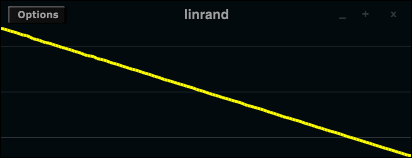

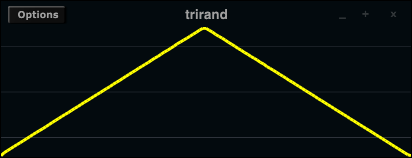

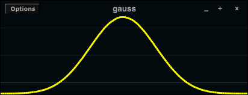

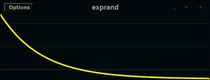

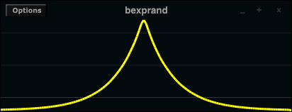

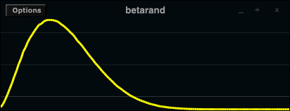

In addition to these so called *x-class noise generators* Csound
provides random function generators, providing values that change over
time a various ways.

[randomh](http://www.csound.com/docs/manual/randomh.html) generates new
random numbers at a user defined rate. The previous value is held until
a new value is generated, and then the output immediately assumes that
value.

The instruction:

    kmin   =         -1
    kmax   =         1
    kfreq  =         2
    kout   randomh   kmin,kmax,kfreq

will produce and output something like:

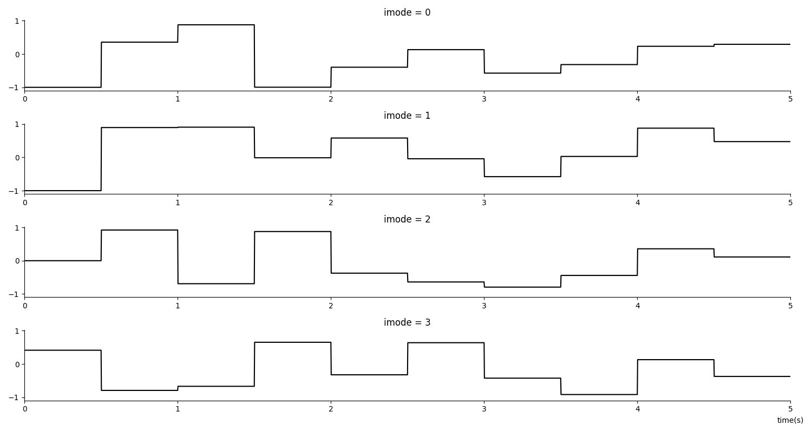

[randomi](http://www.csounds.com/manual/html/randomi.html) is an
interpolating version of randomh. Rather than jump to new values when
they are generated, randomi interpolates linearly to the new value,
reaching it just as a new random value is generated. Replacing randomh
with randomi in the above code snippet would result in the following
output:

In practice randomi's angular changes in direction as new random values
are generated might be audible depending on the how it is used.
[rspline](http://www.csound.com/docs/manual/rspline.html) (or the
simpler [jspline](http://www.csound.com/docs/manual/jspline.html))
allows us to specify not just a single frequency but a minimum and a
maximum frequency, and the resulting function is a smooth spline between
the minimum and maximum values and these minimum and maximum
frequencies. The following input:

    kmin     =         -0.95
    kmax     =         0.95
    kminfrq  =         1
    kmaxfrq  =         4
    asig     rspline   kmin, kmax, kminfrq, kmaxfrq

would generate an output something like:

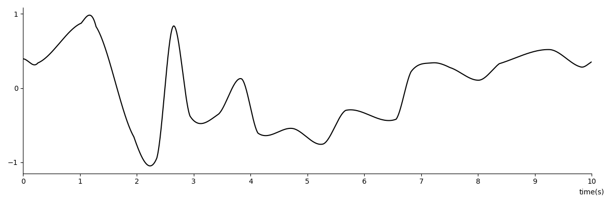

We need to be careful with what we do with rspline's output as it can
exceed the limits set by *kmin* and *kmax*. Minimum and maximum values can
be set conservatively or the
[limit](http://www.csound.com/docs/manual/limit.html) opcode could be
used to prevent out of range values that could cause problems.

The following example uses rspline to *humanise* a simple synthesiser.
A short melody is played, first without any humanising and then with
humanising. rspline random variation is added to the amplitude and pitch
of each note in addition to an i-time random offset.

***EXAMPLE 01D12\_humanising.csd***

~~~
<CsoundSynthesizer>
<CsOptions>
-odac
</CsOptions>
<CsInstruments>
sr = 44100
ksmps = 32
nchnls = 2
0dbfs = 1
seed 0

giWave  ftgen  0, 0, 2^10, 10, 1,0,1/4,0,1/16,0,1/64,0,1/256,0,1/1024

  instr 1 ; an instrument with no 'humanising'
inote =       p4
aEnv  linen   0.1,0.01,p3,0.01
aSig  poscil  aEnv,cpsmidinn(inote),giWave
      outs    aSig,aSig
  endin

  instr 2 ; an instrument with 'humanising'
inote   =       p4

; generate some i-time 'static' random paramters
iRndAmp random  -3,3   ; amp. will be offset by a random number of decibels
iRndNte random  -5,5   ; note will be offset by a random number of cents

; generate some k-rate random functions
kAmpWob rspline -1,1,1,10   ; amplitude 'wobble' (in decibels)
kNteWob rspline -5,5,0.3,10 ; note 'wobble' (in cents)

; calculate final note function (in CPS)
kcps    =        cpsmidinn(inote+(iRndNte*0.01)+(kNteWob*0.01))

; amplitude envelope (randomisation of attack time)
aEnv    linen   0.1*ampdb(iRndAmp+kAmpWob),0.01+rnd(0.03),p3,0.01
aSig    poscil  aEnv,kcps,giWave
        outs    aSig,aSig
endin

</CsInstruments>
<CsScore>
t 0 80
#define SCORE(i) #
i $i 0 1   60
i .  + 2.5 69
i .  + 0.5 67
i .  + 0.5 65
i .  + 0.5 64
i .  + 3   62
i .  + 1   62
i .  + 2.5 70
i .  + 0.5 69
i .  + 0.5 67
i .  + 0.5 65
i .  + 3   64 #
$SCORE(1)  ; play melody without humanising
b 17
$SCORE(2)  ; play melody with humanising
e
</CsScore>
</CsoundSynthesizer>
;example by Iain McCurdy
~~~

The final example implements a simple algorithmic note generator. It
makes use of GEN17 to generate histograms which define the probabilities
of certain notes and certain rhythmic gaps occuring.

***EXAMPLE 01D13\_simple\_algorithmic\_note\_generator.csd***

~~~
<CsoundSynthesizer>
<CsOptions>
-odac -m0
</CsOptions>
<CsInstruments>
sr = 44100
ksmps = 32
nchnls = 1
0dbfs = 1

giNotes ftgen   0,0,-100,-17,0,48, 15,53, 30,55, 40,60, 50,63, 60,65, 79,67, 85,70, 90,72, 96,75
giDurs  ftgen   0,0,-100,-17,0,2, 30,0.5, 75,1, 90,1.5

  instr 1
kDur  init        0.5             ; initial rhythmic duration
kTrig metro       2/kDur          ; metronome freq. 2 times inverse of duration
kNdx  trandom     kTrig,0,1       ; create a random index upon each metro 'click'
kDur  table       kNdx,giDurs,1   ; read a note duration value
      schedkwhen  kTrig,0,0,2,0,1 ; trigger a note!
  endin

  instr 2
iNote table     rnd(1),giNotes,1                 ; read a random value from the function table
aEnv  linsegr   0, 0.005, 1, p3-0.105, 1, 0.1, 0 ; amplitude envelope
iPlk  random    0.1, 0.3                         ; point at which to pluck the string
iDtn  random    -0.05, 0.05                      ; random detune
aSig  wgpluck2  0.98, 0.2, cpsmidinn(iNote+iDtn), iPlk, 0.06
      out       aSig * aEnv
  endin
</CsInstruments>

<CsScore>
i 1 0    300  ; start 3 long notes close after one another
i 1 0.01 300
i 1 0.02 300
e
</CsScore>
</CsoundSynthesizer>
;example by Iain McCurdy
~~~

[^1]: <http://www.etymonline.com/index.php?term=random>
[^2]: Because the sample rate is 44100 samples per second. So a
      repetition after 65536 samples will lead to a repetition after
      65536/44100 = 1.486 seconds.
[^3]: Charles Dodge and Thomas A. Jerse, Computer Music, New York 1985,
      Chapter 8.1, in particular page 269-278.
[^4]: Most of them have been written by Paris Smaragdis in 1995: betarnd,
      bexprnd, cauchy, exprnd, gauss, linrand, pcauchy, poisson, trirand,
      unirand and weibull.
[^5]: According to Dodge/Jerse, the usual algorithms for exponential and
      gaussian are: Exponential: Generate a uniformly distributed number
      between 0 and 1 and take its natural logarithm. Gauss: Take the mean
      of uniformly distributed numbers and scale them by the standard
      deviation.
[^6]: Neukom, Martin. Signals, systems and sound synthesis. Bern: Peter
      Lang, 2013. Print.

