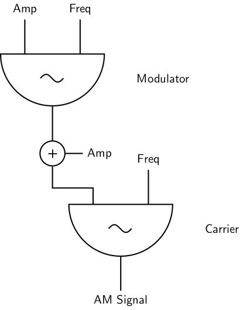

C. AMPLITUDE AND RING MODULATION
================================

Introduction
------------

Amplitude-modulation (AM) means, that one oscillator varies the
volume/amplitude of an other. 

\

::: {.group_img .image-layout-1image_1caption_bottom style="text-align: start;"}
::: {.image .bk-image-editor style="width: 434.347px; height: 554.709px;"}

:::

::: {.caption_small style="width: 434.347px;"}
Basic Model of Amplitude Modulation\
:::
:::

If this modulation is done very slowly (1 Hz to 10 Hz) it is recognised
as tremolo. Volume-modulation above 10 Hz leads to the effect, that the
sound changes its timbre. So called side-bands appear.

***EXAMPLE 04C01\_Simple\_AM.csd***

    <CsoundSynthesizer>
    <CsOptions>
    -o dac
    </CsOptions>
    <CsInstruments>

    sr = 48000
    ksmps = 32
    nchnls = 1
    0dbfs = 1

    instr 1
    aRaise expseg 2, 20, 100
    aModSine poscil 0.5, aRaise, 1
    aDCOffset = 0.5    ; we want amplitude-modulation
    aCarSine poscil 0.3, 440, 1
    out aCarSine*(aModSine + aDCOffset)
    endin

    </CsInstruments>
    <CsScore>
    f 1 0 1024 10 1
    i 1 0 25
    e
    </CsScore>
    </CsoundSynthesizer>
    ; written by Alex Hofmann (Mar. 2011)

Theory, Mathematics and Sidebands
---------------------------------

The side-bands appear on both sides of the main frequency. This means
(freq1-freq2) and (freq1+freq2) appear.

The sounding result of the following example can be calculated as this:
freq1 = 440Hz, freq2 = 40 Hz -\> The result is a sound with \[400, 440,
480\] Hz.

The amount of the sidebands can be controlled by a DC-offset of the
modulator.

***EXAMPLE 04C02\_Sidebands.csd***

    <CsoundSynthesizer>
    <CsOptions>
    -o dac
    </CsOptions>
    <CsInstruments>

    sr = 48000
    ksmps = 32
    nchnls = 1
    0dbfs = 1

    instr 1
    aOffset linseg 0, 1, 0, 5, 0.6, 3, 0
    aSine1 poscil 0.3, 40 , 1
    aSine2 poscil 0.3, 440, 1
    out (aSine1+aOffset)*aSine2
    endin

    </CsInstruments>
    <CsScore>
    f 1 0 1024 10 1
    i 1 0 10
    e
    </CsScore>
    </CsoundSynthesizer>
    ; written by Alex Hofmann (Mar. 2011)

Ring-modulation is a special-case of AM, without DC-offset (DC-Offset =
0). That means the modulator varies between -1 and +1 like the carrier.
The sounding difference to AM is, that RM doesn\'t contain the carrier
frequency.

::: {.group_img .image-layout-1image_1caption_bottom style="text-align: start;"}
::: {.image .bk-image-editor style="width: 674.023px; height: 379.923px;"}

:::

::: {.caption_small style="width: 674.023px;"}
Ring Modulation as Multiplication of two Signals\
:::
:::

(If the modulator is unipolar (oscillates between 0 and +1) the effect
is called AM.)

More Complex Synthesis using Ring Modulation and Amplitude Modulation
---------------------------------------------------------------------

If the modulator itself contains more harmonics, the resulting ring
modulated sound becomes more complex.

Carrier freq: 600 Hz\
Modulator freqs: 200Hz with 3 harmonics = \[200, 400, 600\] Hz\
Resulting freqs:  \[0, 200, 400, \<-600-\>, 800, 1000, 1200\]

***EXAMPLE 04C03\_RingMod.csd***

    <CsoundSynthesizer>
    <CsOptions>
    -o dac
    </CsOptions>
    <CsInstruments>

    sr = 48000
    ksmps = 32
    nchnls = 1
    0dbfs = 1

    instr 1   ; Ring-Modulation (no DC-Offset)
    aSine1 poscil 0.3, 200, 2 ; -> [200, 400, 600] Hz
    aSine2 poscil 0.3, 600, 1
    out aSine1*aSine2
    endin

    </CsInstruments>
    <CsScore>
    f 1 0 1024 10 1 ; sine
    f 2 0 1024 10 1 1 1; 3 harmonics
    i 1 0 5
    e
    </CsScore>
    </CsoundSynthesizer>
    ; written by Alex Hofmann (Mar. 2011)

Using an inharmonic modulator frequency also makes the result sound
inharmonic. Varying the DC-offset makes the sound-spectrum evolve over
time.\
Modulator freqs: \[230, 460, 690\]\
Resulting freqs:  \[ (-)90, 140, 370, \<-600-\>, 830, 1060, 1290\]\
(negative frequencies become mirrored, but phase inverted)

***EXAMPLE 04C04\_Evolving\_AM.csd***

    <CsoundSynthesizer>
    <CsOptions>
    -o dac
    </CsOptions>
    <CsInstruments>

    sr = 48000
    ksmps = 32
    nchnls = 1
    0dbfs = 1

    instr 1   ; Amplitude-Modulation
    aOffset linseg 0, 1, 0, 5, 1, 3, 0
    aSine1 poscil 0.3, 230, 2 ; -> [230, 460, 690] Hz
    aSine2 poscil 0.3, 600, 1
    out (aSine1+aOffset)*aSine2
    endin

    </CsInstruments>
    <CsScore>
    f 1 0 1024 10 1 ; sine
    f 2 0 1024 10 1 1 1; 3 harmonics
    i 1 0 10
    e
    </CsScore>
    </CsoundSynthesizer>
