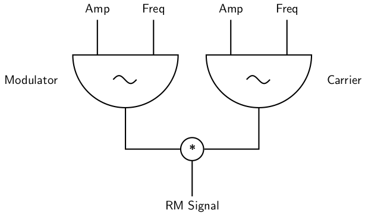

04 C. AMPLITUDE AND RING MODULATION
===================================

Introduction
------------

In *Amplitude Modulation* (AM) the amplitude of a *Carrier* oscillator is modulated by the output of another oscillator, called *Modulator*. So the carrier amplitude consists of a constant value, by tradition called *DC Offset*, and the modulator output which are added to each other.

{width=50%}

If this modulation is in the sub-audio range (less than 15 Hz), it is perceived
as periodic volume modification.[^1] 
Volume-modulation above approximately 15 Hz are perceived as timbre changes. So called *sidebands* appear. This transition is showed in the following example. The modulation frequency starts at 2 Hz and moves over 20 seconds to 100 Hz.

[^1]: For classical string instruments there is a *bow vibrato* which 
      resembles this effect. If the *DC Offset* is weak in comparison
      to the modulation output, the comparison in classical music is
      the *tremolo* effect. Also *pulsation* is often used to describe 
      AM with low frequencies.

   ***EXAMPLE 04C01_Simple_AM.csd***

~~~
<CsoundSynthesizer>
<CsOptions>
-o dac
</CsOptions>
<CsInstruments>

sr = 44100
ksmps = 32
nchnls = 2
0dbfs = 1

instr 1
 aRaise expseg 2, 20, 100
 aModulator poscil 0.3, aRaise
 iDCOffset = 0.3
 aCarrier poscil iDCOffset+aModulator, 440
 out aCarrier, aCarrier
endin

</CsInstruments>
<CsScore>
i 1 0 25
</CsScore>
</CsoundSynthesizer>
; example by Alex Hofmann and joachim heintz
~~~

Theory, Mathematics and Sidebands
---------------------------------

The sidebands appear on both sides of the carrier frequency $f_c$. 
The frequency of the side bands is the sum and the difference between the carrier frequency and the modulator frequency: $f_c - f_m$ and $f_c + f_m$. The amplitude of each sideband is half of the modulator's amplitude.

So the sounding result of the following example can be calculated as this:
$f_c$ = 440 Hz, $f_m$ = 40 Hz -\> The result is a sound with 400, 440, and
480 Hz. The sidebands have an amplitude of 0.2. The amplitude of the carrier frequency starts with 0.2, moves to 0.4, and finally moves to 0. Note that we use an alternative way of applying AM here, shown in the *AM2* instrument:

{width=50%}

It is equivalent to the signal flow in the first flow chart (*AM1* here). It takes one more line, but now you can substitute any audio signal as carrier, not only an oscillator. So this is the bridge to using AM for the modification of sampled sound as shown in [05F](05-f-am-rm-waveshaping.md).

   ***EXAMPLE 04C02_Sidebands.csd***

~~~
<CsoundSynthesizer>
<CsOptions>
-o dac
</CsOptions>
<CsInstruments>

sr = 44100
ksmps = 32
nchnls = 2
0dbfs = 1

instr AM1
 aDC_Offset linseg 0.2, 1, 0.2, 5, 0.4, 3, 0
 aModulator poscil 0.4, 40
 aCarrier poscil aDC_Offset+aModulator, 440
 out aCarrier, aCarrier
endin

instr AM2
 aDC_Offset linseg 0.2, 1, 0.2, 5, 0.4, 3, 0
 aModulator poscil 0.4, 40
 aCarrier poscil 1, 440
 aAM = aCarrier * (aModulator+aDC_Offset)
 out aAM, aAM
endin

</CsInstruments>
<CsScore>
i "AM1" 0 10
i "AM2" 11 10
</CsScore>
</CsoundSynthesizer>
; example by Alex Hofmann and joachim heintz
~~~

At the end of this example, when the *DC Offset* was zero, we reached Ring Modulation (RM). Ring Modulation can thus be considered as special case of Amplitude Modulation, without any DC Offset. This is the very simple model:[^2]

[^2]: Here expressed as multiplication. The alternative would be to feed
      the modulator's output in the amplitude input of the carrier.

{width=70%}

If Ring Modulation happens in the sub-audio domain (less than 10 Hz), it will be perceived as *tremolo*.[^3] If it happens in the audio-domain, we get a sound with *only* the sidebands.

[^3]: Note that the frequency of this tremolo in RM will be perceived twice as 
      much as the frequency in AM because every half sine in the modulating
      signal is perceived as an own period.

AM/RM of Complex Sounds
-----------------------

If either the carrier or the modulator contain more harmonics, the resulting amplitude or ring modulated sound becomes more complex, because of two reasons. First, each partial in the source sound is the origin of two sideband partials in the result. So for three harmonics in the origin we yield six (RM) or nine (AM) partials in the result. And second, the spectrum of the origin is *shifted* by the AM or RM in a characteristic way. This can be demonstrated at a simple example.

Given a carrier signal which consists of three harmonics: 400, 800 and 1200 Hz. The ratio of these partials is 1 : 2 : 3, so our ear will perceice them as based on 400 Hz as base frequency. Ring Modulation with a frequency of 100 will result in the frequencies 300, 500, 700, 900, 1100 and 1300 Hz. We have now also every 200 Hz a frequency, but 400 Hz is not any more the base of it. In case we modulate with a frequency of 50 Hz, we get 350, 450, 750, 850, 1150 and 1250 Hz, so again a shifted spectrum, definitely not with 400 Hz as base frequency. The next example plays these variants.

   ***EXAMPLE 04C03_RingMod.csd***

~~~
<CsoundSynthesizer>
<CsOptions>
-o dac
</CsOptions>
<CsInstruments>

sr = 44100
ksmps = 32
nchnls = 2
0dbfs = 1

instr Carrier
 aPartial_1 poscil .2, 400
 aPartial_2 poscil .2, 800
 aPartial_3 poscil .2, 1200
 gaCarrier sum aPartial_1, aPartial_2, aPartial_3
 ;only output this signal if RM is not playing
 if (active:k("RM") == 0) then
  out gaCarrier, gaCarrier
 endif
endin

instr RM
 iModFreq = p4
 aRM = gaCarrier * poscil:a(1,iModFreq)
 out aRM, aRM
endin

</CsInstruments>
<CsScore>
i "Carrier" 0 14
i "RM" 3 3 100
i "RM" 9 3 50
</CsScore>
</CsoundSynthesizer>
;example by joachim heintz
~~~

