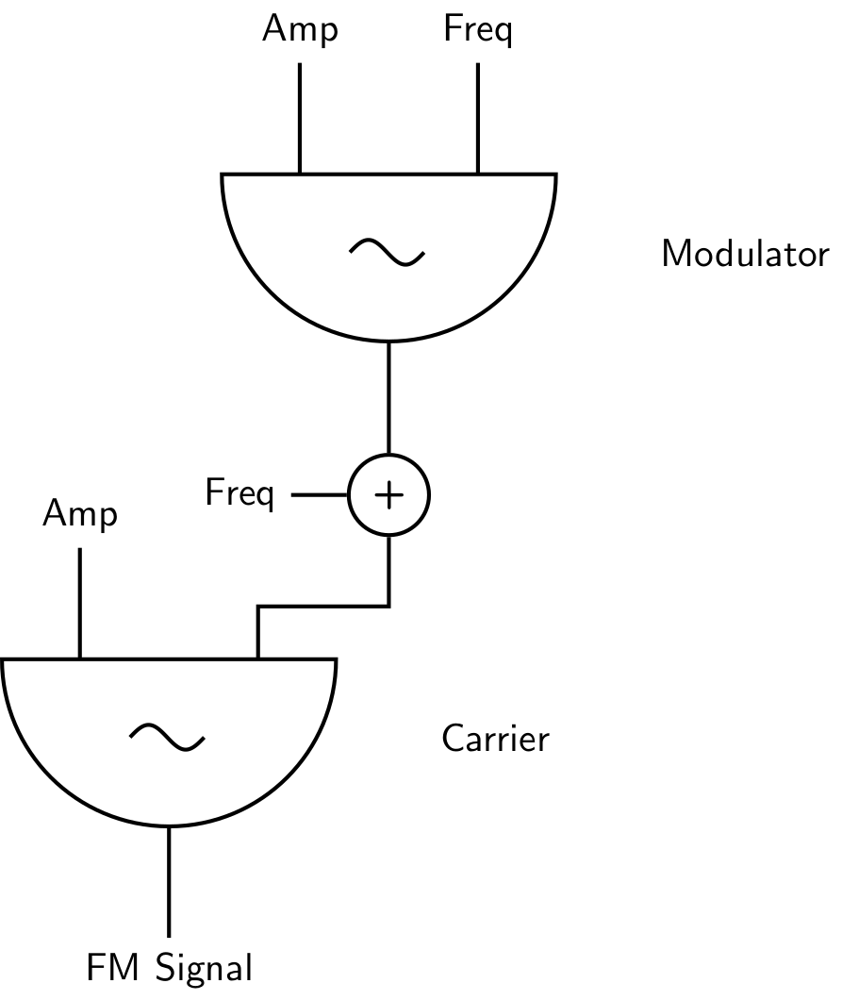
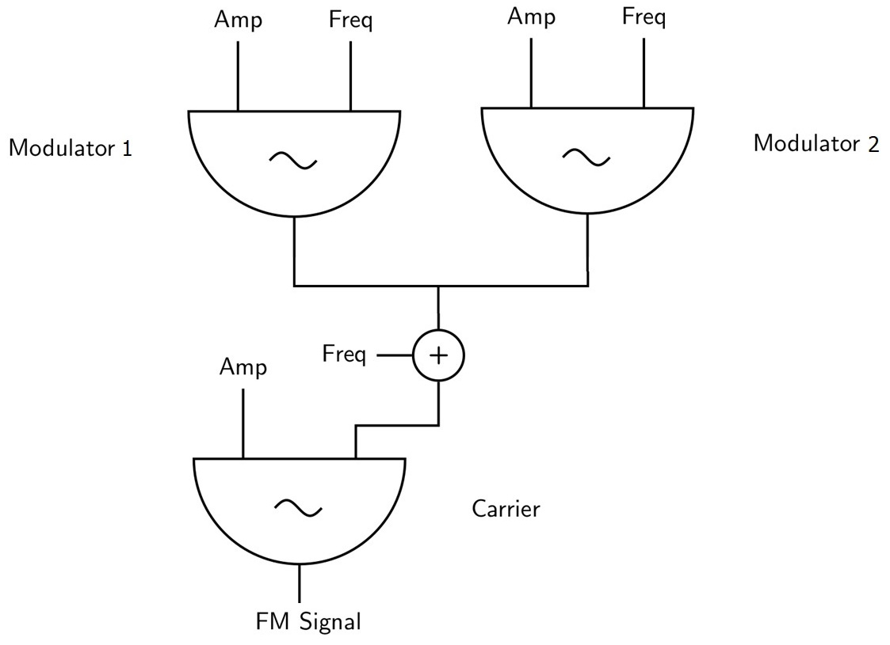
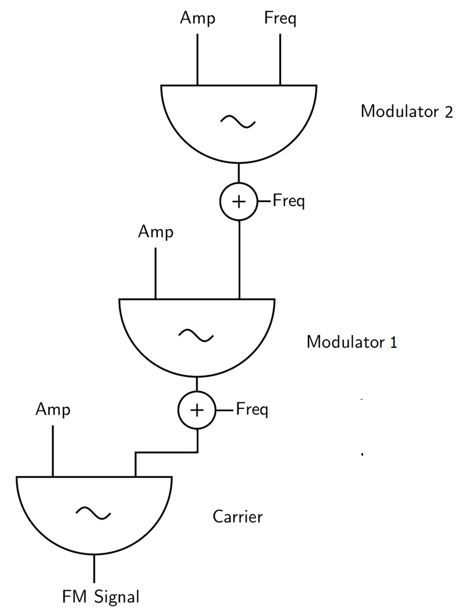
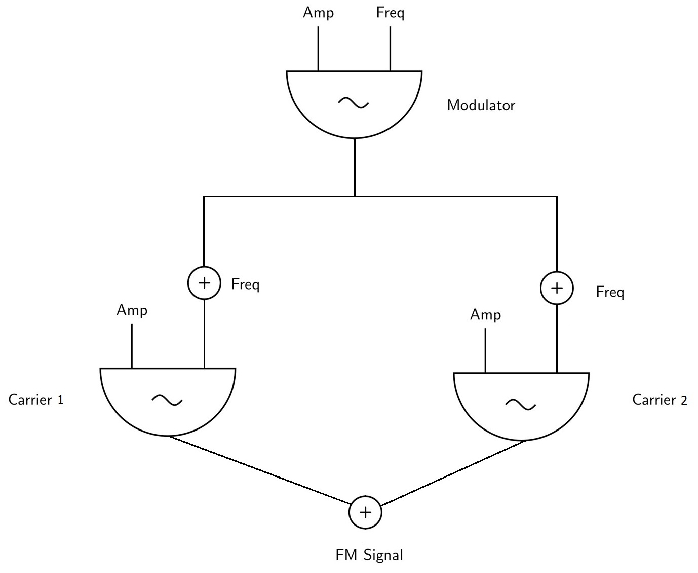

04 D. FREQUENCY MODULATION
==========================

Basic Model
-----------

In FM synthesis, the frequency of one oscillator (called the carrier) is
modulated by the signal from another oscillator (called the modulator).
The output of the modulating oscillator is added to the frequency input
of the carrier oscillator.

{width=50%}

The amplitude of the modulator determines the amount of modulation, or
the frequency deviation from the fundamental carrier frequency. The
frequency of the modulator determines how frequent the deviation will
occur in one second. The amplitude of the modulator determines the
amount of the deviation. An amplitude of 1 will alter the carrier
frequency by ±1 Hz, wheras an amplitude of 10 will alter the carrier
frequency by ±10 Hz. If the amplitude of the modulating signal is zero,
there is no modulation and the output from the carrier oscillator is
simply a sine wave with the frequency of the carrier. When modulation
occurs, the signal from the modulation oscillator, a sine wave with
frequency F~M~, drives the frequency of the carrier oscillator both
above and below the carrier frequency F~C~. If the modulator is
running in the sub-audio frequency range (below 20 Hz), the result of Modulation is vibrato. When the modulator's frequency rises in the audio range, we hear it as a change in the timbre of the carrier.

   ***EXAMPLE 04D01_Frequency_modulation.csd***

~~~Csound
<CsoundSynthesizer>
<CsOptions>
-o dac
</CsOptions>
<CsInstruments>

sr = 44100
ksmps = 32
nchnls = 2
0dbfs = 1

instr FM_vibr ;vibrato as the modulator is in the sub-audio range
 kModFreq randomi 5, 10, 1
 kCarAmp linen 0.5, 0.1, p3, 0.5
 aModulator poscil 20, kModFreq
 aCarrier poscil kCarAmp, 400 + aModulator
 out aCarrier, aCarrier
endin

instr FM_timbr ;timbre change as the modulator is in the audio range
 kModAmp linseg 0, p3/2, 212, p3/2, 50
 kModFreq line 25, p3, 300
 kCarAmp linen 0.5, 0.1, p3, 0.5
 aModulator poscil kModAmp, kModFreq
 aCarrier poscil kCarAmp, 400 + aModulator
 out aCarrier, aCarrier
endin

</CsInstruments>
<CsScore>
i "FM_vibr" 0 10
i "FM_timbr" 10 10
</CsScore>
</CsoundSynthesizer>
;example by marijana janevska
~~~

### Carrier/Modulator Ratio

The position of the frequency components generated by FM depends on the
relationship of the carrier frequency to the modulating frequency
F~C~:F~M~. This is called the ratio. When F~C~:F~M~ is a
simple integer ratio, such as 4:1 (as in the case of two signals at 400
and 100 Hz), FM generates harmonic spectra, that is sidebands that are
integer multiples of the carrier and modulator frequencies. When
F~C~:F~M~ is not a simple integer ratio, such as 8:2.1 (as in the
case of two signals at 800 and 210 Hz), FM generates inharmonic spectra
(noninteger multiples of the carrier and modulator).

   ***EXAMPLE 04D02_Ratio.csd***

~~~Csound
<CsoundSynthesizer>
<CsOptions>
-o dac
</CsOptions>
<CsInstruments>

sr = 44100
ksmps = 32
nchnls = 2
0dbfs = 1

instr Ratio
 kRatio = p4
 kCarFreq = 400
 kModFreq = kCarFreq/kRatio
 aModulator poscil 500, kModFreq
 aCarrier poscil 0.3, kCarFreq + aModulator
 aOut linen aCarrier, .1, p3, 1
 out aOut, aOut
endin

</CsInstruments>
<CsScore>
i 1 0 5 2
i . + . 2.1
</CsScore>
</CsoundSynthesizer>
;example written by marijana janevska
~~~

### Index of Modulation

FM of two sinusoids generates a series of sidebands around the carrier
frequency F~C~. Each sideband spreads out at a distance equal to a
multiple of the modulating frequency F~M~.

The bandwidth of the FM spectrum (the number of sidebands) is controlled
by the index of modulation $I$. The Index is defined mathematically
according to the following relation:

$I = A_M:F_M$

where A~M~ is the amount of frequency deviation (in Hz) from the
carrier frequency. Hence, A~M~ is a way of expressing the depth or
amount of modulation. The amplitude of each sideband depends on the
index of modulation. When there is no modulation, the index of
modulation is zero and all the signal power resides in the carrier
frequency. Increasing the value of the index causes the sidebands to
acquire more power at the expense of the power of the carrier frequency.
The wider the deviation, the more widely distributed is the power among
the sidebands and the greater the number of sidebands that have
significant amplitudes. The number of significant sideband pairs (those
that are more than 1/100 the amplitude of the carrier) is approximately
I+1. For certain values of the carrier and modulator frequencies and
Index, extreme sidebands reflect out of the upper and lower ends of the
spectrum, causing audible side effects. When the lower sidebands extend
below 0 Hz, they reflect back into the spectrum in 180 degree phase
inverted form. Negative frequency components add richness to the lower
frequency parts of the spectrum, but if negative components overlap
exactly with positive components, they can cancel each other. In simple
FM, both oscillators use sine waves as their source waveform, although
any waveform can be used. The FM can produce such rich spectra, that,
when one waveform with a large number of spectral components frequency
modulates another, the resulting sound can be so dense that it sounds
harsh and undefined. Aliasing can occur easily.

   ***EXAMPLE 04D03_Index.csd***

~~~Csound
<CsoundSynthesizer>
<CsOptions>
-o dac
</CsOptions>
<CsInstruments>

sr = 44100
ksmps = 32
nchnls = 2
0dbfs = 1

instr Rising_index
 kModAmp = 400
 kIndex linseg 3, p3, 8
 kModFreq = kModAmp/kIndex
 aModulator poscil kModAmp, kModFreq
 aCarrier poscil 0.3, 400 + aModulator
 aOut linen aCarrier, .1, p3, 1
 out aOut, aOut
endin

</CsInstruments>
<CsScore>
i "Rising_index" 0 10
</CsScore>
</CsoundSynthesizer>
;example by marijana janevska and joachim heintz
~~~

### Standard FM with Ratio and Index

In the basic FM model three variables are given: the frequency of the
carrier (F~C~ or simply C), the frequency of the modulator (F~M~
or simply M) and the amplitude of the modulator which results in the
frequency deviation (so A~M~ or D). By introducing the Ratio (C:M) and
the Index (D:M) as musically meaningful values, it makes sense to
transform the previous C, M and D input to C, R and I. C yields the base
(or perhaps better: middle) frequency of the sound, R yields the overall
characteristic of the timbre, I yields the emergence of the side bands.
The three musically meaningful input values can easily be transformed
into the basic model:

    if R = C : M then M = C : R and
    if I = D : M then D = I · M.

   ***EXAMPLE 04D04_Standard.csd***

~~~Csound
<CsoundSynthesizer>
<CsOptions>
-odac  -m128
</CsOptions>
<CsInstruments>

sr = 44100
ksmps = 32
nchnls = 2
0dbfs = 1

instr Standard

//input
 iC = 400
 iR = p4 ;ratio
 iI = p5 ;index
 prints "Ratio = %.3f, Index = %.3f\n", iR, iI

 //transform
 iM = iC / iR
 iD = iI * iM

 //apply to standard model
 aModulator poscil iD, iM
 aCarrier poscil 0.3, iC + aModulator
 aOut linen aCarrier, .1, p3, 1
 out aOut, aOut

endin

instr PlayMess

 kC randomi 300, 500, 1, 2, 400
 kR randomi 1, 2, 2, 3
 kI randomi 1, 5, randomi:k(3,10,1,3), 3

 //transform
 kM = kC / kR
 kD = kI * kM

 //apply to standard model
 aModulator poscil kD, kM
 aCarrier poscil ampdb(port:k(kI*5-30,.1)), kC + aModulator
 aOut linen aCarrier, .1, p3, p3/10
 out aOut, aOut

endin

</CsInstruments>
<CsScore>
//changing the ratio at constant index=3
i "Standard" 0 3 1 3
i . + . 1.41 .
i . + . 1.75 .
i . + . 2.07 .
s
//changing the index at constant ratio=3.3
i "Standard" 0 3 3.3 0
i . + . . 1
i . + . . 5
i . + . . 10
s
//let some nonsense happen
i "PlayMess" 0 30
</CsScore>
</CsoundSynthesizer>
;example by joachim heintz
~~~

### Using the foscil opcode

Basic FM synthesis can be implemented by using the [foscil](https://csound.com/docs/manual/foscil.html) opcode, which effectively connects two oscil opcodes in the familiar Chowning FM setup. In the example below *kDenominator* is a value that when multiplied by the *kCar* parameter, gives the Carrier frequency and when multiplied by the *kMod* parameter, gives the Modulating frequency.

   ***EXAMPLE 04D05_basic_FM_with_foscil.csd***

~~~Csound
<CsoundSynthesizer>
<CsOptions>
-odac -d
</CsOptions>
<CsInstruments>

sr = 44100
ksmps = 32
nchnls = 2
0dbfs = 1

giSine ftgen 0, 0, 8192, 10, 1

instr 1; basic FM using the foscil opcode
 kDenominator = 110
 kCar = 3
 kMod = 1
 kIndex randomi 1, 2, 20
 aFM foscil 0.1, kDenominator, kCar, kMod, kIndex, giSine
 outs aFM, aFM
endin

instr 2; basic FM with jumping (noisy) Denominator value
 kDenominator random 100, 120
 kCar = 3
 kMod = 1
 kIndex randomi 1, 2, 20
 aFM foscil 0.1, kDenominator, kCar, kMod, kIndex, giSine
 outs aFM, aFM
endin

instr 3; basic FM with jumping Denominator and moving Modulator
 kDenominator random 100, 120
 kCar = 3
 kMod randomi 0, 5, 100, 3
 kIndex randomi 1, 2, 20
 aFM foscil 0.1, kDenominator, kCar, kMod, kIndex, giSine
outs aFM, aFM
endin

</CsInstruments>
<CsScore>
i 1 0 10
i 2 12 10
i 3 24 10
</CsInstruments>
</CsScore>
</CsoundSynthesizer>
;example by Marijana Janevska
~~~

In the example above, in instr 1 the Carrier has a frequency of 330 Hz, the Modulator has a frequency of 110 Hz and the value of the index changes randomly between 1 and 2, 20 times a second. In instr 2, the value of the Denominator is not static. Its value changes randomly between 100 and 120, which makes all the other parameters’ values change (Carrier and Modulator frequencies and Index). In instr 3 we add a changing value to the parameter, that when multiplied with the Denominator value, gives the frequency of the Modulator, which gives even more complex spectra because it affects the value of the Index, too.

More Complex FM Algorithms
--------------------------

Combining more than two oscillators (operators) is called complex FM synthesis. Operators can be connected in different combinations: Multiple modulators FM and Multiple carriers FM.

### Multiple Modulators (MM FM)

In multiple modulator frequency modulation, more than one oscillator modulates a single carrier oscillator. The carrier is always the last operator in the row. Changing its pitch shifts the whole sound. All other operators are modulators, changing their pitch and especially amplitude alters the sound-spectrum. Two basic configurations are possible: parallel and serial. In parallel MM FM, two sinewaves simultaneously modulate a single carrier oscillator. The principle here is, that (Modulator1:Carrier) and (Modulator2:Carrier) will be separate modulations and later added together.

   ***EXAMPLE 04D06_Parallel_MM_FM.csd***

~~~Csound
<CsoundSynthesizer>
<CsOptions>
-odac
</CsOptions>
<CsInstruments>

sr = 44100
ksmps = 32
nchnls = 2
0dbfs = 1

instr parallel_MM_FM
 kAmpMod1 randomi 200, 500, 20
 aModulator1 poscil kAmpMod1, 700
 kAmpMod2 randomi 4, 10, 5
 kFreqMod2 randomi 7, 12, 2
 aModulator2 poscil kAmpMod2, kFreqMod2
 kFreqCar randomi 50, 80, 1, 3
 aCarrier poscil 0.2, kFreqCar+aModulator1+aModulator2
 out aCarrier, aCarrier
endin

</CsInstruments>
<CsScore>
i "parallel_MM_FM" 0 20
</CsScore>
</CsoundSynthesizer>
;example by Alex Hofmann and Marijana Janevska
~~~

In serial MM FM, the output of the first modulator is added with a fixed value and then fed to the second modulator, which then is applied to the frequency input of the carrier. This is much more complicated to calculate and the timbre becomes harder to predict, because Modulator1:Modulator2 produces a complex spectrum, which then modulates the carrier.

   ***EXAMPLE 04D07_Serial_MM_FM.csd***

~~~Csound
<CsoundSynthesizer>
<CsOptions>
-odac
</CsOptions>
<CsInstruments>

sr = 44100
ksmps = 32
nchnls = 2
0dbfs = 1

instr serial_MM_FM
 kAmpMod2 randomi 200, 1400, .5
 aModulator2 poscil kAmpMod2, 700
 kAmpMod1 linseg 400, 15, 1800
 aModulator1 poscil kAmpMod1, 290+aModulator2
 aCarrier poscil 0.2, 440+aModulator1
 outs aCarrier, aCarrier
endin

</CsInstruments>
<CsScore>
i "serial_MM_FM" 0 20
</CsScore>
</CsoundSynthesizer>
;example by Alex Hofmann and Marijana Janevska
~~~

### Multiple Carriers (MC FM)

By multiple carrier frequency modulation, we mean an FM instrument in which one modulator simultaneously modulates two or more carrier oscillators.

   ***EXAMPLE 04D08_MC_FM.csd***

~~~Csound
<CsoundSynthesizer>
<CsOptions>
-odac
</CsOptions>
<CsInstruments>

sr = 44100
ksmps = 32
nchnls = 2
0dbfs = 1

instr FM_two_carriers
 aModulator poscil 100, randomi:k(10,15,1,3)
 aCarrier1 poscil 0.3, 700 + aModulator
 aCarrier2 poscil 0.1, 701 + aModulator
 outs aCarrier1+aCarrier2, aCarrier1+aCarrier2
endin

</CsInstruments>
<CsScore>
i "FM_two_carriers" 0 20
</CsScore>
</CsoundSynthesizer>
;example by Marijana Janevska
~~~

### The John Chowning FM Model of a Trumpet

Composer and researcher Jown Chowning worked on the first digital implementation of FM in the 1970's. By using envelopes to control the modulation index and the overall amplitude evolving sounds with enormous spectral variations can be created. Chowning showed these possibilities in his pieces, in which various sound transformations occur. In the piece Sabelithe a drum sound morphes over the time into a trumpet tone. In the example below, the amplitude of the Modulator has a complex envelope in the attack of the sound, which gives the trumpet-like timbre.

   ***EXAMPLE 04D09_Trumpet.csd***

~~~Csound
<CsoundSynthesizer>
<CsOptions>
-o dac
</CsOptions>
<CsInstruments>

sr = 44100
ksmps = 32
nchnls = 2
0dbfs = 1

instr simple_trumpet
 kCarFreq = 440
 kModFreq = 440
 kIndex = 5
 kIndexM = 0
 kMaxDev = kIndex*kModFreq
 kMinDev = kIndexM * kModFreq
 kVarDev = kMaxDev-kMinDev
 aEnv expseg .001, 0.2, 1, p3-0.3, 1, 0.2, 0.001
 aModAmp = kMinDev+kVarDev*aEnv
 aModulator poscil aModAmp, kModFreq
 aCarrier poscil 0.3*aEnv, kCarFreq+aModulator
 outs aCarrier, aCarrier
endin

</CsInstruments>
<CsScore>
i 1 0 2
</CsScore>
</CsoundSynthesizer>
;example by Alex Hofmann
~~~

The following example uses the same instrument, with different settings to generate a bell-like sound:

   ***EXAMPLE 04D10_Bell.csd***

~~~Csound
<CsoundSynthesizer>
<CsOptions>
-o dac
</CsOptions>
<CsInstruments>

sr = 44100
ksmps = 32
nchnls = 2
0dbfs = 1

instr bell_like
 kCarFreq = 200  ; 200/280 = 5:7 -> inharmonic spectrum
 kModFreq = 280
 kIndex = 12
 kIndexM = 0
 kMaxDev = kIndex*kModFreq
 kMinDev = kIndexM * kModFreq
 kVarDev = kMaxDev-kMinDev
 aEnv expseg .001, 0.001, 1, 0.3, 0.5, 8.5, .001
 aModAmp = kMinDev+kVarDev*aEnv
 aModulator poscil aModAmp, kModFreq
 aCarrier poscil 0.3*aEnv, kCarFreq+aModulator
 outs aCarrier, aCarrier
endin

</CsInstruments>
<CsScore>
i "bell_like" 0 9
</CsScore>
</CsoundSynthesizer>
;example by Alex Hofmann
~~~

### Phase Modulation - the Yamaha DX7 and Feedback FM

There is a strong relation between frequency modulation and phase modulation, as both techniques influence the oscillator's pitch, and the resulting timbre modifications are the same.

For a feedback FM system, it can happen that the self-modulation comes to a zero point, which would hang the whole system. To avoid this, the carriers table-lookup phase is modulated, instead of its pitch.

Also the most famous FM-synthesizer Yamaha DX7 is based on the phase-modulation (PM) technique, because this allows feedback. The DX7 provides 7 operators, and offers 32 routing combinations of these (cf <http://yala.freeservers.com/t2synths.htm#DX7>).

To build a PM-synth in Csound the tablei opcode substitutes the FM oscillator. In order to step through the f-table, a phasor will output the necessary steps.

   ***EXAMPLE 04D11_Phase modulation and Feedback FM.csd***

~~~Csound
<CsoundSynthesizer>
<CsOptions>
-o dac
</CsOptions>
<CsInstruments>

sr = 44100
ksmps = 32
nchnls = 2
0dbfs = 1

giSine ftgen 0, 0, 8192, 10, 1

instr PM
 kCarFreq = 200
 kModFreq = 280
 kModFactor = kCarFreq/kModFreq
 kIndex = 12/6.28   ;  12/2pi to convert from radians to norm. table index
 aEnv expseg .001, 0.001, 1, 0.3, 0.5, 8.5, .001
 aModulator poscil kIndex*aEnv, kModFreq
 aPhase phasor kCarFreq
 aCarrier tablei aPhase+aModulator, giSine, 1, 0, 1
 out aCarrier*aEnv, aCarrier*aEnv
endin

</CsInstruments>
<CsScore>
i "PM" 0 9
</CsScore>
</CsoundSynthesizer>
;example by Alex Hofmann
~~~

In the last example we use the possibilities of self-modulation (feedback-modulation) of the oscillator. So here the oscillator is both modulator and carrier. To control the amount of modulation, an envelope scales the feedback.

   ***EXAMPLE 04D12_Feedback modulation.csd***

~~~Csound
<CsoundSynthesizer>
<CsOptions>
-o dac
</CsOptions>
<CsInstruments>

sr = 44100
ksmps = 32
nchnls = 2
0dbfs = 1

giSine ftgen 0, 0, 8192, 10, 1

instr feedback_PM
 kCarFreq = 200
 kFeedbackAmountEnv linseg 0, 2, 0.2, 0.1, 0.3, 0.8, 0.2, 1.5, 0
 aAmpEnv expseg .001, 0.001, 1, 0.3, 0.5, 8.5, .001
 aPhase phasor kCarFreq
 aCarrier init 0 ; init for feedback
 aCarrier tablei aPhase+(aCarrier*kFeedbackAmountEnv), giSine, 1, 0, 1
 outs aCarrier*aAmpEnv, aCarrier*aAmpEnv
endin

</CsInstruments>
<CsScore>
i "feedback_PM" 0 9
</CsScore>
</CsoundSynthesizer>
;example by Alex Hofmann
~~~
