04 G. PHYSICAL MODELLING
========================

With physical modelling we employ a completely different approach to
synthesis than we do with all other standard techniques. Unusually the
focus is not primarily to produce a sound, but to model a physical
process and if this process exhibits certain features such as periodic
oscillation within a frequency range of 20 to 20000 Hz, it will produce
sound.

Physical modelling synthesis techniques do not build sound using wave
tables, oscillators and audio signal generators, instead they attempt to
establish a model, as a system in itself, which can then produce sound
because of how the system varies with time. A physical model usually
derives from the real physical world, but could be any time-varying
system. Physical modelling is an exciting area for the production of new
sounds.

Compared with the complexity of a real-world physically dynamic system a
physical model will most likely represent a brutal simplification.
Nevertheless, using this technique will demand a lot of formulae,
because physical models are described in terms of mathematics. Although
designing a model may require some considerable work, once established
the results commonly exhibit a lively tone with time-varying partials
and a "natural" difference between attack and release by their very
design - features that other synthesis techniques will demand more from
the end user in order to establish.

Csound already contains many ready-made physical models as opcodes but
you can still build your own from scratch. This chapter will look at how
to implement two classical models from first principles and then
introduce a number of Csound's ready made physical modelling opcodes.

The Mass-Spring Model[^1]
-------------------------

[^1]:  The explanation here follows chapter 8.1.1 of Martin Neukom's
       *Signale Systeme Klangsynthese* (Bern 2003)

Many oscillating processes in nature can be modelled as connections of
masses and springs. Imagine one mass-spring unit which has been set into
motion. This system can be described as a sequence of states, where
every new state results from the two preceding ones. Assumed the first
state *a0* is 0 and the second state *a1* is 0.5. Without the
restricting force of the spring, the mass would continue moving
unimpeded following a constant velocity:

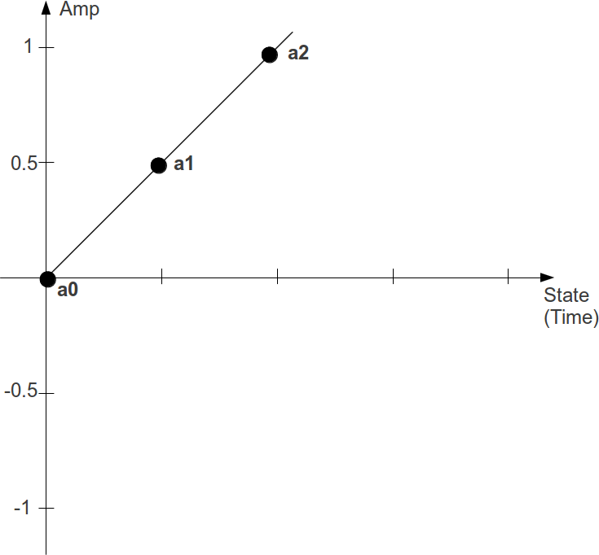{width=50%}

As the velocity between the first two states can be described as
$a_1 - a_0$, the value of the third state $a_2$ will be:

$a_2 = a_1 + (a_1 - a_0) = 0.5 + 0.5 = 1$

But, the spring pulls the mass back with a force which increases the
further the mass moves away from the point of equilibrium. Therefore the
masses movement can be described as the product of a constant factor $c$
and the last position $a1$. This damps the continuous movement of the
mass so that for a factor of c=0.4 the next position will be:

$a_2 = (a_1 + (a_1 - a_0)) - c * a_1 = 1 - 0.2 = 0.8$

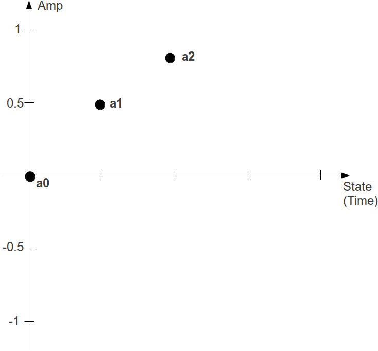{width=50%}

Csound can easily calculate the values by simply applying the formulae.
For the first k-cycle[^2], they are set via the
[init](https://csound.com/docs/manual/init.html) opcode. After
calculating the new state, *a1* becomes *a0* and *a2* becomes *a1* for
the next k-cycle. In the next csd the new values will be printed five
times per second (the states are named here as *k0/k1/k2* instead of
*a0/a1/a2*, because k-rate values are needed for printing instead of
audio samples).

[^2]:  See chapter
       [03A](03-a-initialization-and-performance-pass.md)
       for more information about Csound's performance loops.

   ***EXAMPLE 04G01_Mass_spring_sine.csd***

~~~csound
<CsoundSynthesizer>
<CsOptions>
-n ;no sound
</CsOptions>
<CsInstruments>
sr = 44100
ksmps = 8820 ;5 steps per second

instr PrintVals
 ;initial values
 kstep init 0
 k0 init 0
 k1 init 0.5
 kc init 0.4
 ;calculation of the next value
 k2 = k1 + (k1 - k0) - kc * k1
 printks "Sample=%d: k0 = %.3f, k1 = %.3f, k2 = %.3f\n", 0, kstep, k0, k1, k2
 ;actualize values for the next step
 kstep = kstep+1
 k0 = k1
 k1 = k2
endin

</CsInstruments>
<CsScore>
i "PrintVals" 0 10
</CsScore>
</CsoundSynthesizer>
;example by joachim heintz
~~~

The output starts with:

    State=0:  k0 =  0.000,  k1 =  0.500,  k2 =  0.800
    State=1:  k0 =  0.500,  k1 =  0.800,  k2 =  0.780
    State=2:  k0 =  0.800,  k1 =  0.780,  k2 =  0.448
    State=3:  k0 =  0.780,  k1 =  0.448,  k2 = -0.063
    State=4:  k0 =  0.448,  k1 = -0.063,  k2 = -0.549
    State=5:  k0 = -0.063,  k1 = -0.549,  k2 = -0.815
    State=6:  k0 = -0.549,  k1 = -0.815,  k2 = -0.756
    State=7:  k0 = -0.815,  k1 = -0.756,  k2 = -0.393
    State=8:  k0 = -0.756,  k1 = -0.393,  k2 =  0.126
    State=9:  k0 = -0.393,  k1 =  0.126,  k2 =  0.595
    State=10: k0 =  0.126,  k1 =  0.595,  k2 =  0.826
    State=11: k0 =  0.595,  k1 =  0.826,  k2 =  0.727
    State=12: k0 =  0.826,  k1 =  0.727,  k2 =  0.337

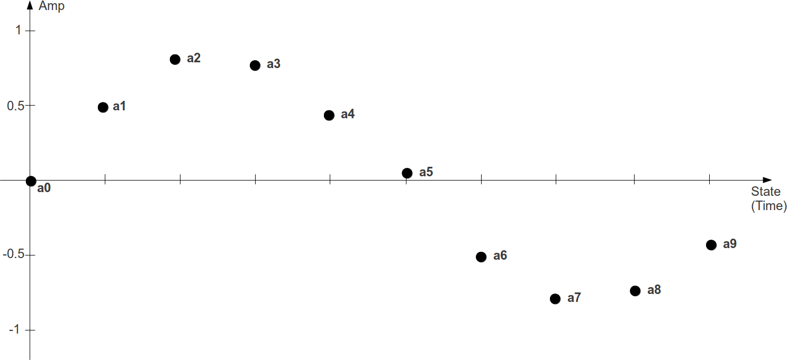

So, a sine wave has been created, without the use of any of Csound's
oscillators...

Here is the audible proof:

   ***EXAMPLE 04G02_MS_sine_audible.csd***

~~~csound
<CsoundSynthesizer>
<CsOptions>
-odac
</CsOptions>
<CsInstruments>
sr = 44100
ksmps = 1
nchnls = 2
0dbfs = 1

instr MassSpring
 ;initial values
 a0        init      0
 a1        init      0.05
 ic        =         0.01 ;spring constant
 ;calculation of the next value
 a2        =         a1+(a1-a0) - ic*a1
           outs      a0, a0
 ;actualize values for the next step
 a0        =         a1
 a1        =         a2
endin
</CsInstruments>
<CsScore>
i "MassSpring" 0 10
</CsScore>
</CsoundSynthesizer>
;example by joachim heintz, after martin neukom
~~~

As the next sample is calculated in the next control cycle, either
[ksmps](https://csound.com/docs/manual/ksmps.html) has to be set to
1, or a
[setksmps](https://csound.com/docs/manual/setksmps.html)
statement must be set in the instrument, with the same effect.
The resulting frequency depends on the spring constant: the higher
the constant, the higher the frequency. The resulting amplitude depends
on both, the starting value and the spring constant.

This simple model shows the basic principle of a physical modelling
synthesis: creating a system which produces sound because it varies in
time. Certainly it is not the goal of physical modelling synthesis to
reinvent the wheel of a sine wave. But modulating the parameters of a
model may lead to interesting results. The next example varies the
spring constant, which is now no longer a constant:

   ***EXAMPLE 04G03_MS_variable_constant.csd***

~~~csound
<CsoundSynthesizer>
<CsOptions>
-odac
</CsOptions>
<CsInstruments>
sr = 44100
ksmps = 32
nchnls = 2
0dbfs = 1

instr MassSpring
 ;set ksmps=1 in this instrument
 setksmps 1
 ;initial values
 a0        init      0
 a1        init      0.05
 kc        randomi   .001, .05, 8, 3
 ;calculation of the next value
 a2        =         a1+(a1-a0) - kc*a1
           outs      a0, a0
 ;actualize values for the next step
 a0        =         a1
 a1        =         a2
endin
</CsInstruments>
<CsScore>
i "MassSpring" 0 10
</CsScore>
</CsoundSynthesizer>
;example by joachim heintz
~~~

Working with physical modelling demands thought in more physical or
mathematical terms: examples of this might be if you were to change the
formula when a certain value of $c$ had been reached, or combine more
than one spring.

Implementing Simple Physical Systems
------------------------------------

This text shows how to get oscillators and filters from simple physical
models by recording the position of a point (mass) of a physical system.
The behavior of a particle (mass on a spring, mass of a pendulum, etc.)
is described by its position, velocity and acceleration. The
mathematical equations, which describe the movement of such a point, are
*differential equations*. In what follows, we describe how to derive
time discrete system equations (also called difference equations) from
physical models (described by differential equations). At every time
step we first calculate the acceleration of a mass and then its new
velocity and position. This procedure is called Euler's method and
yields good results for low frequencies compared to the sampling rate
(better approximations are achieved with the improved Euler's method or
the Runge--Kutta methods).

### Integrating the Trajectory of a Point

Velocity $v$ is the difference of positions $x$ per time unit $T$,
acceleration $a$ the difference of velocities $v$ per time unit $T$:

$v_t = (x_t - x_{t-1} )/T, a_t = (v_t - v_{t-1})/T$

Putting T = 1 we get

$v_t~ = x_t - x_{t-1}, a_t~ = v_t - v_{t-1}$

If we know the position and velocity of a point at time $t - 1$ and are
able to calculate its acceleration at time $t$ we can calculate the
velocity $v_t$ and the position $x_t$ at time $t$:

$v_t = v_{t-1} + a_t$
and
$x_t = x_{t-1} + v_t$

With the following algorithm we calculate a sequence of successive
positions *x*:

    1. init x and v
    2. calculate a
    3. v += a       ; v = v + a
    4. x += v       ; x = x + v

Example 1: The acceleration of gravity is constant (*g* = --9.81ms^-2^).
For a mass with initial position *x* = 300m (above ground) and velocity
*v* = 70ms^-1^ (upwards) we get the following trajectory (path)

    g = -9.81; x = 300; v = 70; Table[v += g; x += v, {16}];

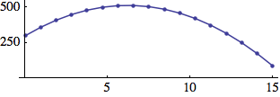

Example 2: The acceleration *a* of a mass on a spring is proportional
(with factor --*c*) to its position (deflection) *x*.

    x = 0; v = 1; c = .3; Table[a = -c*x; v += a; x += v, {22}];

### Introducing damping

Since damping is proportional to the velocity we reduce velocity at
every time step by a certain amount *d*:

    v *= (1 - d)

Example 3: Spring with damping (see *lin_reson.csd* below):

    d = 0.2; c = .3; x = 0; v = 1;
    Table[a = -c*x; v += a; v *= (1 - d); x += v, {22}];

The factor *c* can be calculated from the frequency *f*:

$c = 2 - \sqrt{4 - d^2} cos(2\pi f/sr)$

### Introducing excitation

In the examples 2 and 3 the systems oscillate because of their initial
velocity *v* = 1. The resultant oscillation is the impulse response of
the systems. We can excite the systems continuously by adding a value
*exc* to the velocity at every time step.

    v += exc;

Example 4: Damped spring with random excitation (resonator with noise as
input)

    d = .01; s = 0; v = 0;  
    Table[a = -.3*s; v += a; v += RandomReal[{-1, 1}]; 
    v *= (1 - d); s += v, {61}];

   ***EXAMPLE 04G04_lin_reson.csd***

~~~csound
<CsoundSynthesizer>
<CsOptions>
-odac
</CsOptions>
<CsInstruments>
sr = 44100
ksmps = 32
nchnls = 1
0dbfs = 1

opcode  lin\_reson, a, akk
setksmps 1
avel    init    0               ;velocity
ax      init    0               ;deflection x
ain,kf,kdamp    xin
kc      =       2-sqrt(4-kdamp\^2)*cos(kf*2*$M\_PI/sr)
aacel   =       -kc*ax
avel    =       avel+aacel+ain
avel    =       avel*(1-kdamp)
ax      =       ax+avel
        xout    ax
endop

instr 1
aexc    rand    p4
aout    lin\_reson       aexc,p5,p6
        out     aout
endin

</CsInstruments>
<CsScore>
;               p4              p5      p6
;               excitaion       freq    damping
i1 0 5          .0001           440     .0001
</CsScore>
</CsoundSynthesizer>
;example by martin neukom
~~~

### Introducing nonlinear acceleration

Example 5: The acceleration of a pendulum depends on its deflection
(angle *x*).

    a = c*sin(x)

This figure shows the function --.3sin(*x*)

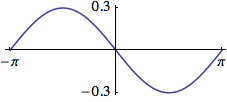

The following trajectory shows that the frequency decreases with
encreasing amplitude and that the pendulum can turn around.

    d = .003; s = 0; v = 0;
    Table[a = f[s]; v += a; v += RandomReal[{-.09, .1}]; v *= (1 - d);
    s += v, {400}];

We can implement systems with accelerations that are arbitrary functions
of position *x*.

Example 6: *a* = *f*(*x*) = -- *c*~1~x + *c*~2~sin(*c*~3~x)

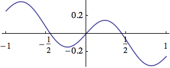

    d = .03; x = 0; v = 0;  Table[a = f[x]; v += a; 
    v += RandomReal[{-.1, .1}]; v *= (1 - d);   x += v, {400}];

   ***EXAMPLE 04G05_nonlin_reson.csd***

~~~csound
<CsoundSynthesizer>
<CsOptions>
-odac
</CsOptions>
<CsInstruments>

sr = 44100
ksmps = 32
nchnls = 1
0dbfs = 1

; simple damped nonlinear resonator
opcode nonlin_reson, a, akki
setksmps 1
avel    init 0                  ;velocity
adef    init 0                  ;deflection
ain,kc,kdamp,ifn xin
aacel   tablei  adef, ifn, 1, .5 ;acceleration = -c1*f1(def)
aacel   =       -kc*aacel
avel    =       avel+aacel+ain  ;vel += acel + excitation
avel    =       avel*(1-kdamp)
adef    =       adef+avel
        xout    adef
endop

instr 1
kenv    oscil           p4,.5,1
aexc    rand            kenv
aout    nonlin_reson    aexc,p5,p6,p7
        out             aout
endin

</CsInstruments>
<CsScore>
f1 0 1024 10 1
f2 0 1024 7 -1 510 .15 4 -.15 510 1
f3 0 1024 7 -1 350 .1 100 -.3 100 .2 100 -.1 354 1
;               p4              p5      p6      p7
;               excitation      c1      damping ifn
i1 0 20         .0001           .01     .00001   3
;i1 0 20        .0001           .01     .00001   2
</CsScore>
</CsoundSynthesizer>
;example by martin neukom
~~~

### The Van der Pol Oscillator

While attempting to explain the nonlinear dynamics of vacuum tube
circuits, the Dutch electrical engineer Balthasar van der Pol derived
the differential equation

$d^2 x / d t^2 = -\omega^2 x + \mu(1 - x^2) dx/dt$
(where $d^2 x /d t^2 =$ accelleration and $dx/dt$ = velocity)

The equation describes a linear oscillator d^2^*x*/d*t*^2^ =
--ω^2^*x* with an additional nonlinear term μ(1 -- x^2^)d*x*/d*t*. When
\|*x*\| \> 1, the nonlinear term results in damping, but when \|*x*\| \<
1, negative damping results, which means that energy is introduced into
the system.

Such oscillators compensating for energy loss by an inner energy source
are called *self-sustained oscillators*.

    v = 0; x = .001; ω = 0.1; μ = 0.25;
    snd = Table[v += (-ω^2*x + μ*(1 - x^2)*v); x += v, {200}];

The constant ω is the angular frequency of the linear oscillator (μ =
0). For a simulation with sampling rate *sr* we calculate the frequency
*f* in Hz as

$f = \omega · sr/2\pi$

Since the simulation is only an approximation of the oscillation this
formula gives good results only for low frequencies. The exact frequency
of the simulation is

$f = arccos(1 - \omega^2/2) · sr/2\pi$

We get $\omega^2$ from frequency $f$ as

$2 - 2cos(f · 2\pi/sr)$

With increasing μ the oscillations nonlinearity becomes stronger and
more overtones arise (and at the same time the frequency becomes lower).
The following figure shows the spectrum of the oscillation for various
values of μ.

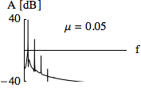

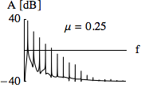

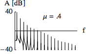

Certain oscillators can be synchronized either by an external force or
by mutual influence. Examples of synchronization by an external force
are the control of cardiac activity by a pace maker and the adjusting of
a clock by radio signals. An example for the mutual synchronization of
oscillating systems is the coordinated clapping of an audience. These
systems have in common that they are not linear and that they oscillate
without external excitation (*self-sustained* oscillators).

The UDO *v_d_p* represents a Van der Pol oscillator with a natural
frequency *kfr* and a nonlinearity factor *kmu*. It can be excited by a
sine wave of frequency *kfex* and amplitude *kaex*. The range of
frequency within which the oscillator is synchronized to the exciting
frequency increases as *kmu* and *kaex* increase.

   ***EXAMPLE 04G06_van_der_pol.csd***

~~~csound
<CsoundSynthesizer>
<CsOptions>
-odac
</CsOptions>
<CsInstruments>

sr = 44100
ksmps = 32
nchnls = 2
0dbfs = 1

;Van der Pol Oscillator ;outputs a nonliniear oscillation
;inputs: a_excitation, k_frequency in Hz (of the linear part),
;nonlinearity (0 < mu < ca. 0.7)
opcode v_d_p, a, akk
 setksmps 1
 av init 0
 ax init 0
 ain,kfr,kmu xin
 kc = 2-2*cos(kfr*2*$M_PI/sr)
 aa = -kc*ax + kmu*(1-ax*ax)*av
 av = av + aa
 ax = ax + av + ain
 xout ax
endop

instr 1
 kaex = .001
 kfex = 830
 kamp = .15
 kf = 455
 kmu linseg 0,p3,.7
 a1 poscil kaex,kfex
 aout v\_d\_p a1,kf,kmu
 out kamp*aout,a1*100
endin

</CsInstruments>
<CsScore>
i1 0 20
</CsScore>
</CsoundSynthesizer>
;example by martin neukom, adapted by joachim heintz
~~~

The variation of the phase difference between excitation and
oscillation, as well as the transitions between synchronous, beating and
asynchronous behaviors, can be visualized by showing the sum of the
excitation and the oscillation signals in a phase diagram. The following
figures show to the upper left the waveform of the Van der Pol
oscillator, to the lower left that of the excitation (normalized) and to
the right the phase diagram of their sum. For these figures, the same
values were always used for *kfr*, *kmu* and *kaex*. Comparing the first
two figures, one sees that the oscillator adopts the exciting frequency
*kfex* within a large frequency range. When the frequency is low (figure
a), the phases of the two waves are nearly the same. Hence there is a
large deflection along the *x*-axis in the phase diagram showing the sum
of the waveforms. When the frequency is high, the phases are nearly
inverted (figure b) and the phase diagram shows only a small deflection.
The figure c shows the transition to asynchronous behavior. If the
proportion between the natural frequency of the oscillator *kfr* and the
excitation frequency kfex is approximately simple (*kfex*/kfr ≅
*m*/*n*), then within a certain range the frequency of the Van der Pol
oscillator is synchronized so that *kfex*/kfr = *m*/*n*. Here one speaks
of higher order synchronization (figure d).

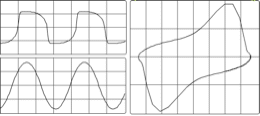

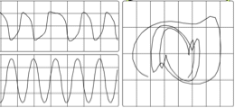

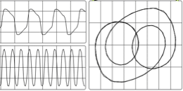

The Karplus-Strong Algorithm: Plucked String
--------------------------------------------

The Karplus-Strong algorithm provides another simple yet interesting
example of how physical modelling can be used to synthesized sound. A
buffer is filled with random values of either +1 or -1. At the end of
the buffer, the mean of the first and the second value to come out of
the buffer is calculated. This value is then put back at the beginning
of the buffer, and all the values in the buffer are shifted by one
position.

This is what happens for a buffer of five values, for the first five
steps:

  ---------------- ------ ---- ---- ---- ----
   initial state    1     -1   1    1    -1
   step 1           0      1   -1   1    1
   step 2           1      0   1    -1   1
   step 3           0      1   0    1    -1
   step 4           0      0   1    0    1
   step 5           0.5    0   0    1    0
  ---------------- ------ ---- ---- ---- ----

The next Csound example represents the content of the buffer in a
function table, implements and executes the algorithm, and prints the
result after each five steps which here is referred to as one cycle:

   ***EXAMPLE 04G07_KarplusStrong.csd***

~~~csound
<CsoundSynthesizer>
<CsOptions>
-n
</CsOptions>
<CsInstruments>
sr = 44100
ksmps = 32
nchnls = 1
0dbfs = 1

  opcode KS, 0, ii
  ;performs the karplus-strong algorithm
iTab, iTbSiz xin
;calculate the mean of the last two values
iUlt      tab\_i     iTbSiz-1, iTab
iPenUlt   tab\_i     iTbSiz-2, iTab
iNewVal   =         (iUlt + iPenUlt) / 2
;shift values one position to the right
indx      =         iTbSiz-2
loop:
iVal      tab\_i     indx, iTab
          tabw\_i    iVal, indx+1, iTab
          loop\_ge   indx, 1, 0, loop
;fill the new value at the beginning of the table
          tabw\_i    iNewVal, 0, iTab
  endop

  opcode PrintTab, 0, iiS
  ;prints table content, with a starting string
iTab, iTbSiz, Sin xin
indx      =         0
Sout      strcpy    Sin
loop:
iVal      tab_i     indx, iTab
Snew      sprintf   "%8.3f", iVal
Sout      strcat    Sout, Snew
          loop\_lt   indx, 1, iTbSiz, loop
          puts      Sout, 1
  endop

instr ShowBuffer
;fill the function table
iTab      ftgen     0, 0, -5, -2, 1, -1, 1, 1, -1
iTbLen    tableng   iTab
;loop cycles (five states)
iCycle    =         0
cycle:
Scycle    sprintf   "Cycle %d:", iCycle
          PrintTab  iTab, iTbLen, Scycle
;loop states
iState    =         0
state:
          KS        iTab, iTbLen
          loop\_lt   iState, 1, iTbLen, state
          loop\_lt   iCycle, 1, 10, cycle
endin

</CsInstruments>
<CsScore>
i "ShowBuffer" 0 1
</CsScore>
</CsoundSynthesizer>
;example by joachim heintz
~~~

This is the output:

    Cycle 0:   1.000  -1.000   1.000   1.000  -1.000
    Cycle 1:   0.500   0.000   0.000   1.000   0.000
    Cycle 2:   0.500   0.250   0.000   0.500   0.500
    Cycle 3:   0.500   0.375   0.125   0.250   0.500
    Cycle 4:   0.438   0.438   0.250   0.188   0.375
    Cycle 5:   0.359   0.438   0.344   0.219   0.281
    Cycle 6:   0.305   0.398   0.391   0.281   0.250
    Cycle 7:   0.285   0.352   0.395   0.336   0.266
    Cycle 8:   0.293   0.318   0.373   0.365   0.301
    Cycle 9:   0.313   0.306   0.346   0.369   0.333

It can be seen clearly that the values get smoothed more and more from
cycle to cycle. As the buffer size is very small here, the values tend
to come to a constant level; in this case 0.333. But for larger buffer
sizes, after some cycles the buffer content has the effect of a period
which is repeated with a slight loss of amplitude. This is how it
sounds, if the buffer size is 1/100 second (or 441 samples at sr=44100):

   ***EXAMPLE 04G08_Plucked.csd***

~~~csound
<CsoundSynthesizer>
<CsOptions>
-odac
</CsOptions>
<CsInstruments>
sr = 44100
ksmps =  1
nchnls = 2
0dbfs = 1

instr 1
;delay time
iDelTm    =         0.01
;fill the delay line with either -1 or 1 randomly
kDur      timeinsts
 if kDur < iDelTm then
aFill     rand      1, 2, 1, 1 ;values 0-2
aFill     =         floor(aFill)*2 - 1 ;just -1 or +1
          else
aFill     =         0
 endif
;delay and feedback
aUlt      init      0 ;last sample in the delay line
aUlt1     init      0 ;delayed by one sample
aMean     =         (aUlt+aUlt1)/2 ;mean of these two
aUlt      delay     aFill+aMean, iDelTm
aUlt1     delay1    aUlt
          outs      aUlt, aUlt
endin

</CsInstruments>
<CsScore>
i 1 0 60
</CsScore>
</CsoundSynthesizer>
;example by joachim heintz, after martin neukom
~~~

This sound resembles a plucked string: at the beginning the sound is
noisy but after a short period of time it exhibits periodicity. As can
be heard, unless a natural string, the steady state is virtually
endless, so for practical use it needs some fade-out. The frequency the
listener perceives is related to the length of the delay line. If the
delay line is 1/100 of a second, the perceived frequency is 100 Hz.
Compared with a sine wave of similar frequency, the inherent periodicity
can be seen, and also the rich overtone structure:

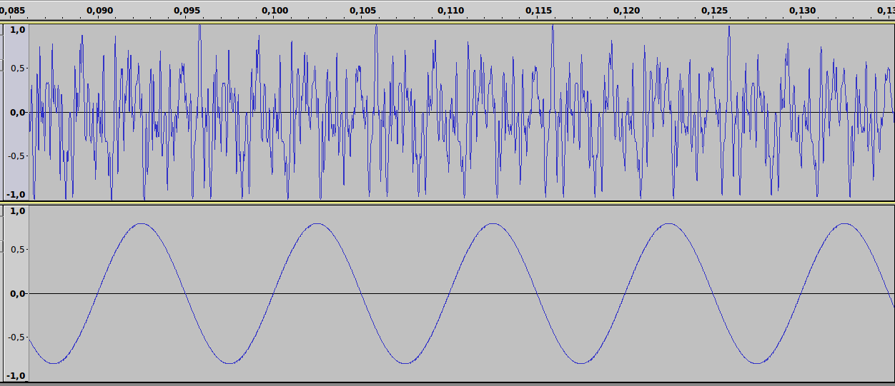

Csound Opcodes for Physical Modelling
-------------------------------------

Csound contains over forty opcodes which provide a wide variety of
ready-made physical models and emulations. A small number of them will
be introduced here to give a brief overview of the sort of things
available.

### wgbow - A Waveguide Emulation of a Bowed String by Perry Cook

Perry Cook is a prolific author of physical models and a lot of his work
has been converted into Csound opcodes. A number of these models
[wgbow](https://csound.com/docs/manual/wgbow.html),
[wgflute](https://csound.com/docs/manual/wgflute.html),
[wgclar](https://csound.com/docs/manual/wgclar.html)
[wgbowedbar](https://csound.com/docs/manual/wgbowedbar.html) and
[wgbrass](https://csound.com/docs/manual/wgbrass.html) are based on
waveguides. A waveguide, in its broadest sense, is some sort of
mechanism that limits the extend of oscillations, such as a vibrating
string fixed at both ends or a pipe. In these sorts of physical model a
delay is used to emulate these limits. One of these,
[wgbow](https://csound.com/docs/manual/wgbow.html), implements an
emulation of a bowed string. Perhaps the most interesting aspect of many
physical models in not specifically whether they emulate the target
instrument played in a conventional way accurately but the facilities
they provide for extending the physical limits of the instrument and how
it is played - there are already vast sample libraries and software
samplers for emulating conventional instruments played conventionally.
[wgbow](https://csound.com/docs/manual/wgbow.html) offers several
interesting options for experimentation including the ability to
modulate the bow pressure and the bowing position at k-rate. Varying bow
pressure will change the tone of the sound produced by changing the
harmonic emphasis. As bow pressure reduces, the fundamental of the tone
becomes weaker and overtones become more prominent. If the bow pressure
is reduced further the ability of the system to produce a resonance at
all collapse. This boundary between tone production and the inability to
produce a tone can provide some interesting new sound effect. The
following example explores this sound area by modulating the bow
pressure parameter around this threshold. Some additional features to
enhance the example are that 7 different notes are played
simultaneously, the bow pressure modulations in the right channel are
delayed by a varying amount with respect top the left channel in order
to create a stereo effect and a reverb has been added.

   ***EXAMPLE 04G09_wgbow.csd***

~~~csound
<CsoundSynthesizer>
<CsOptions>
-odac
</CsOptions>
<CsInstruments>
sr      =       44100
ksmps   =       32
nchnls  =       2
0dbfs   =       1
        seed    0

gisine  ftgen   0,0,4096,10,1

gaSendL,gaSendR init 0

 instr 1 ; wgbow instrument
kamp     =        0.3
kfreq    =        p4
ipres1   =        p5
ipres2   =        p6
; kpres (bow pressure) defined using a random spline
kpres    rspline  p5,p6,0.5,2
krat     =        0.127236
kvibf    =        4.5
kvibamp  =        0
iminfreq =        20
; call the wgbow opcode
aSigL    wgbow    kamp,kfreq,kpres,krat,kvibf,kvibamp,gisine,iminfreq
; modulating delay time
kdel     rspline  0.01,0.1,0.1,0.5
; bow pressure parameter delayed by a varying time in the right channel
kpres    vdel_k   kpres,kdel,0.2,2
aSigR    wgbow    kamp,kfreq,kpres,krat,kvibf,kvibamp,gisine,iminfreq
         outs     aSigL,aSigR
; send some audio to the reverb
gaSendL  =        gaSendL + aSigL/3
gaSendR  =        gaSendR + aSigR/3
 endin

 instr 2 ; reverb
aRvbL,aRvbR reverbsc gaSendL,gaSendR,0.9,7000
            outs     aRvbL,aRvbR
            clear    gaSendL,gaSendR
 endin

</CsInstruments>
<CsScore>
; instr. 1
;  p4 = pitch (hz.)
;  p5 = minimum bow pressure
;  p6 = maximum bow pressure
; 7 notes played by the wgbow instrument
i 1  0 480  70 0.03 0.1
i 1  0 480  85 0.03 0.1
i 1  0 480 100 0.03 0.09
i 1  0 480 135 0.03 0.09
i 1  0 480 170 0.02 0.09
i 1  0 480 202 0.04 0.1
i 1  0 480 233 0.05 0.11
; reverb instrument
i 2 0 480
</CsScore>
</CsoundSynthesizer>
;example by Iain McCurdy
~~~

This time a stack of eight sustaining notes, each separated by an
octave, vary their *bowing position* randomly and independently. You
will hear how different bowing positions accentuates and attenuates
different partials of the bowing tone. To enhance the sound produced
some filtering with [tone](https://csound.com/docs/manual/tone.html)
and [pareq](https://csound.com/docs/manual/pareq.html) is employed
and some reverb is added.

   ***EXAMPLE 04G10_wgbow_enhanced.csd***

~~~csound
<CsoundSynthesizer>
<CsOptions>
-odac
</CsOptions>
<CsInstruments>
sr      =       44100
ksmps   =       32
nchnls  =       2
0dbfs   =       1
        seed    0

gisine  ftgen   0,0,4096,10,1

gaSend init 0

 instr 1 ; wgbow instrument
kamp     =        0.1
kfreq    =        p4
kpres    =        0.2
krat     rspline  0.006,0.988,0.1,0.4
kvibf    =        4.5
kvibamp  =        0
iminfreq =        20
aSig     wgbow    kamp,kfreq,kpres,krat,kvibf,kvibamp,gisine,iminfreq
aSig     butlp     aSig,2000
aSig     pareq    aSig,80,6,0.707
         outs     aSig,aSig
gaSend   =        gaSend + aSig/3
 endin

 instr 2 ; reverb
aRvbL,aRvbR reverbsc gaSend,gaSend,0.9,7000
            outs     aRvbL,aRvbR
            clear    gaSend
 endin

</CsInstruments>
<CsScore>
; instr. 1 (wgbow instrument)
;  p4 = pitch (hertz)
; wgbow instrument
i 1  0 480  20
i 1  0 480  40
i 1  0 480  80
i 1  0 480  160
i 1  0 480  320
i 1  0 480  640
i 1  0 480  1280
i 1  0 480  2460
; reverb instrument
i 2 0 480
</CsScore>
</CsoundSynthesizer>
;example by Iain McCurdy
~~~

All of the wg- family of opcodes are worth exploring and often the
approach taken here - exploring each input parameter in isolation whilst
the others retain constant values - sets the path to understanding the
model better. Tone production with
[wgbrass](https://csound.com/docs/manual/wgbrass.html) is very much
dependent upon the relationship between intended pitch and lip tension,
random experimentation with this opcode is as likely to result in
silence as it is in sound and in this way is perhaps a reflection of the
experience of learning a brass instrument when the student spends most
time push air silently through the instrument. With patience it is
capable of some interesting sounds however. In its case, I would
recommend building a realtime GUI and exploring the interaction of its
input arguments that way.
[wgbowedbar](https://csound.com/docs/manual/wgbowedbar.html), like a
number of physical modelling algorithms, is rather unstable. This is not
necessary a design flaw in the algorithm but instead perhaps an
indication that the algorithm has been left quite open for out
experimentation - or abuse. In these situation caution is advised in
order to protect ears and loudspeakers. Positive feedback within the
model can result in signals of enormous amplitude very quickly.
Employment of the [clip](https://csound.com/docs/manual/clip.html)
opcode as a means of some protection is recommended when experimenting
in realtime.

### barmodel - a Model of a Struck Metal Bar by Stefan Bilbao

[barmodel](https://csound.com/docs/manual/barmodel.html) can also
imitate wooden bars, tubular bells, chimes and other resonant inharmonic
objects. [barmodel](https://csound.com/docs/manual/barmodel.html) is
a model that can easily be abused to produce ear shreddingly loud sounds
therefore precautions are advised when experimenting with it in
realtime. We are presented with a wealth of input arguments such as
*stiffness*, *strike position* and *strike velocity*, which relate
in an easily understandable way to the physical process we are
emulating. Some parameters will evidently have more of a dramatic effect
on the sound produced than other and again it is recommended to create a
realtime GUI for exploration. Nonetheless, a fixed example is provided
below that should offer some insight into the kinds of sounds possible.

Probably the most important parameter for us is the stiffness of the
bar. This actually provides us with our pitch control and is not in
cycle-per-second so some experimentation will be required to find a
desired pitch. There is a relationship between stiffness and the
parameter used to define the width of the strike - when the stiffness
coefficient is higher a wider strike may be required in order for the
note to sound. Strike width also impacts upon the tone produced,
narrower strikes generating emphasis upon upper partials (provided a
tone is still produced) whilst wider strikes tend to emphasize the
fundamental).

The parameter for strike position also has some impact upon the spectral
balance. This effect may be more subtle and may be dependent upon some
other parameter settings, for example, when strike width is particularly
wide, its effect may be imperceptible. A general rule of thumb here is
that in order to achieve the greatest effect from strike position,
strike width should be as low as will still produce a tone. This kind of
interdependency between input parameters is the essence of working with
a physical model that can be both intriguing and frustrating.

An important parameter that will vary the impression of the bar from
metal to wood is

An interesting feature incorporated into the model in the ability to
modulate the point along the bar at which vibrations are read. This
could also be described as pick-up position. Moving this scanning
location results in tonal and amplitude variations. We just have control
over the frequency at which the scanning location is modulated.

   ***EXAMPLE 04G11_barmodel.csd***

~~~csound
<CsoundSynthesizer>
<CsOptions>
-odac
</CsOptions>
<CsInstruments>
sr     = 44100
ksmps  = 32
nchnls = 2
0dbfs  = 1

 instr   1
; boundary conditions 1=fixed 2=pivot 3=free
kbcL    =               1
kbcR    =               1
; stiffness
iK      =               p4
; high freq. loss (damping)
ib      =               p5
; scanning frequency
kscan   rspline         p6,p7,0.2,0.8
; time to reach 30db decay
iT30    =               p3
; strike position
ipos    random          0,1
; strike velocity
ivel    =               1000
; width of strike
iwid    =               0.1156
aSig    barmodel        kbcL,kbcR,iK,ib,kscan,iT30,ipos,ivel,iwid
kPan    rspline         0.1,0.9,0.5,2
aL,aR   pan2            aSig,kPan
        outs             aL,aR
 endin

</CsInstruments>

<CsScore>
;t 0 90 1 30 2 60 5 90 7 30
; p4 = stiffness (pitch)

\#define gliss(dur'Kstrt'Kend'b'scan1'scan2)
\#
i 1 0     20 $Kstrt $b $scan1 $scan2
i 1 \^+0.05 $dur >     $b $scan1 $scan2
i 1 \^+0.05 $dur >     $b $scan1 $scan2
i 1 \^+0.05 $dur >     $b $scan1 $scan2
i 1 \^+0.05 $dur >     $b $scan1 $scan2
i 1 \^+0.05 $dur >     $b $scan1 $scan2
i 1 \^+0.05 $dur >     $b $scan1 $scan2
i 1 \^+0.05 $dur >     $b $scan1 $scan2
i 1 \^+0.05 $dur >     $b $scan1 $scan2
i 1 \^+0.05 $dur >     $b $scan1 $scan2
i 1 \^+0.05 $dur >     $b $scan1 $scan2
i 1 \^+0.05 $dur >     $b $scan1 $scan2
i 1 \^+0.05 $dur >     $b $scan1 $scan2
i 1 \^+0.05 $dur >     $b $scan1 $scan2
i 1 \^+0.05 $dur >     $b $scan1 $scan2
i 1 \^+0.05 $dur >     $b $scan1 $scan2
i 1 \^+0.05 $dur >     $b $scan1 $scan2
i 1 \^+0.05 $dur $Kend $b $scan1 $scan2
\#
$gliss(15'40'400'0.0755'0.1'2)
b 5
$gliss(2'80'800'0.755'0'0.1)
b 10
$gliss(3'10'100'0.1'0'0)
b 15
$gliss(40'40'433'0'0.2'5)
e
</CsScore>
</CsoundSynthesizer>
; example written by Iain McCurdy
~~~

### PhISEM - Physically Inspired Stochastic Event Modeling

The PhiSEM set of models in Csound, again based on the work of Perry
Cook, imitate instruments that rely on collisions between smaller sound
producing object to produce their sounds. These models include a
[tambourine](https://csound.com/docs/manual/tambourine.html), a set
of [bamboo](https://csound.com/docs/manual/bamboo.html) windchimes
and [sleighbells.](https://csound.com/docs/manual/sleighbells.html)
These models algorithmically mimic these multiple collisions internally
so that we only need to define elements such as the number of internal
elements (timbrels, beans, bells etc.) internal damping and resonances.
Once again the most interesting aspect of working with a model is to
stretch the physical limits so that we can hear the results from, for
example, a maraca with an impossible number of beans, a tambourine with
so little internal damping that it never decays. In the following
example I explore
[tambourine](https://csound.com/docs/manual/tambourine.html),
[bamboo](https://csound.com/docs/manual/bamboo.html) and
[sleighbells](https://csound.com/docs/manual/sleighbells.html) each
in turn, first in a state that mimics the source instrument and then
with some more extreme conditions.

   ***EXAMPLE 04G12_PhiSEM.csd***

~~~csound
<CsoundSynthesizer>
<CsOptions>
-odac
</CsOptions>
<CsInstruments>
sr     = 44100
ksmps  = 32
nchnls = 1
0dbfs  = 1

 instr  1 ; tambourine
iAmp      =           p4
iDettack  =           0.01
iNum      =           p5
iDamp     =           p6
iMaxShake =           0
iFreq     =           p7
iFreq1    =           p8
iFreq2    =           p9
aSig      tambourine  iAmp,iDettack,iNum,iDamp,iMaxShake,iFreq,iFreq1,iFreq2
          out         aSig
 endin

 instr  2 ; bamboo
iAmp      =           p4
iDettack  =           0.01
iNum      =           p5
iDamp     =           p6
iMaxShake =           0
iFreq     =           p7
iFreq1    =           p8
iFreq2    =           p9
aSig      bamboo      iAmp,iDettack,iNum,iDamp,iMaxShake,iFreq,iFreq1,iFreq2
          out         aSig
 endin

 instr  3 ; sleighbells
iAmp      =           p4
iDettack  =           0.01
iNum      =           p5
iDamp     =           p6
iMaxShake =           0
iFreq     =           p7
iFreq1    =           p8
iFreq2    =           p9
aSig      sleighbells iAmp,iDettack,iNum,iDamp,iMaxShake,iFreq,iFreq1,iFreq2
          out         aSig
 endin

</CsInstruments>
<CsScore>
; p4 = amp.
; p5 = number of timbrels
; p6 = damping
; p7 = freq (main)
; p8 = freq 1
; p9 = freq 2

; tambourine
i 1 0 1 0.1  32 0.47 2300 5600 8100
i 1 + 1 0.1  32 0.47 2300 5600 8100
i 1 + 2 0.1  32 0.75 2300 5600 8100
i 1 + 2 0.05  2 0.75 2300 5600 8100
i 1 + 1 0.1  16 0.65 2000 4000 8000
i 1 + 1 0.1  16 0.65 1000 2000 3000
i 1 8 2 0.01  1 0.75 1257 2653 6245
i 1 8 2 0.01  1 0.75  673 3256 9102
i 1 8 2 0.01  1 0.75  314 1629 4756

b 10

; bamboo
i 2 0 1 0.4 1.25 0.0  2800 2240 3360
i 2 + 1 0.4 1.25 0.0  2800 2240 3360
i 2 + 2 0.4 1.25 0.05 2800 2240 3360
i 2 + 2 0.2   10 0.05 2800 2240 3360
i 2 + 1 0.3   16 0.01 2000 4000 8000
i 2 + 1 0.3   16 0.01 1000 2000 3000
i 2 8 2 0.1    1 0.05 1257 2653 6245
i 2 8 2 0.1    1 0.05 1073 3256 8102
i 2 8 2 0.1    1 0.05  514 6629 9756

b 20

; sleighbells
i 3 0 1 0.7 1.25 0.17 2500 5300 6500
i 3 + 1 0.7 1.25 0.17 2500 5300 6500
i 3 + 2 0.7 1.25 0.3  2500 5300 6500
i 3 + 2 0.4   10 0.3  2500 5300 6500
i 3 + 1 0.5   16 0.2  2000 4000 8000
i 3 + 1 0.5   16 0.2  1000 2000 3000
i 3 8 2 0.3    1 0.3  1257 2653 6245
i 3 8 2 0.3    1 0.3  1073 3256 8102
i 3 8 2 0.3    1 0.3   514 6629 9756
e
</CsScore>
</CsoundSynthesizer>
; example written by Iain McCurdy
~~~

Physical modelling can produce rich, spectrally dynamic sounds with user
manipulation usually abstracted to a small number of descriptive
parameters. Csound offers a wealth of other opcodes for physical
modelling which cannot all be introduced here so the user is encouraged
to explore based on the approaches exemplified here. You can find lists
in the chapters
[Models and Emulations](https://csound.com/docs/manual/SiggenModels.html),
[Scanned Synthesis](https://csound.com/docs/manual/SiggenScanTop.html) and
[Waveguide Physical Modeling](https://csound.com/docs/manual/SiggenWavguide.html) of the
[Csound Manual](https://csound.com/docs/manual/index.html).
