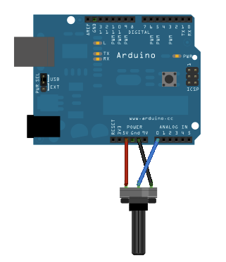
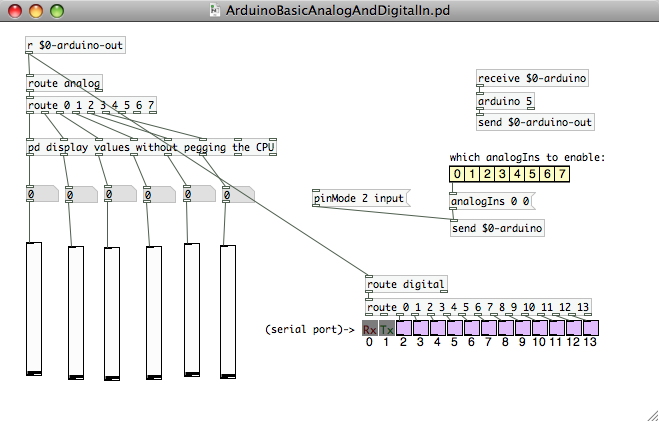
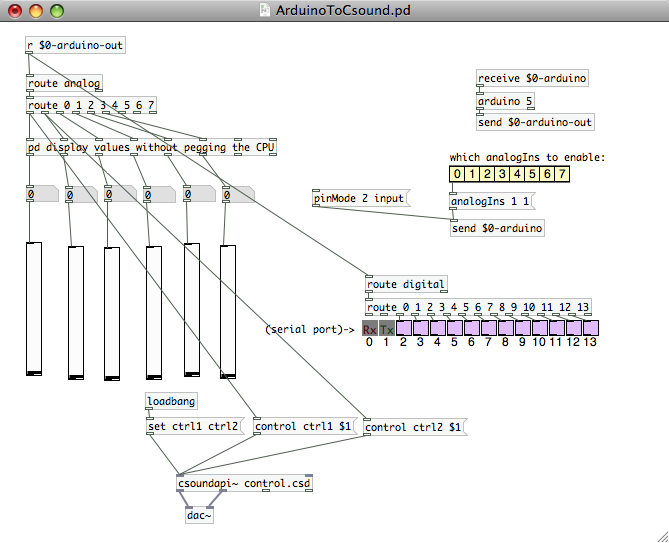
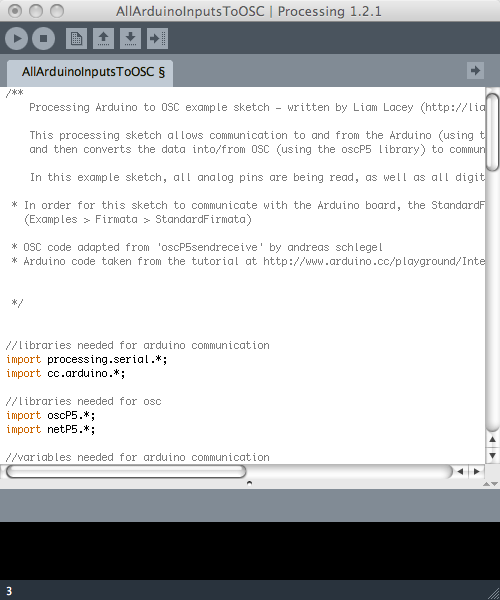
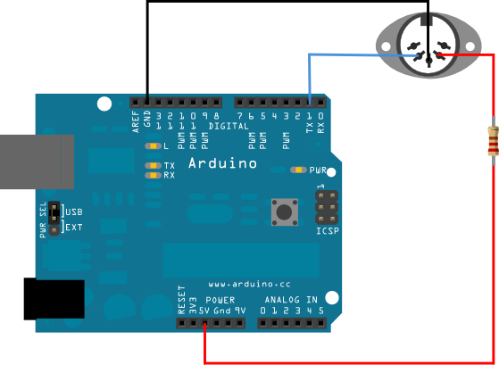

08 B. CSOUND AND ARDUINO
========================

It is the intention of this chapter to suggest a number of ways in which
Csound can be paired with an Arduino prototyping circuit board. It is
not the intention of this chapter to go into any detail about how to use
an Arduino, there is already a wealth of information available elsewhere
online about this. It is common to use an Arduino and Csound with
another program functioning as an interpreter, so therefore some time is
spent discussing these other programs.

An Arduino is a simple microcontroller circuit board that has become
enormously popular as a component in multidisciplinary and interactive
projects for musicians and artists since its introduction in 2005. An
Arduino board can be programmed to do many things and to send and
receive data to and from a wide variety of other components and devices.
As such it is impossible to specifically define its function here. An
Arduino is normally programmed using its own development environment
(IDE). A program is written on a computer which is then uploaded to the
Arduino; the Arduino then runs this program, independent of the computer
if necessary. Arduino\'s IDE is based on that used by
[Processing](https://processing.org "Wiring") and
[Wiring](http://wiring.org.co/ "Wiring"). Arduino programs are often
referred to as \"sketches\". There now exists a plethora of Arduino
variants and even a number of derivatives and clones but all function in
more or less the same way.

Interaction between an Arduino and Csound is essentially a question of
communication and as such a number of possible solutions exist. This
chapter will suggest several possibilities and it will then be up to the
user to choose the one most suitable for their requirements. Most
Arduino boards communicate using serial communication (normally via a
USB cable). A number of Arduino programs, called \"Firmata\", exist that
are intended to simplify and standardise communication between Arduinos
and software. Through the use of a Firmata the complexity of Arduino\'s
serial communication is shielded from the user and a number of simpler
objects, ugens or opcodes (depending on what the secondary software is)
can instead be used to establish communication. Unfortunately Csound is
rather poorly served with facilities to communicate using the Firmata
(although this will hopefully improve in the future) so it might prove
easiest to use another program (such as Pd or Processing) as an
intermediary between the Arduino and Csound.

Arduino - Pd - Csound
---------------------

First we will consider communication between an Arduino (running a
Standard Firmata) and Pd. Later we can consider the options for further
communication from Pd to Csound.

Assuming that the [Arduino
IDE](https://www.arduino.cc/en/main/software "Wiring") (integrated
development environment) has been installed and that the Arduino has
been connected, we should then open and upload a Firmata sketch. One can
normally be found by going to File -\> Examples -\> Firmata -\> \...
There will be a variety of flavours from which to choose but
\"StandardFirmata\" should be a good place to start. Choose the
appropriate Arduino board type under Tools -\> Board -\> \... and then
choose the relevant serial port under Tools -\> Serial Port -\> \...
Choosing the appropriate serial port may require some trial and error
but if you have chosen the wrong one this will become apparent when you
attempt to upload the sketch. Once you have established the correct
serial port to use, it is worth taking a note of which number on the
list (counting from zero) this corresponds to as this number will be
used by Pd to communicate with the Arduino. Finally upload the sketch by
clicking on the right-pointing arrow button.

::: {.group_img}
::: {.image}

:::
:::

Assuming that [Pd](http://puredata.info/downloads "Wiring") is already
installed, it will also be necessary to install an add-on library for Pd
called [Pduino](http://puredata.info/downloads/pduino "Wiring"). Follow
its included instructions about where to place this library on your
platform and then reopen Pd. You will now have access to a set of Pd
objects for communicating with your Arduino. The Pduino download will
also have included a number of examples Pd. \"arduino-test.pd\" will
probably be the best patch to start. First set the appropriate serial
port number to establish communication and then set Arduino pins as
\"input\", \"output\" etc. as you desire. It is beyond the scope of this
chapter to go into further detail regarding setting up an Arduino with
sensors and auxiliary components, suffice to say that communication to
an Arduino is normally tested by \'blinking\' digital pin 13 and
communication from an Arduino is normally tested by connecting a 10
kilo-ohm (10k) potentiometer to analog pin zero. For the sake of
argument, we shall assume in this tutorial that we are setting the
Arduino as a hardware controller and have a potentiometer connected to
pin 0.

::: {.group_img}
::: {.image}
 
:::
:::

This picture below demonstrates a simple Pd patch that uses Pduino\'s
objects to receive communication from Arduino\'s analog and digital
inputs. (Note that digital pins 0 and 1 are normally reserved for serial
communication if the USB serial communication is unavailable.) In this
example serial port \'5\' has been chosen. Once the analogIns enable box
for pin 0 is checked, moving the potentiometer will change the values in
the left-most number box (and move the slider connected to it).
Arduino\'s analog inputs generate integers with 10-bit resolution (0 -
1023) but these values will often be rescaled as floats within the range
0 - 1 in the host program for convenience.

::: {.group_img}
::: {.image}

:::
:::

::: {.group_img}
::: {.image}

:::
:::

Having established communication between the Arduino and Pd we can now
consider the options available to us for communicating between Pd and
Csound. The most obvious (but not necessarily the best or most flexible)
method is to use Pd\'s csoundapi\~ object (csound6\~ in Csound6). The
above example could be modified to employ csoundapi\~ as shown below.

::: {.group_img}
::: {.image}

:::
:::

The outputs from the first two Arduino analog controls are passed into
Csound using its API. Note that we should use the unpegged (not
quantised in time) values directly from the \'route\' object. The Csound
.csd file \'control.csd\' is called upon by Pd and it should reside in
the same directory as the Pd patch. Establishing communication to and
from Pd could employ code such as that shown below. Data from controller
one (Arduino analog 0) is used to modulate the amplitude of an
oscillator and data from controller two (Arduino analog 1) varies its
pitch across a four octave range.

***EXAMPLE 08B01\_Pd\_to\_Csound.csd***

    <CsoundSynthesizer>

    <CsOptions>
    </CsOptions>

    <CsInstruments>

    sr = 44100
    nchnls = 2
    0dbfs = 1
    ksmps = 32

     instr 1
    ; read in controller data from Pd via the API using 'invalue'
    kctrl1  invalue  "ctrl1"
    kctrl2  invalue  "ctrl2"
    ; re-range controller values from 0 - 1 to 7 - 11
    koct    =        (kctrl2*4)+7
    ; create an oscillator
    a1      vco2     kctrl1,cpsoct(koct),4,0.1
            outs     a1,a1
     endin
    </CsInstruments>

    <CsScore>
    i 1 0 10000
    e
    </CsScore>

    </CsoundSynthesizer>

Communication from Pd into Csound is established using the
[invalue](http://www.csounds.com/manual/html/invalue.html "Wiring")
opcodes and audio is passed back to Pd from Csound using
[outs](http://www.csounds.com/manual/html/outs.html "Wiring"). Note that
Csound does not address the computer\'s audio hardware itself but merely
passes audio signals back to Pd. Greater detail about using Csound
within Pd can be found in the chapter [Csound in
Pd](http://en.flossmanuals.net/csound/csound-in-pd/ "Wiring").

A disadvantage of using the method is that in order to modify the Csound
patch it will require being edited in an external editor, re-saved, and
then the Pd patch will need to be reloaded to reflect these changes.
This workflow might be considered rather inefficient.

Another method of data communication between PD and Csound could be to
use MIDI. In this case some sort of MIDI connection node or virtual
patchbay will need to be employed. On Mac this could be the IAC driver,
on Windows this could be [MIDI Yoke](http://www.midiox.com/ "Wiring")
and on Linux this could be Jack. This method will have the disadvantage
that the Arduino\'s signal might have to be quantised in order to match
the 7-bit MIDI controller format but the advantage is that Csound\'s
audio engine will be used (not Pd\'s; in fact audio can be disabled in
Pd) so that making modifications to the Csound .csd and hearing the
changes should require fewer steps.

A final method for communication between Pd and Csound is to use OSC.
This method would have the advantage that analog 10 bit signal would not
have to be quantised. Again workflow should be good with this method as
Pd\'s interaction will effectively be transparent to the user and once
started it can reside in the background during working. Communication
using OSC is also used between Processing and Csound so is described in
greater detail below.

Arduino - Processing - Csound
-----------------------------

It is easy to communicate with an Arduino using a Processing sketch and
any data within Processing can be passed to Csound using OSC.

The following method makes use of the
[Arduino](http://playground.arduino.cc/interfacing/processing "Wiring")
and [P5](http://www.sojamo.de/libraries/controlP5/ "Wiring") (glove)
libraries for processing. Again these need to be copied into the
appropriate directory for your chosen platform in order for Processing
to be able to use them. Once again there is no requirement to actually
know very much about Processing beyond installing it and running a patch
(sketch). The following
[sketch](http://iainmccurdy.org/CsoundRealtimeExamples/ArduinoProcessingOSC/AllArduinoInputsToOSC.pde "Wiring")
will read all Arduino inputs and output them as OSC.

::: {.group_img}
::: {.image}

:::
:::

Start the Processing sketch by simply clicking the triangle button at
the top-left of the GUI. Processing is now reading serial data from the
Arduino and transmitting this as OSC data within the computer.

The OSC data sent by Processing can be read by Csound using its own OSC
opcodes. The following example simply reads in data transmitted by
Arduino\'s analog pin 0 and prints changed values to the terminal. To
read in data from all analog and digital inputs you can use [this
example
.csd](http://www.iainmccurdy.org/CsoundRealtimeExamples/ArduinoProcessingOSC/Arduino_Processing_OSC_Csound.csd "Wiring").

***EXAMPLE 08B02\_Processing\_to\_Csound.csd***

    <CsoundSynthesizer>

    <CsOptions>
    -o dac
    </CsOptions>

    <CsInstruments>

    sr = 44100
    ksmps = 8
    nchnls = 1
    0dbfs = 1

    ; handle used to reference osc stream
    gihandle OSCinit 12001

     instr 1
    ; initialise variable used for analog values
    gkana0      init       0
    ; read in OSC channel '/analog/0'
    gktrigana0  OSClisten  gihandle, "/analog/0", "i", gkana0
    ; print changed values to terminal
                printk2    gkana0
     endin

    </CsInstruments>

    <CsScore>
    i 1 0 3600
    e
    </CsScore>

    </CsoundSynthesizer>

Also worth in investigating is Jacob Joaquin\'s
[Csoundo](https://github.com/jacobjoaquin/Csoundo "Wiring") - a Csound
library for Processing. This library will allow closer interaction
between Processing and Csound in the manner of the csoundapi\~ object in
Pd. This project has more recently been developed by Rory Walsh.

Arduino as a MIDI Device
------------------------

Some users might find it most useful to simply set the Arduino up as a
MIDI device and to use that protocol for communication. In order to do
this all that is required is to connect MIDI pin 4 to the Arduino\'s 5v
via a 200k resistor, to connect MIDI pin 5 to the Arduino\'s TX (serial
transmit) pin/pin 1 and to connect MIDI pin 2 to ground, as shown below.
In order to program the Arduino it will be necessary to install
Arduino\'s [MIDI
library](http://playground.arduino.cc/Main/MIDILibrary "Wiring").

::: {.group_img}
::: {.image}

:::
:::

Programming an Arduino to generate a MIDI controller signal  from analog
pin 0 could be done using the following code:

    // example written by Iain McCurdy
    // import midi library
    #include <MIDI.h>

    const int analogInPin = A0; // choose analog input pin
    int sensorValue = 0;        // sensor value variable
    int oldSensorValue = 0;     // sensor value from previous pass
    int midiChannel = 1;        // set MIDI channel

    void setup()
    {
     MIDI.begin(1);
    }

    void loop()
    {
      sensorValue = analogRead(analogInPin);

      // only send out a MIDI message if controller has changed
      if (sensorValue!=oldSensorValue)
        {
        // controller 1, rescale value from 0-1023 (Arduino) to 0-127 (MIDI)
        MIDI.sendControlChange(1,sensorValue/8,midiChannel);
        oldSensorValue = sensorValue; // set old sensor value to current
        }
      }

      delay(10);
    }

Data from the Arduino can now be read using Csound\'s
[ctrl7](http://www.csounds.com/manual/html/ctrl7.html "Wiring") opcodes
for reading MIDI controller data.

The Serial Opcodes
------------------

Serial data can also be read directly from the Arduino by Csound by
using Matt Ingalls\' opcodes for serial communication:
[serialBegin](http://www.csounds.com/manual/html/serialBegin.html "Wiring")
and
[serialRead.](http://www.csounds.com/manual/html/serialRead.html "Wiring")

An example Arduino sketch for serial communication could be as simple as
this:

    // Example written by Matt Ingalls
    // ARDUINO CODE:

    void setup()  {
      // enable serial communication
      Serial.begin(9600);

      // declare pin 9 to be an output:
      pinMode(9, OUTPUT);
    }

    void loop()
    {
      // only do something if we received something (this should be at csound's k-rate)
      if (Serial.available())
      {

             // set the brightness of LED (connected to pin 9) to our input value
           int brightness = Serial.read();
           analogWrite(9, brightness);

           // while we are here, get our knob value and send it to csound
           int sensorValue = analogRead(A0);
           Serial.write(sensorValue/4); // scale to 1-byte range (0-255)
      }
    }

It will be necessary to provide the correct address of the serial port
to which the Arduino is connected (in the given example the Windows
platform was being used and the port address was /COM4).

It will be necessary to scale the value to correspond to the range
provided by a single byte (0-255) so therefore the Arduino\'s 10 bit
analog input range (0-1023) will have to be divided by four.

***EXAMPLE 08B03\_Serial\_Read.csd***

    ; Example written by Matt Ingalls
    ; CSOUND CODE:
    ; run with a commandline something like:
    ; csound --opcode-lib=serialOpcodes.dylib serialdemo.csd -odac -iadc

    <CsoundSynthesizer>

    <CsOptions>

    </CsOptions>
    ;--opcode-lib=serialOpcodes.dylib -odac
    <CsInstruments>

    ksmps = 500 ; the default krate can be too fast for the arduino to handle
    0dbfs = 1

    instr 1
            iPort   serialBegin     "/COM4", 9600
            kVal    serialRead      iPort
                    printk2         kVal
    endin

    </CsInstruments>
    <CsScore>
    i 1 0 3600
    e
    </CsScore>
    </CsoundSynthesizer>

This example will read serial data from the Arduino and print it to the
terminal. Reading output streams from several of Arduino\'s sensor
inputs simultaneously will require more complex parsing of data within
Csound as well as more complex packaging of data from the Arduino. This
is demonstrated in the following example which also shows how to handle
serial transmission of integers larger than 255 (the Arduino analog
inputs have 10 bit resolution).

First the Arduino sketch, in this case reading and transmitting two
analog and one digital input:

    // Example written by Sigurd Saue
    // ARDUINO CODE:

    // Analog pins
    int potPin = 0;
    int lightPin = 1;

    // Digital pin
    int buttonPin = 2;

    // Value IDs (must be between 128 and 255)
    byte potID = 128;
    byte lightID = 129;
    byte buttonID = 130;

    // Value to toggle between inputs
    int select;

    /*
    ** Two functions that handles serial send of numbers of varying length
    */

    // Recursive function that sends the bytes in the right order
    void serial_send_recursive(int number, int bytePart)
    {
      if (number < 128) {        // End of recursion
        Serial.write(bytePart);  // Send the number of bytes first
      }
      else {
        serial_send_recursive((number >> 7), (bytePart + 1));
      }
      Serial.write(number % 128);  // Sends one byte
    }

    void serial_send(byte id, int number)
    {
      Serial.write(id);
      serial_send_recursive(number, 1);
    }

    void setup()  {
      // enable serial communication
      Serial.begin(9600);
      pinMode(buttonPin, INPUT);
    }

    void loop()
    {
      // Only do something if we received something (at csound's k-rate)
      if (Serial.available())
      {
          // Read the value (to empty the buffer)
           int csound_val = Serial.read();

           // Read one value at the time (determined by the select variable)
           switch (select) {
             case 0: {
               int potVal = analogRead(potPin);
               serial_send(potID, potVal);
             }
             break;
             case 1: {
               int lightVal = analogRead(lightPin);
               serial_send(lightID, lightVal);
             }
             break;
             case 2: {
               int buttonVal = digitalRead(buttonPin);
               serial_send(buttonID, buttonVal);
             }
             break;
           }

           // Update the select (0, 1 and 2)
           select = (select+1)%3;
      }
    }

The solution is similar to MIDI messages. You have to define an ID (a
unique number \>= 128) for every sensor. The ID behaves as a status byte
that clearly marks the beginning of a message received by Csound. The
remaining bytes of the message will all have a most significant bit
equal to zero (value \< 128). The sensor values are transmitted as ID,
length (number of data bytes), and the data itself. The recursive
function *serial\_send\_recursive* counts the number of data bytes
necessary and sends the bytes in the correct order. Only one sensor
value is transmitted for each run through the Arduino loop.

The Csound code receives the values with the ID first. Of course you
have to make sure that the IDs in the Csound code matches the ones in
the Arduino sketch. Here\'s an example of a Csound orchestra that
handles the messages sent from the Arduino sketch:

***EXAMPLE 08B04\_Serial\_Read\_multiple.csd***

    ; Example written by Sigurd Saue
    ; CSOUND CODE:
    <CsoundSynthesizer>
    <CsOptions>
    -d -odac
    </CsOptions>
    <CsInstruments>

    sr  = 44100
    ksmps = 500 ; the default krate can be too fast for the arduino to handle
    nchnls = 2
    0dbfs  = 1

    giSaw  ftgen 0, 0, 4096, 10, 1, 1/2, 1/3, 1/4, 1/5, 1/6, 1/7, 1/8

    instr 1

    ; Initialize the three variables to read
    kPot    init 0
    kLight  init 0
    kButton init 0

    iPort   serialBegin "/COM5", 9600 ;connect to the arduino with baudrate = 9600
            serialWrite iPort, 1    ;Triggering the Arduino (k-rate)

    kValue  = 0
    kType   serialRead iPort        ; Read type of data (pot, light, button)

    if (kType >= 128) then

            kIndex = 0
            kSize  serialRead iPort

            loopStart:
                kValue      = kValue << 7
                kByte       serialRead iPort
                kValue      = kValue + kByte
                loop_lt kIndex, 1, kSize, loopStart
    endif

    if (kValue < 0) kgoto continue

    if (kType == 128) then          ; This is the potmeter
            kPot    = kValue
    elseif (kType == 129) then      ; This is the light
            kLight  = kValue
    elseif (kType == 130) then      ; This is the button (on/off)
            kButton = kValue
    endif

    continue:

    ; Here you can do something with the variables kPot, kLight and kButton
    ; printks "Pot %f\n", 1, kPot
    ; printks "Light %f\n", 1, kLight
    ; printks "Button %d\n", 1, kButton

    ; Example: A simple oscillater controlled by the three parameters
    kAmp    port    kPot/1024, 0.1
    kFreq   port    (kLight > 100 ? kLight : 100), 0.1
    aOut    oscil   kAmp, kFreq, giSaw

    if (kButton == 0) then
            out     aOut
    endif

    endin

    </CsInstruments>
    <CsScore>
    i 1 0 60        ; Duration one minute
    e
    </CsScore>
    </CsoundSynthesizer>

Remember to provide the correct address of the serial port to which the
Arduino is connected (the example uses \"/COM5\").

HID
---

Another option for communication has been made available by a new
Arduino board called \"Leonardo\". It pairs with a computer as if it
were an HID (Human Interface Device) such as a mouse, keyboard or a
gamepad. Sensor data can therefore be used to imitate the actions of a
mouse connected to the computer or keystrokes on a keyboard. Csound is
already equipped with opcodes to make use of this data. Gamepad-like
data is perhaps the most useful option though and there exist opcodes
(at least in the Linux version) for reading gamepad data. It is also
possible to read in data from a gamepad using
[pygame](http://www.pygame.org/news.html "Wiring") and Csound\'s python
opcodes.
