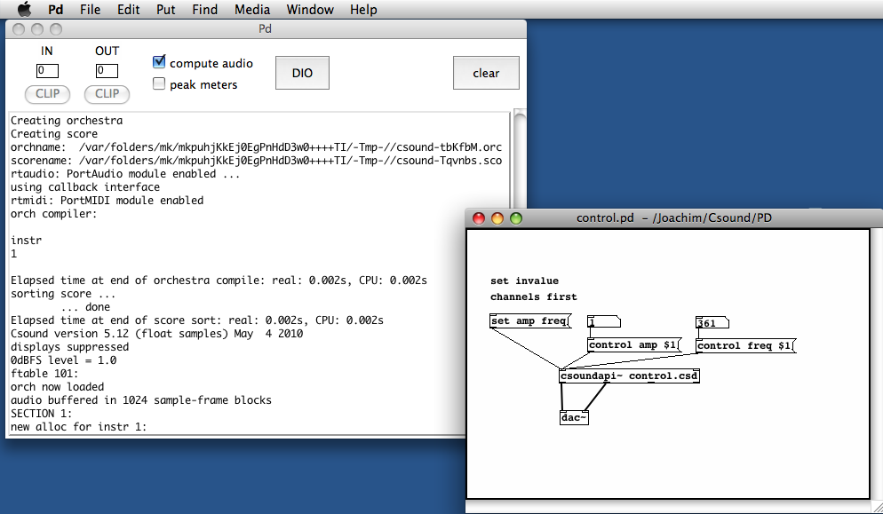
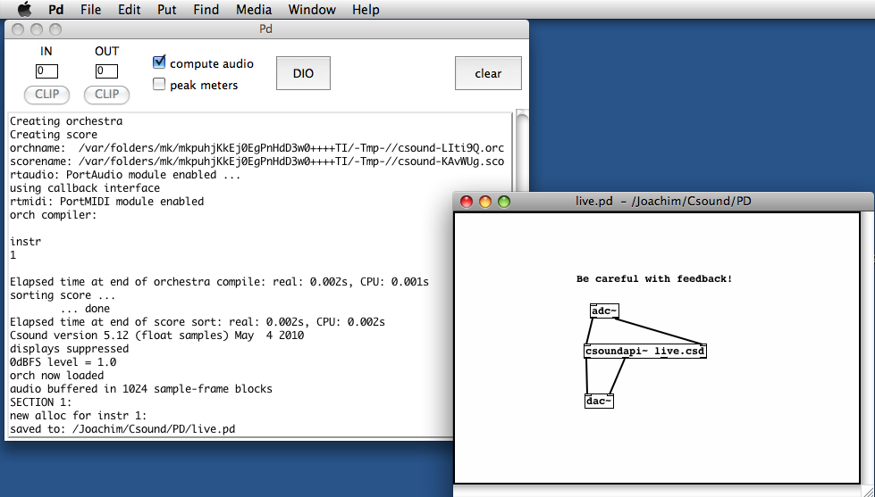
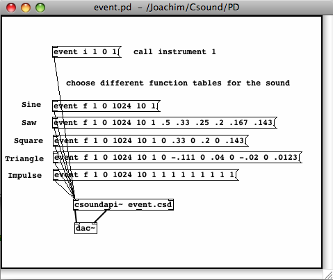
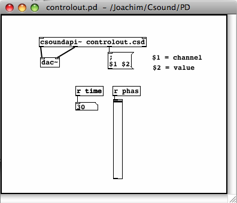
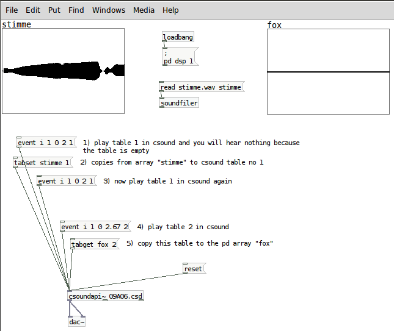

09 A. CSOUND IN PD
==================

Installing
----------

You can embed Csound in PD via the external object **csound6~**
which has been written by Victor Lazzarini. This external is either part
of the Csound distribution or can be built from the sources at
<https://github.com/csound/csound_pd> . In the examples folder of this
repository you can also find all the .csd and .pd files of this chapter.

On **Ubuntu Linux**, you can install the csound6~ via the Synaptic
Package Manager. Just look for *csound6~* or *pd-csound*, check
*install*, and your system will install the library at the appropriate
location. If you build Csound from sources, go to the
[csound_pd repository](https://github.com/csound/csound_pd)
and follow the build instructions.
Once it is compiled, the object will appear as *csound6~.pd_linux* and
should be copied (together with *csound6~-help.pd*) to */usr/lib/pd/extra*,
so that PD can find it. If not, add it to PD's search path
(*File->Path...*).

On **Mac OSX**, you find the *csound6~* external, help file and examples
in the [release](https://github.com/csound/csound_pd/releases) directory of the *csound_pd* repository. (Prior to 6.11, the *csound6~* was in
*/Library/Frameworks/CsoundLib64.framework/Versions/6.0/Resources/PD* after installing Csound.)

Put these files in a folder which is in PD's search path. For
PD-extended, it is by default *~/Library/Pd*. But you can put it
anywhere. Just make sure that the location is specified in PD's
*Preferences-> Path...* menu.

On **Windows**, you find the *csound6~* external, help file and examples
in the [release](https://github.com/csound/csound_pd/releases) directory of the *csound_pd* repository, too.

Control Data
------------

You can send control data from PD to your Csound instrument via the
keyword *control* in a message box. In your Csound code, you must
receive the data via
[invalue](https://csound.com/docs/manual/invalue.html)
or
[chnget](https://csound.com/docs/manual/chnget.html).
This is a simple example:

   ***EXAMPLE 09A01_pdcs_control_in.csd***

~~~Csound
<CsoundSynthesizer>
<CsOptions>
</CsOptions>
<CsInstruments>
sr = 44100
nchnls = 2
0dbfs = 1
ksmps = 8

instr 1
kFreq     invalue   "freq"
kAmp      invalue   "amp"
aSin      poscil    kAmp, kFreq
          out       aSin, aSin
endin

</CsInstruments>
<CsScore>
i 1 0 10000
</CsScore>
</CsoundSynthesizer>
;example by joachim heintz
~~~

Save this file under the name *control.csd*. Save a PD window in the
same folder and create the following patch:

Note that for *invalue* channels, you first must register these channels
by a *set* message. The usage of *chnget* is easier; a simple example
can be found in
[this](https://github.com/csound/csound_pd/blob/master/examples/iem_workshop/cs_pd_05_control_input.pd)
example in the *csound6~* repository.

As you see, the first two outlets of the csound6~ object are the signal
outlets for the audio channels 1 and 2. The third outlet is an outlet
for control data (not used here, see below). The rightmost outlet sends
a bang when the score has been finished.

Live Input
----------

Audio streams from PD can be received in Csound via the
[inch](https://csound.com/docs/manual/inch.html)
opcode. The number of audio inlets created in the *csound6~* object will
depend on the number of input channels used in the Csound orchestra. The
following .csd uses two audio inputs:

   ***EXAMPLE 09A02_pdcs_live_in.csd ***

~~~Csound
<CsoundSynthesizer>
<CsOptions>
</CsOptions>
<CsInstruments>
sr = 44100
0dbfs = 1
ksmps = 8
nchnls = 2

instr 1
aL        inch      1
aR        inch      2
kcfL      randomi   100, 1000, 1; center frequency
kcfR      randomi   100, 1000, 1; for band pass filter
aFiltL    butterbp  aL, kcfL, kcfL/10
aoutL     balance   aFiltL, aL
aFiltR    butterbp  aR, kcfR, kcfR/10
aoutR     balance   aFiltR, aR
          outch     1, aoutL
          outch     2, aoutR
endin

</CsInstruments>
<CsScore>
i 1 0 10000
</CsScore>
</CsoundSynthesizer>
;example by joachim heintz
~~~

The corresponding PD patch is extremely simple:

MIDI
----

The *csound6~* object receives MIDI data via the keyword *midi*. Csound
is able to trigger instrument instances in receiving a *note on*
message, and turning them off in receiving a *note off* message (or a
note-on message with velocity=0). So this is a very simple way to build
a synthesizer with arbitrary polyphonic output:

This is the corresponding midi.csd. It must contain the options
*-+rtmidi=null -M0* in the *\<CsOptions\>* tag. It is an FM synth in which
the modulation index is defined according to the note velocity. The
harder a key is truck, the higher the index of modulation will be; and
therefore a greater number of stronger partials will be created. The
ratio is calculated randomly between two limits, which can be adjusted.

   ***EXAMPLE 09A03_pdcs_midi.csd ***

~~~Csound
<CsOptions>
-+rtmidi=null -M0
</CsOptions>
<CsoundSynthesizer>
<CsInstruments>
sr      =  44100
ksmps   =  8
nchnls  =  2
0dbfs = 1

giSine    ftgen     0, 0, 2^10, 10, 1

instr 1
iFreq     cpsmidi   ;gets frequency of a pressed key
iAmp      ampmidi   8;gets amplitude and scales 0-8
iRatio    random    .9, 1.1; ratio randomly between 0.9 and 1.1
aTone     foscili   .1, iFreq, 1, iRatio/5, iAmp+1, giSine; fm
aEnv      linenr    aTone, 0, .01, .01; avoiding clicks at the end of a note
          outs      aEnv, aEnv
endin

</CsInstruments>
<CsScore>
f 0 36000; play for 10 hours
e
</CsScore>
</CsoundSynthesizer>
;example by joachim heintz
~~~

Score Events
------------

Score events can be sent from PD to Csound by a message with the keyword
**event**. You can send any kind of score events, like instrument calls
or function table statements. The following example triggers Csound's
instrument 1 whenever you press the message box on the top. Different
sounds can be selected by sending f events (building/replacing a
function table) to Csound.

   ***EXAMPLE 09A04_pdcs_events.csd***

~~~Csound
<CsoundSynthesizer>
<CsOptions>
</CsOptions>
<CsInstruments>
sr = 44100
ksmps = 8
nchnls = 2
0dbfs = 1
seed 0; each time different seed

instr 1
iDur      random    0.5, 3
p3        =         iDur
iFreq1    random    400, 1200
iFreq2    random    400, 1200
idB       random    -18, -6
kFreq     linseg    iFreq1, iDur, iFreq2
kEnv      transeg   ampdb(idB), p3, -10, 0
aTone     poscil    kEnv, kFreq
          outs      aTone, aTone
endin

</CsInstruments>
<CsScore>
</CsScore>
</CsoundSynthesizer>
;example by joachim heintz
~~~

Control Output
--------------

If you want Csound to pass any control data to PD, you can use the
opcode [outvalue](https://csound.com/docs/manual/outvalue.html).
You will receive this data at the second outlet from the right of the
*csound6~* object. The data are sent as a list with two elements. The
name of the control channel is the first element, and the value is the
second element. You can get the values by a *route* object or by a
*send/receive* chain. This is a simple example:

***EXAMPLE 09A05_pdcs_control_out.csd ***

~~~Csound
<CsoundSynthesizer>
<CsOptions>
</CsOptions>
<CsInstruments>
sr = 44100
nchnls = 2
0dbfs = 1
ksmps = 8

instr 1
ktim      times
kphas     phasor    1
          outvalue  "time", ktim
          outvalue  "phas", kphas*127
endin

</CsInstruments>
<CsScore>
i 1 0 30
</CsScore>
</CsoundSynthesizer>
;example by joachim heintz
~~~

Send/Receive Buffers from PD to Csound and back
-----------------------------------------------

A PD array can be sent directly to Csound, and a Csound function table
to PD. The message *tabset array-name ftable-number* copies a
PD array into a Csound function table. The message
*tabget array-name ftable-number* copies a Csound function table into a PD
array. The example below should explain everything. Just choose another
soundfile instead of *stimme.wav*.

   ***EXAMPLE 06A06_pdcs_tabset_tabget.csd***

~~~Csound
<CsoundSynthesizer>
<CsOptions>
-odac
</CsOptions>
<CsInstruments>
sr = 44100
ksmps = 8
nchnls = 1
0dbfs = 1

giCopy ftgen 1, 0, -88200, 2, 0 ;"empty" table
giFox  ftgen 2, 0, 0, 1, "fox.wav", 0, 0, 1

  opcode BufPlay1, a, ipop
ifn, ispeed, iskip, ivol xin
icps      =         ispeed / (ftlen(ifn) / sr)
iphs      =         iskip / (ftlen(ifn) / sr)
asig      poscil3   ivol, icps, ifn, iphs
          xout      asig
  endop

  instr 1
itable    =         p4
aout      BufPlay1  itable
          out       aout
  endin

</CsInstruments>
<CsScore>
f 0 99999
</CsScore>
</CsoundSynthesizer>
;example by joachim heintz
~~~

Settings
--------

Make sure that the Csound vector size given by the
[ksmps](https://csound.com/docs/manual/ksmps.html) value, is
not larger than the internal PD vector size. It should be a power of 2.
I would recommend starting with ksmps=8. If there are performance
problems, try to increase this value to 16, 32, or 64, i.e. ascending
powers of 2.

The *csound6~* object runs by default if you turn on audio in PD. You can
stop it by sending a *run 0* message, and start it again with a *run 1* message.

You can recompile the *csd* file of a *csound6~* object by sending a
*reset* message.

By default, you see all the messages of Csound in the PD window. If you
do not want to see them, send a *message 0* message. *message 1*
re-enables message printing.

If you want to open a new .csd file in the *csound6~* object, send the
message *open*, followed by the path of the .csd file you want to
load.

A *rewind* message rewinds the score without recompilation. The
message *offset*, followed by a number, offsets the score playback by
that number of seconds.

