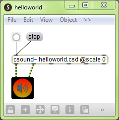
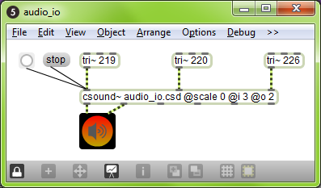
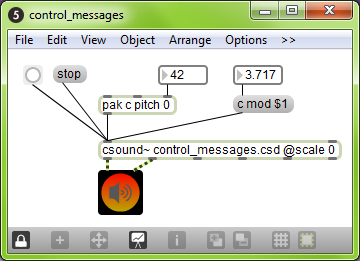
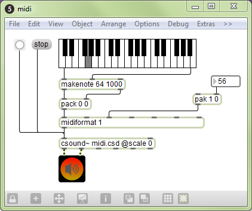
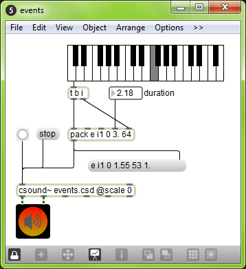

09 B. CSOUND IN MAXMSP
======================

Csound can be embedded in a [Max](http://cycling74.com/products/max/)
patch using the *csound~* object. This allows you to synthesize and
process audio, MIDI, or control data with Csound.

Note: Most of the descriptions below have been written years ago by Davis Pyon. They may be outdated and will need to be updated.

Installing
----------

The *csound~* requires an installation of Csound. The external can be downloaded on [Csound's download page](https://csound.com/download.html) (under *Other*).

Creating a *csound~* Patch
--------------------------

1.  Create the following patch:

    

2.  Save as *helloworld.maxpat* and close it.
3.  Create a text file called *helloworld.csd* within the same folder
    as your patch.
4.  Add the following to the text file:\

    ***EXAMPLE 09B01_maxcs_helloworld.csd ***

        <CsoundSynthesizer>
        <CsInstruments>
        ;Example by Davis Pyon
        sr     = 44100
        ksmps  = 32
        nchnls = 2
        0dbfs  = 1

        instr 1
        aNoise noise .1, 0
               outch 1, aNoise, 2, aNoise
        endin

        </CsInstruments>
        <CsScore>
        f0 86400
        i1 0 86400
        e
        </CsScore>
        </CsoundSynthesizer>

5.  Open the patch, press the bang button, then press the speaker icon.

At this point, you should hear some noise. Congratulations! You created
your first *csound~* patch.

You may be wondering why we had to save, close, and reopen the patch.
This is needed in order for *csound~* to find the csd file. In effect,
saving and opening the patch allows *csound~* to "know" where the patch
is. Using this information, *csound~* can then find csd files specified
using a relative pathname (e.g. *helloworld.csd*). Keep in mind that
this is only necessary for newly created patches that have not been
saved yet. By the way, had we specified an absolute pathname (e.g.
*C:/Mystuff/helloworld.csd*), the process of saving and reopening
would have been unnecessary.

The *@scale 0* argument tells *csound~* not to scale audio data
between Max and Csound. By default, *csound~* will scale audio to match
0dB levels. Max uses a 0dB level equal to one, while Csound uses a 0dB
level equal to 32768. Using *@scale 0* and adding the statement
*0dbfs = 1* within the csd file allows you to work with a 0dB level equal to one everywhere. This is highly recommended.

Audio I/O
---------

All *csound~* inlets accept an audio signal and some outlets send an
audio signal. The number of audio outlets is determined by the arguments
to the *csound~* object. Here are four ways to specify the number of
inlets and outlets:

-   \[csound\~ \@io 3\]
-   \[csound\~ \@i 4 \@o 7\]
-   \[csound\~ 3\]
-   \[csound\~ 4 7\]

*@io 3* creates 3 audio inlets and 3 audio outlets. *@i 4 @o 7*
creates 4 audio inlets and 7 audio outlets. The third and fourth lines
accomplish the same thing as the first two. If you don't specify the
number of audio inlets or outlets, then *csound~* will have two audio
inlets and two audio oulets. By the way, audio outlets always appear to
the left of non-audio outlets. Let's create a patch called
*audio_io.maxpat* that demonstrates audio i/o:

Here is the corresponding text file (let's call it *audio_io.csd*):

   ***EXAMPLE 09B02_maxcs_audio_io.csd ***

~~~
<CsoundSynthesizer>
<CsInstruments>
sr     = 44100
ksmps  = 32
nchnls = 3
0dbfs  = 1

instr 1
aTri1 inch 1
aTri2 inch 2
aTri3 inch 3
aMix  = (aTri1 + aTri2 + aTri3) * .2
      outch 1, aMix, 2, aMix
endin

</CsInstruments>
<CsScore>
f0 86400
i1 0 86400
e
</CsScore>
</CsoundSynthesizer>
;example by Davis Pyon
~~~

In *audio_io.maxpat*, we are mixing three triangle waves into a stereo
pair of outlets. In *audio_io.csd*, we us
[inch](https://csound.com/docs/manual/inch.html) and
[outch](https://csound.com/docs/manual/outch.html) to receive
and send audio from and to *csound~*. *inch* and *outch* both use a
numbering system that starts with one (the left-most inlet or outlet).

Notice the statement *nchnls = 3* in
the orchestra header. This tells the Csound compiler to create three
audio input channels and three audio output channels. Naturally, this
means that our *csound~* object should have no more than three audio
inlets or outlets.

Control Messages
----------------

Control messages allow you to send numbers to Csound. It is the primary
way to control Csound parameters at i-rate or k-rate. To control a-rate
(audio) parameters, you must use and audio inlet. Here are two examples:

-   control frequency 2000
-   c resonance .8

Notice that you can use either *control* or *c* to indicate a
control message. The second argument specifies the name of the channel
you want to control and the third argument specifies the value.

The following patch and Csound file demonstrates control messages:

   ***EXAMPLE 09B03_maxcs_control_in.csd ***

~~~
<CsoundSynthesizer>
<CsInstruments>
sr     = 44100
ksmps  = 32
nchnls = 2
0dbfs  = 1

giSine ftgen 1, 0, 16384, 10, 1 ; Generate a sine wave table.

instr 1
kPitch chnget "pitch"
kMod   invalue "mod"
aFM    foscil .2, cpsmidinn(kPitch), 2, kMod, 1.5, giSine
       outch 1, aFM, 2, aFM
endin
</CsInstruments>
<CsScore>
f0 86400
i1 0 86400
e
</CsScore>
</CsoundSynthesizer>
;example by Davis Pyon
~~~

In the patch, notice that we use two different methods to construct
control messages. The *pak* method is a little faster than the message
box method, but do whatever looks best to you. You may be wondering how
we can send messages to an audio inlet (remember, all inlets are audio
inlets). Don't worry about it. In fact, we can send a message to any
inlet and it will work.

In the Csound file, notice that we use two different opcodes to receive
the values sent in the control messages:
[chnget](https://csound.com/docs/manual/chnget.html) and
[invalue](https://csound.com/docs/manual/invalue.html).
*chnget* is more versatile (it works at i-rate and k-rate, and it accepts strings) and is a tiny bit faster than *invalue*. On the other hand, the limited nature of *invalue* (only works at k-rate, never requires any declarations in the header section of the orchestra) may be easier for newcomers to Csound.

MIDI
----

*csound~* accepts raw MIDI numbers in its first inlet. This allows you
to create Csound instrument instances with MIDI notes and also control
parameters using MIDI Control Change. *csound~* accepts all types of MIDI
messages, except for: sysex, time code, and sync. Let's look at a patch
and text file that uses MIDI:

   ***EXAMPLE 09B04_maxcs_midi.csd ***

~~~
<CsoundSynthesizer>
<CsInstruments>
sr     = 44100
ksmps  = 32
nchnls = 2
0dbfs  = 1

massign 0, 0 ; Disable default MIDI assignments.
massign 1, 1 ; Assign MIDI channel 1 to instr 1.

giSine ftgen 1, 0, 16384, 10, 1 ; Generate a sine wave table.

instr 1
iPitch cpsmidi
kMod   midic7 1, 0, 10
aFM    foscil .2, iPitch, 2, kMod, 1.5, giSine
       outch 1, aFM, 2, aFM
endin
</CsInstruments>
<CsScore>
</CsScore>
</CsoundSynthesizer>
;example by Davis Pyon
~~~

In the patch, notice how we're using *midiformat* to format note and
control change lists into raw MIDI bytes. The *1* argument for
midiformat specifies that all MIDI messages will be on channel one.

In the Csound file, notice the
[massign](https://csound.com/docs/manual/massign.html)
statements in the header of the orchestra. *massign 0, 0* tells Csound to clear all mappings between MIDI channels and Csound instrument numbers. This is highly recommended because forgetting to add this statement may cause confusion somewhere down the road. The next statement *massign 1,1*
tells Csound to map MIDI channel one to instrument one.

To get the MIDI pitch, we use the opcode
[cpsmidi](https://csound.com/docs/manual/cpsmidi.html). To get
the FM modulation factor, we use
[midic7](https://csound.com/docs/manual/midic7.html) in order to
read the last known value of MIDI CC number one (mapped to the range
\[0,10\]).[^1]

[^1]: Csound's MIDI options and opcodes are described in detail in
      section 7 of this manual.

Notice that in the score section of the Csound file, we no longer have the
statement *i1 0 86400* as we had in earlier examples. The score section is left empty here, so that instrument 1 is compiled but not activated. Activation is done via MIDI here.

Events
------

To send Csound events (i.e. score statements), use the *event* or
*e* message. You can send any type of event that Csound understands.
The following patch and text file demonstrates how to send events:

   ***EXAMPLE 09B05_maxcs_events.csd ***

~~~
<CsoundSynthesizer>
<CsInstruments>
sr     = 44100
ksmps  = 32
nchnls = 2
0dbfs  = 1

instr 1
  iDur = p3
  iCps = cpsmidinn(p4)
 iMeth = 1
       print iDur, iCps, iMeth
aPluck pluck .2, iCps, iCps, 0, iMeth
       outch 1, aPluck, 2, aPluck
endin
</CsInstruments>
<CsScore>
</CsScore>
</CsoundSynthesizer>
;example by Davis Pyon
~~~

In the patch, notice how the arguments to the *pack* object are declared.
The *i1* statement tells Csound that we want to create an instance of
instrument one. There is no space between *i* and *1* because pack
considers *i* as a special symbol signifying an integer. The next
number specifies the start time. Here, we use *0* because we want the
event to start right now. The duration *3.* is specified as a floating
point number so that we can have non-integer durations. Finally, the
number *64* determines the MIDI pitch. You might be wondering why the
*pack* object output is being sent to a message box. This is good practice
as it will reveal any mistakes you made in constructing an event
message.

In the Csound file, we access the event parameters using p-statements. We
never access *p1* (instrument number) or *p2* (start time) because
they are not important within the context of our instrument. Although
*p3* (duration) is not used for anything here, it is often used to
create audio envelopes. Finally, *p4* (MIDI pitch) is converted to
cycles-per-second. The
[print](https://csound.com/docs/manual/print.html) statement is
there so that we can verify the parameter values.
