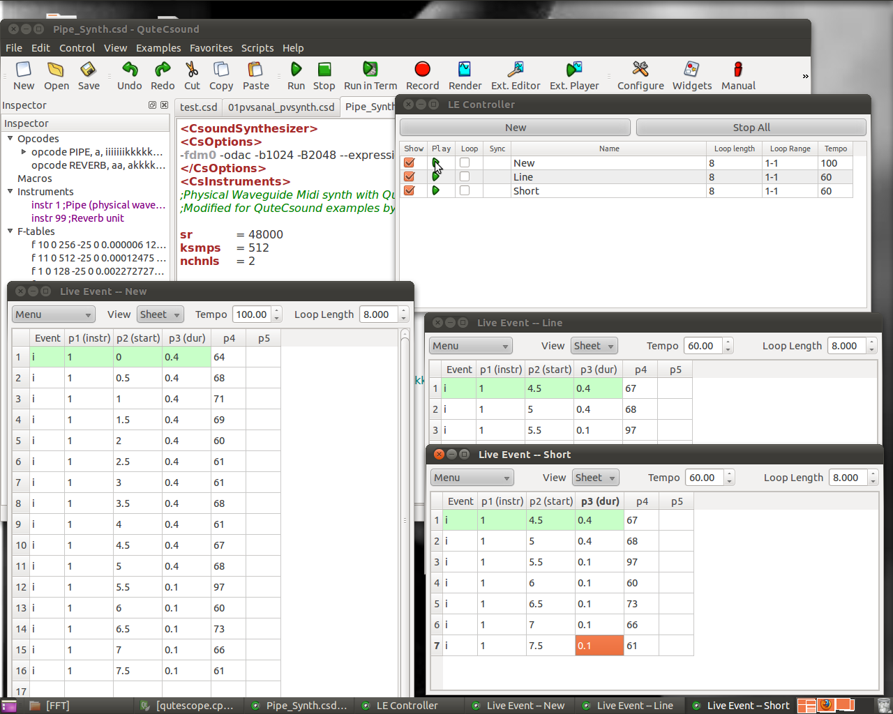

10 A. CSOUNDQT
==============

CsoundQt (named *QuteCsound* until automn 2011) is a free, cross-platform graphical frontend to Csound. It has been written by Andrés Cabrera and is maintained since 2016 by Tarmo Johannes. It
features syntax highlighting, code completion and a graphical widget
editor for realtime control of Csound. It comes with many useful code
examples, from basic tutorials to complex synthesizers and pieces
written in Csound. It also features an integrated Csound language help
display.

Installing
----------

CsoundQt is a *frontend* for Csound, so **Csound needs to be installed first**. Make sure you have installed Csound before you install CsoundQt; otherwise it will not work at all.

CsoundQt is **included** in the Csound installers **for Mac OSX and Windows**. It is recommended to use the CsoundQt version which is shipped with the installer for compatibility between CsoundQt and Csound. The Windows installer will probably install CsoundQt automatically. For OSX, first install the Csound package, then open the CsoundQt disk image and copy the CsoundQt Application into the *Applications* folder.

For **Linux** there is a Debian/Ubuntu package. Unfortunately it is built without *RtMidi* support, so you will not be able to connect CsoundQt's widgets directly with your midi controllers. The alternative is to build CsoundQt with [QtCreator](https://www.qt.io/development-tools) which is not too hard and gives you all options, including the PythonQt connection. You will find instructions how to build in the [CsoundQt Wiki](https://github.com/CsoundQt/CsoundQt/wiki).

General Usage and Configuration
-------------------------------

CsoundQt can be used as a code
editor tailored for Csound, as it facilitates running and rendering
Csound files without the need of typing on the command line using the
Run and Render buttons.

In the widget editor panel, you can create a variety of widgets to
control Csound. To link the value from a widget, you first need to set
its channel, and then use the Csound opcodes invalue or chnget. To send
values to widgets, e.g. for data display, you need to use the outvalue
or chnset opcode.

CsoundQt also implements the use of HTML and JavaScript code
embedded in the optional \<html\> element of the CSD file. If this
element is detected, CsoundQt will parse it out as a Web page, compile
it, and display it in the *HTML5 Gui* window. HTML code in this window
can control Csound via a selected part of the Csound API that is exposed
in JavaScript. This can be used to define custom user interfaces,
display video and 3D graphics, generate Csound scores, and much more.
See chapter [Csound and Html](12-g-csound-and-html.md) for more information.

CsoundQt also offers convenient facilities for score editing in a
spreadsheet like environment which can be transformed using Python
scripting (see also the chapter about 
[Python in CsoundQt](14-b-python-in-csoundqt.md)).

You will find more detailed information at 
[CsoundQt's home page](https://csoundqt.github.io).

### Configuring CsoundQt 

CsoundQt gives easy access to the most important 
[Csound options](https://csound.com/docs/manual/CommandFlags.html) and to
many specific CsoundQt settings via its Configuration Panel. In
particular the *Run* tab offers many choices which have to be
understood and set carefully.

To open the configuration panel simply push the *Configure* button.
The configuration panel comprises seven tabs. The available configurable
parameters in each tab are described below for each tab.

The single options, their meaning and tips of how to set them are listed at the [Configuring CsoundQt](https://csoundqt.github.io/pages/configuring-csoundqt.html) page of CsoundQt's website.

