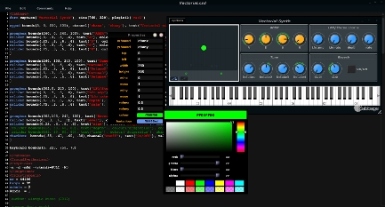
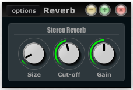
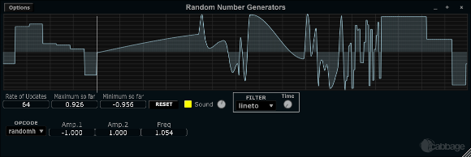
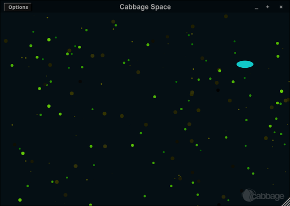

10 B. CABBAGE
=============

Cabbage is a Csound frontend that provides users with the means to work
with Csound, to develop audio plugins and standalone software across the
three major operating systems. Whilst Cabbage makes use of underlying
plugin technologies, such as Steinberg's VST SDK, ASIO, etc, Csound is
used to process all incoming and outgoing audio, therefore existing
Csound instruments can be adapted to work with Cabbage with relative
ease. Cabbage also provides a big palette of GUI widgets ranging
from simple sliders to XY-pads and graph tables. All GUI widgets in a
Cabbage plugin can be controlled via host automation in a plugin host,
thereby providing a quick and effective means of automating Csound
instrument parameters in both commercial and non-commercial DAWs. A
user-forum exists at
[www.thecabbagefoundation.org](http://www.thecabbagefoundation.org), and
users are invited to discuss, contribute, and share instruments and
music.

Download and Install
--------------------

Cabbage is hosted on GitHub, and **pre-compiled binaries** for **Windows** and
**OSX** can be found on the
[release](https://github.com/cabbageaudio/cabbage/releases)
section of Cabbage's home page.
If you run **Linux** you will need to build Cabbage yourself, but
instructions are included with the source code.
You will **need to have Csound installed**.

The Cabbage Standalone Host
---------------------------

The main Cabbage application that launches when you open Cabbage is
known as the standalone host. This simple application hosts Cabbage
plugins in the same way any DAW hosts a plugin, but it is restricted to
one plugin at a time (the host can be instantiated multiple times
however). The host also features a source code editor for editing your
code, and it also allows users to enter a GUI designer mode within which
they can design interfaces using a simple drag-and-drop system. Access
to the Csound output console and Reference Manual through the Cabbage
host facilitate debugging and learning and the host also facilitates
control of audio and MIDI settings used by Csound. If a user wishes to
make their Cabbage patch available as a plugin for use within other
software they can use the *Export* option which will prompt them to
export their instrument as an audio plugin. In addition to interacting
with hosts via audio and MIDI connections, Cabbage plugins can also
respond to host controls such as tempo, song position and play/stop
status. The plugin formats are currently restricted to VST and Linux
Native VST. Whilst the main purpose of the Cabbage standalone host is
for prototyping and development, it can also be used as a fully blown
production environment depending on the complexity of the hosted
instrument.

Cabbage Instruments.
--------------------

Cabbage instruments are nothing more than Csound instruments with an
additional \<Cabbage\> ... \</Cabbage\> section that exists outside of the
\<CsoundSynthesizer\> tags. Each line of text in this section defines a
GUI widget. Special identifiers can be used to control the look and
behavior of each widget. This text ultimately defines how the graphical
interface will look but recent innovations facilitate the modification
of widget appearance from within the Csound orchestra. This opens up
interesting possibilities including dynamically hiding and showing parts
of the GUI and moving and resizing widgets during performance
time. Instruments can be exported as either effects or synths. Effects
process incoming audio, while synths won't produce any sound until they
are triggered via the MIDI widget, or a MIDI keyboard. Cabbage makes no
differentiation between synths and effects, but VST hosts do, so one
must be careful when exporting instruments. A full list of available
widgets, identifiers and parameters can be found in the Cabbage
reference manual that comes with all Cabbage binaries.

### A Basic Cabbage Synthesiser

Example code to create the most basic Cabbage synthesiser is presented
below. This instrument uses the MIDI interop command line flags to pipe
MIDI data directly to p-fields in instrument 1. In this case all MIDI
pitch data is sent directly to p4, and all MIDI amplitude data is sent
to p5. (An alternative approach is to use Csounds opcodes
[cpsmidi](https://csound.com/docs/manual/cpsmidi.html),
[ampmidi](https://csound.com/docs/manual/ampmidi.html) etc. to read
midi data into an instrument.) MIDI data sent on channel 1 will cause
instrument 1 to play. Data sent on channel 2 will cause instrument 2 to
play. If one prefers they may use the massign opcode rather than the
MIDI interop flags, but regardless of what mechanism is used, you still
need to declare *-+RTMIDI=NULL -M0* in the CsOptions.

~~~
<Cabbage>
form size(400, 120), caption("Simple Synth"), pluginID("plu1")
keyboard bounds(0, 0, 380, 100)
</Cabbage>
<CsoundSynthesizer>
<CsOptions>
-n -d -+rtmidi=NULL -M0 --midi-key-cps=4 --midi-velocity-amp=5
</CsOptions>
<CsInstruments>
sr = 44100
ksmps = 64
nchnls = 2
0dbfs=1

instr 1
kenv linenr p5, 0.1, .25, 0.01
a1 oscil kenv*k1, p4, 1
outs a1, a1
endin

</CsInstruments>
<CsScore>
f1 0 1024 10 1
f0 3600
</CsScore>
</CsoundSynthesizer>
~~~

You will notice that a *-n* and *-d* are passed to Csound in the
\<CsOptions\> section. *-n* stops Csound from writing audio to disk. This
must be used when Cabbage is managing audio. If users wish to use Csound
audio IO modules they need to disable Cabbage audio from the settings
menu. The -d prevents any FLTK widgets from displaying. You will also
notice that our instrument is stereo. ALL Cabbage instruments operate in
stereo.

### Controlling Your Instrument

The most obvious limitation to the above instrument is that users cannot
interact directly with Csound. In order to do this one can use a Csound
channel opcode and a Cabbage control such as a slider. Any control that
is to interact with Csound must have a channel identifier.

When one supplies a channel name to the *channel()* identifier Csound will
listen for data being sent on that channel through the use of the named
channel opcodes. In order to retrieve data from the named channel bus in
Csound one can use the chnget opcode. It is defined in the Csound
reference manual as:

    kval chnget Sname

Sname is the name of the channel. This same name must be passed to the
*channel()* identifier in the corresponding \<Cabbage\> section. Cabbage
only works with the *chnget/chnset* method of sending and receiving
channel data. The *invalue* and *outvalue* opcodes are not supported.

The previous example can be modified so that a slider now controls the
volume of our oscillator.

~~~
<Cabbage>
form size(400, 170), caption("Simple Synth"), pluginID("plu1")
hslider  bounds(0, 110, 380, 50), channel("gain"), range(0, 1, .5), textBox(1)
keyboard bounds(0, 0, 380, 100)
</Cabbage>
<CsoundSynthesizer>
<CsOptions>
-n -d -+rtmidi=NULL -M0 --midi-key-cps=4 --midi-velocity-amp=5
</CsOptions>
<CsInstruments>
sr = 44100
ksmps = 64
nchnls = 2
0dbfs=1

instr 1
k1 chnget "gain"
kenv linenr p5, 0.1, 1, 0.1
a1 oscil kenv*k1, p4, 1
outs a1, a1
endin

</CsInstruments>
<CsScore>
f1 0 1024 10 1
f0 3600
</CsScore>
</CsoundSynthesizer>
~~~

control which is a horizontal slider. The *bounds()* identifier sets up
the position and size of the widget. The most important identifier is
*channel()*. It is passed a string "gain". This is the same string we
pass to [chnget](https://csound.com/docs/manual/chnget.html) in our
Csound code. When a user moves the slider, the current position of the
slider is sent to Csound on a channel named "gain". Without the
*channel()* identifier no communication would take place between the
Cabbage control and Csound. The keyboard widget can be used en lieu of a
real MIDI keyboard when testing plugins. It is also possible to move
Cabbage widgets from within the Csound orchestra using the
[chnset](https://csound.com/docs/manual/chnset.html) opcode.

### A basic Cabbage effect

Cabbage effects are used to process incoming audio. To do so one must
make sure they can access the incoming audio stream. Any of Csound's
signal input opcodes can be used for this. The examples that come with
Cabbage use both the ins and inch opcodes to retrieve the incoming audio
signal. The following code is for a simple reverb unit. It accepts a
stereo input and outputs a stereo signal.

~~~
<Cabbage>
form caption("Reverb") size(230, 130)
groupbox text("Stereo Reverb"), bounds(0, 0, 200, 100)
rslider channel("size"), bounds(10, 25, 70, 70), text("Size"), range(0, 2, 0.2)
rslider channel("fco"), bounds(70, 25, 70, 70), text("Cut-off"), range(0, 22000, 10000)
rslider channel("gain"), bounds(130, 25, 70, 70), text("Gain"), range(0, 1, 0.5)
</Cabbage>
<CsoundSynthesizer>
<CsOptions>
-d -n
</CsOptions>
<CsInstruments>
; Initialize the global variables.
sr = 44100
ksmps = 32
nchnls = 2

instr 1
kfdback chnget "size"
kfco chnget "fco"
kgain chnget "gain"
ainL inch 1
ainR inch 2
aoutL, aoutR reverbsc ainL, ainR, kfdback, kfco
outs aoutL*kgain, aoutR*kgain
endin

</CsInstruments>
<CsScore>
f1 0 4096 10 1
i1 0 1000
</CsScore>
</CsoundSynthesizer>
~~~

The above instrument uses 3 sliders to control the reverb size, the
cut-off frequency for the internal low-pass filters, and the overall
gain. The *range()* identifier is used with each slider to specify the
min, max and starting value of the sliders. If you compare the two score
sections in the above instruments you will notice that the synth
instrument does not use any i-statement. Instead it uses an f0 3600.
This tells Csound to wait for 3600 seconds before exiting. (In recent
versions of Csound this step is no longer necessary to sustain
performance.) Because synth instruments are controlled via MIDI we don't
need to use an i-statement in the score. In the audio effect example we
use an i-statement with a long duration so that the effect runs without
stopping for a long time, typically longer than a user session in a
DAW.

Recent Innovations
------------------

### Gentable Widget

The *gentable* widget can be used to display any Csound function table.

*gentable* views can be updated during performance in order to reflect any
changes that may have been made to their contents by the Csound
orchestra. Updating is actuated by using the gentable widget's
so-called *ident* channel (a channel that is used exclusively for
changing the appearance of widgets and that is channel separate from the
normal value channel).

It is also possible to modify the contents of a some function tables
that are represented using *gentable* by clicking and dragging upon their
GUI representations. This feature is a work in progress and is currently
only available with *GEN 02*, *05* and *07*.

### Soundfiler Widget

Whilst audio files stored in *GEN 01* function tables can be viewed using
gentable it is more efficient (particularly with longer files) to do
this using the *soundfiler* widget.

*soundfiler* also facilitates zooming into and out of the viewed waveform
and a portion of the waveform can be highlighted using click and drag.
The start and end points of this highlighted region can be read into
Csound and used, for example, as loop points. An example of this can be
found in the *Table3FilePlayer* example in Cabbage's built-in examples in
the File Players subsection. A *scrubber* (a vertical line through the
waveform) can also be displayed to indicate playback position.

Using *soundfiler* in combination with a button widget, we can open a
browser and browse for a new sound file during performance. All of the
examples in *Examples->FilePlayers* make use of this possibility.

### Widgetarray

The *widgetarray* identifier can be used with most widgets to generate
large numbers of widgets in a single step.

The screenshot from the example shown above (which can be found in
Cabbage's built-in examples in the *FunAndGames* subsection) employs
300 image widgets to create the stars and the UFO and these are
generated in a single line of code. Each individual widget can be
addressed from within the Csound orchestra using a numbered identity
channel, thereby they can be individually repositioned or modified in
any other way. This process can be simplified by using looping
procedures.

### Texteditor

The *texteditor* widget can be used to directly type in a string on the
computer keyboard which can then be sent to Csound. An example use of
this is to type in score events in real time (exemplified in the example
RealTimeScoreEvents in the the *Instructional* subsection in
Cabbage's built-in examples.)

### Plants and Popups

Cabbage *plants* provides a convenient mechanism with which GUI
elements which belong together in some way can be grouped. An example of
this might be the various widgets pertaining to the values used by an
envelope. Thereafter if becomes easier to modify the grouped widgets en
masse: to move them somewhere else in the gui or to hide or reveal them
completely.

An more elaborate function is to hold a plant in a completely separate
GUI window that can be launched using a *pop-up* button. An example of
this is the *Clavinet* instrument in the *Synths* subsection in
Cabbage's built-in examples.

### Range Sliders

A special type of slider (horizontal or vertical but not rotary \'r\'
type) employs two control knobs so that it can output two values.

This widget can be seen in action in the example *DelayGrain* in the
*Effects* subsection in Cabbage's built-in examples.

### Reserved Channels

Reserved channels in Cabbage provide a means of reading in a variety of
data beyond that of the Cabbage GUI widgets. This includes providing a
means of reading in mouse position and mouse button activations and also
tempo, song position and start/stop/record status (if used as a plugin
within a host). These channels are read using the chnset opcode.

More information on any of these features can be found in the Cabbage
reference manual which comes built into Cabbage or can be found
[here](http://thecabbagefoundation.org/documentation.php).

