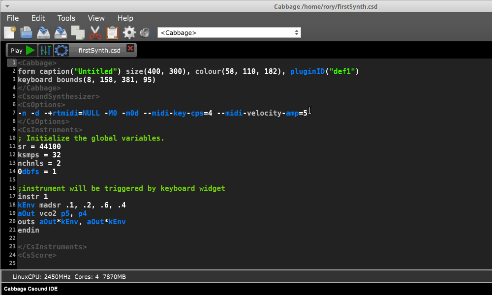
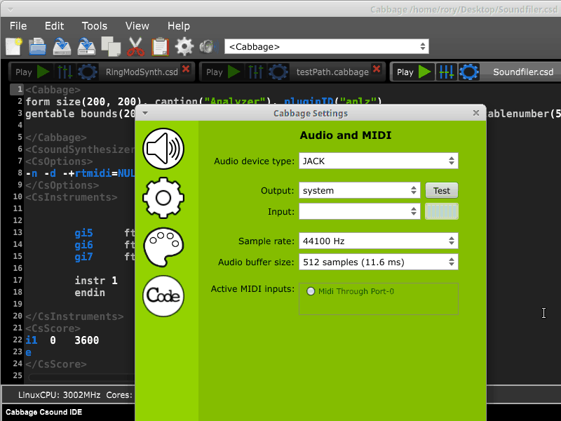
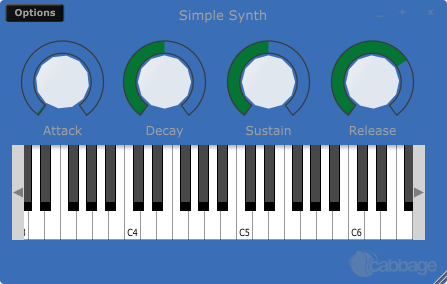
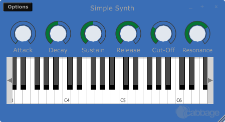
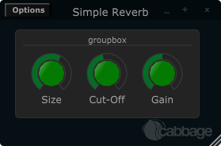

10 B. CABBAGE
=============

Cabbage is a software for prototyping and developing audio instruments with the Csound audio synthesis language. Instrument development and prototyping is carried out with the main Cabbage IDE. Users write and compile Csound code in a code editor. If one wishes, they can also create a graphical frontend, although this is not essential. Any Csound file can be run with Cabbage, regardless of whether or not it has a graphical interface. Cabbage is designed for realtime processing in mind. While it is possible to use Cabbage to run Csound in the more traditional score-driven way, but your success may vary.

Cabbage is a 'host' application. It treats each and every Csound instruments as a unique native plugin, which gets added to a digital audio graph (DAG) once it is compiled. The graph can be opened and edited at any point during a performance. If one wishes to use one of their Csound instruments in another audio plugin host, such as Reaper, Live, Bitwig, Ardour, QTractor, etc, they can export the instrument through the 'Export instrument' option.

Download and Install
--------------------

Cabbage is hosted on GitHub, and **pre-compiled binaries** for **Windows** and **OSX** can be found on the [release](https://github.com/cabbageaudio/cabbage/releases) section of Cabbage's home page. If you run **Linux** you will need to build Cabbage yourself, but instructions are included with the source code. The main platform installers for Cabbage inclue an option of installing the latest version of Csound. If you already have a version of Csound installed, you can skip this step.
Note that you will **need to have Csound installed** one way or another in order to run Cabbage.

Using Cabbage
-------------

Instrument development and prototyping is carried out with the main Cabbage IDE. Users write and compile their Csound code in a code editor. Each Csound file opened with have a corresponding editor. If one wishes one can also create a graphical frontend, although this is no longer a requirement for Cabbage. Any Csound file can be run with Cabbage, regardless of whether or not it has a graphical interface. Each Csound files that is compiled by Cabbage will be added to an underlying digital audio graph. Through this graph users can manage and configure instrument to create patches of complex processing chains.

### Opening files
User can open any .csd files by clicking on the Open File menu command, or toolbar button. Users can also browse the Examples menu from the main File menu. Cabbage ships with over 100 high-end instruments that can be modified, hacked, and adapted in any way you wish. Note that if you wish to modify the examples, use the Save-as option first. Although this is only required on Windows, it's a good habit to form. You don't want to constantly overwrite the examples with your own code.
Cabbage can load and perform non-Cabbage score-driven .csd files. However, it also uses its own audio IO, so it will overwrite any -odac options set in the CsOptions section of a .csd file.

### Creating a new file
News files can be created by clicking the New file button in the toolbar, or by clicking File->New Csound file from the main menu. When a new file is requested, Cabbage will give you the choice of 3 basic templates, as shown below.

The choices are:

* A new synth. When this option is selected Cabbage will generate a simple synthesiser with an ADSR envelope and MIDI keyboard widget. In the world of VST, these instruments are referred to a VSTi's.
* A new effect. When this option is selected Cabbage will create a simple audio effect. It will generate a simple Csound instrument that provides access to an incoming audio stream. It also generates code that will control the gain of the output.
* A new Csound file. This will generate a basic Csound file without any graphical frontend.

Note that these templates are provided for quickly creating new instruments. One can modify any of the template code to convert it from a synth to an effect or vice versa.

### Building/exporting instruments

To run an instrument users can use the controls at the top of the file's editor. Alternatively one can go to the 'Tools' menu and hit 'Build Instrument'. If you wish to export a plugin go to 'Export' and choose the type of plugin you wish to export. To use the plugin in a host, you will need to let the host know where your plugin file is located. On Windows and Linux, the corresponding .csd should be located in the same directory as the plugin dll. The situation is different on MacOS as the .csd file is automatically packaged into the plugin bundle.

Closing a file will not stop it from performing. To stop a file from performing you must hit the Stop button.

### Creating GUI interfaces for instruments

To create a GUI for your instrument you must enter edit mode for that instrument. You can do this by hitting the Edit mode button at the top of the file's editor, or by hitting Ctrl+e when the editor for that instrument have focus. Once in edit mode, each widget will have a thin white border around it. you can move widgets around whilst in edit. You can also right-click and insert new widgets, as well as modify their appearance using the GUI properties editor on the right-hand side of the screen.

You will notice that when you select a widget whilst in edit mode, Cabbage will highlight the corresponding line of text in your source code. When updating GUI properties, hit 'Enter' when you are editing single line text or numeric properties, 'Tab' when you are editing multi-line text properties, and 'Escape' when you are editing colours.

### Editing the audio graph
Each and every instrument that you compile in Cabbage will be added to an underlying audio graph. This is true for both Cabbage files, and traditional Csound files. To edit the graph one can launch the Cabbage patcher from the view menu.

Instruments can also be added directly through the graph by right-clicking and adding them from the context menu. The context menu will show all the examples files, along with a selection of files from a user-defined folder. See the section below on *Settings* to learn how to set this folder.

Instruments can also be deleted by right-clicking the instrument node. Users can delete/modify connections by clicking on the connections themselves. They can also connect node by clicking and dragging from an output to an input.

Once an instrument node has been added, Cabbage will automatically open the corresponding code. Each time you update the corresponding source code, the node will also be updated.

As mentioned above, closing a file will not stop it from performing. It is possible to have many instruments running even though their code is not showing. To stop an instrument you must hit the Stop button at the top of its editor, or delete the plugin from the graph.

### Navigating large source files
It can become quite tricky to navigate very long text files. For this reason Cabbage provides a means of quickly jumping to instrument definitions. It is also possible to create a special `;- Region:` tag. Any text that appears after this tag will be appended to the drop-down combo box in the Cabbage tool bar.

### Using the code repository
Cabbage provides a quick way of saving and recalling blocks of code. To save code to the repository simple select the code you want, right-click and hit *Add to code repository*. To insert code later from the repository, right-click the place you wish to insert the code and hit *Add from code repository*.

Code can be modified, edited or deleted at a later stage in the Settings dialogue.

Settings
--------

The settings dialogue can be opened by going to the Edit->Setting menu command, or pressing the Settings cog in the main toolbar.

### Audio and MIDI settings
These settings are used to choose your audio/MIDI input/output devices. You can also select the sampling rate and audio buffer sizes. Small buffer sizes will reduce latency but might cause some clicks in the audio. Note te buffer sizes selected here are only relevant when using the Cabbage IDE. Plugins will have their buffer sizes set by the host. The last known audio and MIDI settings will automatically be saved and recalled for the next session.

### Editor
The following settings provide control for various aspects of Cabbage and how it runs its instruments.

- Auto-load: Enabling this will cause Cabbage to automatically load the last files that were open.
- Plugin Window: Enable this checkbox to ensure that the plugin window is always on top and does not disappear behind the main editor when it loses focus.
- Graph Window: Same as above only for the Cabbage patcher window.
- Auto-complete: provides a rough auto-complete of variable names
Editor lines to scroll with MouseWheel: Sets the number of lines to jump on each movement of the mouse wheel.

### Directories
These directory fields are given default directories that rarely, if ever, need to be changed.

- Csound manual directory: Sets the path to index.html in the Csound help manual. The default directories will be the standard location of the Csound help manual after installing Csound.
- Cabbage manual directory: Sets the path to index.html in the Cabbage help manual.
- Cabbage examples directory: Set the path to the Cabbage examples folder. This should never need to be modified.
- User files directory: Sets the path to a folder containing user files that can be inserted by right-clicking in the patcher. Only files stored in this, and the examples path will be accessible in the Cabbage patcher context menu.

### Colours
- Interface: Allows user to set custom colours for various elements of the main graphical interface
- Editor: Allows users to modify the syntax highlighting in the Csound editor
- Console: Allows users to changes various colours in the Csound output console.

### Code Repository
This tab shows the various blocks of code that have been saved to the repository. You can edit or delete any of the code blocks. Hit Save/Update to update any changes.

First Synth
-----------

As mentioned in the previous section, each Cabbage instrument is defined in a simple text file with a .csd extension. The syntax used to create GUI widgets is quite straightforward and should be provided within special xml-style tags `<Cabbage>` and `</Cabbage>` which can appear either above or below Csound's own `<CsoundSynthesizer>` tags. Each line of Cabbage specific code relates to one GUI widget only. The attributes of each widget are set using different identifiers such as colour(), channel(), size() etc. Where identifiers are not used, Cabbage will use the default values. Long lines can be broken up with a `\` placed at the end of a line.

Each and every Cabbage widget has 4 common parameters: position on screen(x, y) and size(width, height). Apart from position and size all other parameters are optional and if left out default values will be assigned. To set widget parameters you will need to use an appropriate identifier after the widget name. More information on the various widgets and identifiers available in Cabbage can be found in the Widget reference section of these docs.

### Getting started

Now that the basics of the Csound language have been outlined, let's create a simple instrument. The opcodes used in this simple walk through are `vco2`, `madsr`, `moogladder` and `outs`.

The vco2 opcode models a voltage controlled oscillator. It provides users with an effective way of generating band-limited waveforms and can be the building blocks of many a synthesiser. Its syntax, taken from the Csound [reference](https://csound.github.io/docs/manual/vco2.html) manual, is given below. It is important to become au fait with the way opcodes are presented in the Csound reference manual. It, along with the the Cabbage widget reference are two documents that you will end up referencing time and time again as you start developing Cabbage instruments.

~~~csound
ares vco2 kamp, kcps [, imode] [, kpw] [, kphs] [, inyx]
~~~

`vco2` outputs an a-rate signal and accepts several different input argument. The types of input parameters are given by the first letter in their names. We see above that the kamp argument needs to be k-rate. Square brackets around an input argument means that argument is optional and can be left out. Although not seen above, whenever an input argument start with *x*, it can be an *i*, *k* or *a*-rate variable.

*kamp* determines the amplitude of the signal, while *kcps* set the frequency of the signal. The default type of waveform created by a `vco2` is a sawtooth waveform. The simplest instrument that can be written to use a `vco2` is given below. The `out` opcode is used to output an a-rate signal as audio.

~~~csound
instr 1
 aOut vco2 1, 440
 out aOut
endin
~~~

In the traditional Csound context, we would start this instrument using a *score statement*. We'll learn about score statements later, but because we are building a synthesiser that will be played with a MIDI keyboard, our score section will not be very complex. In fact, it will only contain one line of code. *f0 z* is a special score statement that instructs Csound to listen for events for an extremely long time. Below is the entire source code, including a simple Cabbage section for the instrument presented above.

~~~csound
<Cabbage>
form caption("Untitled") size(400, 300), \
  colour(58, 110, 182), \
  pluginID("def1")
keyboard bounds(8, 158, 381, 95)
</Cabbage>
<CsoundSynthesizer>
<CsOptions>
-+rtmidi=NULL -M0 -m0d --midi-key-cps=4 --midi-velocity-amp=5
</CsOptions>
<CsInstruments>
; Initialize the global variables.
sr = 44100
ksmps = 32
nchnls = 2
0dbfs = 1

;instrument will be triggered by keyboard widget
instr 1
 iFreq = p4
 iAmp = p5
 aOut vco2 iAmp, iFreq
 outs aOut, aOut
endin

</CsInstruments>
<CsScore>
;causes Csound to run for about 7000 years...
f0 z
</CsScore>
</CsoundSynthesizer>
~~~

You'll notice that the pitch and frequency for the `vco2` opcode has been replaced with two *i*-rate variables, *iFreq* and *iAmp*, who in turn get their value from *p5*, and *p4*. *p5* and *p4* are p-variables. Their values will be assigned based on incoming MIDI data. If you look at the code in the <CsOptions> section you'll see the text '--midi-key-cps=4 --midi-velocity-amp=5'. This instructs Csound to pass the current note's velocity to *p5*, and the current note's frequency, in cycle per second(Hz.) to *p4*. *p4* and *p5* were chosen arbitrarily. *p7*, *p8*, *p*-whatever could have been used, so long as we accessed those same *p* variables in our instrument.

Another important piece of text from the <CsOptions> section is the '*-M0*'. This tells Csound to send MIDI data to our instruments. Whenever a note is pressed using the on-screen MIDI keyboard, or a hardware keyboard if one is connected, it will trigger instrument 1 to play. Not only will it trigger instrument one to play, it will also pass the current note's amplitude and frequency to our two *p* variables.

### Don't be a click head!

If you've tried out the instrument above you'll notice the notes will click each time they sound. To avoid this, an amplitude envelope should be applied to the output signal. The most common envelope is the ubiquitous ADSR envelope. ADSR stands for Attack, Decay, Sustain and Release. The attack, decay and sustain sections are given in seconds as they relate to time values. The sustain value describes the sustain level which kicks in after the attack and decay times have passed. The note's amplitude will rest at this sustain level until it is released.

Csound offers several ADSR envelopes. The simplest one to use, and the one that will work out of the box with MIDI based instruments is `madsr` Its syntax, as listed in the Csound [reference](https://csound.github.io/docs/manual/madsr.html) manual, is given as:

~~~csound
kres madsr iatt, idec, islev, irel
~~~

Note that the inputs to madsr are *i*-rate. They cannot change over the duration of a note. There are several places in the instrument code where the output of this opcode can be used. It could be applied directly to the first input argument of the vco2 opcode, or it can be placed in the line with the out opcode. Both are valid approaches.

~~~csound
<Cabbage>
form caption("Untitled") size(400, 300), \
  colour(58, 110, 182), \
  pluginID("def1")
keyboard bounds(8, 158, 381, 95)
</Cabbage>
<CsoundSynthesizer>
<CsOptions>
-n -d -+rtmidi=NULL -M0 -m0d --midi-key-cps=4 --midi-velocity-amp=5
</CsOptions>
<CsInstruments>
; Initialize the global variables.
sr = 44100
ksmps = 32
nchnls = 2
0dbfs = 1

;instrument will be triggered by keyboard widget
instr 1
 iFreq = p4
 iAmp = p5
 iAtt = 0.1
 iDec = 0.4
 iSus = 0.6
 iRel = 0.7
 kEnv madsr iAtt, iDec, iSus, iRel
 aOut vco2 iAmp, iFreq
 outs aOut*kEnv, aOut*kEnv
endin

</CsInstruments>
<CsScore>
;causes Csound to run for about 7000 years...
f0 z
</CsScore>
</CsoundSynthesizer>
~~~

### Controlling ADSR parameters.

The values of the ADSR parameters can be set using widgets. A typical widget for such control is a slider of some sort. They all behave in more or less the same way. Their job is to send numbers to Csound on a fixed channel. Each widget that is capable of controlling some aspect of an instrument must have a channel set using the `channel()` identifier. In the following code 4 rsliders are created. Each one has a unique `channel()` set, and they all have the same range. More details on sliders can be found in the widget reference section.

~~~csound
<Cabbage>
form caption("Simple Synth") \
  size(450, 260), \
  colour(58, 110, 182), \
  pluginID("def1")
keyboard bounds(14, 120, 413, 95)
rslider bounds(12, 14, 105, 101), \
  channel("att"), range(0, 1, 0.01, 1, .01), \
  text("Attack")
rslider bounds(114, 14, 105, 101), channel("dec"), \
  range(0, 1, 0.5, 1, .01), text("Decay")
rslider bounds(218, 14, 105, 101), channel("sus"), \
  range(0, 1, 0.5, 1, .01), text("Sustain")
rslider bounds(322, 14, 105, 101), channel("rel"), \
  range(0, 1, 0.7, 1, .01), text("Release")
</Cabbage>
~~~

It can't be stated enough that each widget responsible for controlling an aspect of your instrument MUST have a channel set using the `channel()` identifier. Why? Because Csound can access these channels using its `chnget` opcode. The syntax for `chnget` is very simple:

~~~csound
kRes chnget "channel"
~~~

The `chnget` opcode will create a variable that will contain the current value of the named channel. The rate at which the `chnget` opcode will operate at is determined by the first letter of its output variable. The simple instrument shown in the complete example above can now be modified so that it accesses the values of each of the sliders.

~~~csound
instr 1
 iFreq = p4
 iAmp = p5
 iAtt chnget "att"
 iDec chnget "dec"
 iSus chnget "sus"
 iRel chnget "rel"
 kEnv madsr iAtt, iDec, iSus, iRel
 aOut vco2 iAmp, iFreq
 outs aOut*kEnv, aOut*kEnv
endin
~~~

Every time a user plays a note, the instrument will grab the current value of each slider and use that value to set its ADSR envelop. Note that the `chnget` opcodes listed above all operate at i-time only. This is important because the `madsr` opcode expects *i*-rate variable.

### Low-pass me the Cabbage please...

ADSR envelopes are often used to control the cut-off frequency of low-pass filters. Low-pass filters block high frequency components of a sound, while letting lower frequencies pass. A popular low-pass filter found in Csound is the moogladder filter which is modeled on the famous filters found in Moog synthesisers. Its syntax, as listed in the Csound [reference](https://csound.github.io/docs/manual/moogladder.html) manual is given as:

~~~csound
asig moogladder ain, kcf, kres
~~~

Its first input argument is an a-rate variable. The next two arguments set the filter cut-off frequency and the amount of resonance to be added to the signal. Both of these can be k-rate variables, thus allowing them to be changed during the note. Cut-off and resonance controls can easily be added to our instrument. To do so we need to add two more sliders to our Cabbage section of code. We'll also need to add two more `chnget` opcodes and a `moogladder` to our Csound code. One thing to note about the cut-off slider is that it should be exponential. As the users increases the slider, it should increment in larger and larger steps. We can do this be setting the sliders *skew* value to .5. More details about this can be found in the slider widget reference page.

~~~csound
<Cabbage>
form caption("Simple Synth") size(450, 220), \
  colour(58, 110, 182), \
  pluginID("def1")
keyboard bounds(14, 88, 413, 95)
rslider bounds(12, 14, 70, 70), \
  channel("att"), \
  range(0, 1, 0.01, 1, .01), \
  text("Attack")
rslider bounds(82, 14, 70, 70), \
  channel("dec"), \
  range(0, 1, 0.5, 1, .01), \
  text("Decay")
rslider bounds(152, 14, 70, 70), \
  channel("sus"), \
  range(0, 1, 0.5, 1, .01), \
  text("Sustain")
rslider bounds(222, 14, 70, 70), \
  channel("rel"), \
  range(0, 1, 0.7, 1, .01), \
  text("Release")
rslider bounds(292, 14, 70, 70), \
  channel("cutoff"), \
  range(0, 22000, 2000, .5, .01), \
  text("Cut-Off")
rslider bounds(360, 14, 70, 70), \
  channel("res"), range(0, 1, 0.7, 1, .01), \
  text("Resonance")
</Cabbage>
<CsoundSynthesizer>
<CsOptions>
-n -d -+rtmidi=NULL -M0 -m0d --midi-key-cps=4 --midi-velocity-amp=5
</CsOptions>
<CsInstruments>
; Initialize the global variables.
sr = 44100
ksmps = 32
nchnls = 2
0dbfs = 1

;instrument will be triggered by keyboard widget
instr 1
 iFreq = p4
 iAmp = p5

 iAtt chnget "att"
 iDec chnget "dec"
 iSus chnget "sus"
 iRel chnget "rel"
 kRes chnget "res"
 kCutOff chnget "cutoff"

 kEnv madsr iAtt, iDec, iSus, iRel
 aOut vco2 iAmp, iFreq
 aLP moogladder aOut, kCutOff, kRes
 outs aLP*kEnv, aLP*kEnv
endin

</CsInstruments>
<CsScore>
;causes Csound to run for about 7000 years...
f0 z
</CsScore>
</CsoundSynthesizer>
~~~

### Sightings of LFOs!

Many synths use some kind of automation to control filter parameters. Sometimes an ADSR is used to control the cut-off frequency of a filter, and in other cases low frequency oscillators, or LFOs are used. As we have already seen how ADSRs work, let's look at implementing an LFO to control the filters cut-off frequency. Csound comes with a standard LFO opcode that provides several different type of waveforms to use. Its syntax, as listed in the Csound [reference](https://csound.github.io/docs/manual/lfo.html) manual is given as:

~~~csound
kres lfo kamp, kcps [, itype]
~~~

Type can be one of the following:

- itype = 0  sine
- itype = 1  triangles
- itype = 2  square (bipolar)
- itype = 3  square (unipolar)
- itype = 4  saw-tooth
- itype = 5  saw-tooth(down)

In our example we will use a downward moving saw-tooth wave form. A basic implementation would look like this.

~~~csound
(...)
kEnv madsr iAtt, iDec, iSus, iRel
aOut vco2 iAmp, iFreq
kLFO lfo 1, 1, 5
aLP moogladder aOut, kLFO*kCutOff, kRes
outs aLP*kEnv, aLP*kEnv
endin
(...)
~~~

The output of the LFO is multiplied by the value of *kCutOff*. The frequency of the LFO is set to 1 which means the cut-off frequency will move from *kCutOff* to 0, once every second. This will create a simple rhythmical effect. Of course it doesn't make much sense to have the frequency fixed at 1. Instead, it is better to give the user control over the frequency using another slider. Finally, an amplitude control slider will also be added, allowing users to control the over amplitude of their synth.

There are many further improvements that could be made to the simple instrument. For example, a second `vco2` could be added to create a detune effect which will add some depth to the synth's sound. One could also an ADSR to control the filter envelope, allowing the user an option to switch between modes. If you do end up with something special why not share it on the Cabbage recipes forum!

~~~csound
<Cabbage>
form caption("Simple Synth") size(310, 310), \
  colour(58, 110, 182), \
  pluginID("def1")
keyboard bounds(12, 164, 281, 95)
rslider bounds(12, 14, 70, 70), \
  channel("att"), \
  range(0, 1, 0.01, 1, .01), \
  text("Attack")
rslider bounds(82, 14, 70, 70), \
  channel("dec"), \
  range(0, 1, 0.5, 1, .01), \
  text("Decay")
rslider bounds(152, 14, 70, 70), \
  channel("sus"), \
  range(0, 1, 0.5, 1, .01), \
  text("Sustain")
rslider bounds(222, 14, 70, 70), \
  channel("rel"), \
  range(0, 1, 0.7, 1, .01), \
  text("Release")
rslider bounds(12, 84, 70, 70), \
  channel("cutoff"), \
  range(0, 22000, 2000, .5, .01), \
  text("Cut-Off")
rslider bounds(82, 84, 70, 70), \
  channel("res"), \
  range(0, 1, 0.7, 1, .01), \
  text("Resonance")
rslider bounds(152, 84, 70, 70), \
  channel("LFOFreq"), \
  range(0, 10, 0, 1, .01), \
  text("LFO Freq")
rslider bounds(222, 84, 70, 70), \
  channel("amp"), \
  range(0, 1, 0.7, 1, .01), \
  text("Amp")
</Cabbage>
<CsoundSynthesizer>
<CsOptions>
-n -d -+rtmidi=NULL -M0 -m0d --midi-key-cps=4 --midi-velocity-amp=5
</CsOptions>
<CsInstruments>
; Initialize the global variables.
sr = 44100
ksmps = 32
nchnls = 2
0dbfs = 1

;instrument will be triggered by keyboard widget
instr 1
 iFreq = p4
 iAmp = p5

 iAtt chnget "att"
 iDec chnget "dec"
 iSus chnget "sus"
 iRel chnget "rel"
 kRes chnget "res"
 kCutOff chnget "cutoff"
 kLFOFreq chnget "LFOFreq"
 kAmp chnget "amp"

 kEnv madsr iAtt, iDec, iSus, iRel
 aOut vco2 iAmp, iFreq
 kLFO lfo 1, kLFOFreq
 aLP moogladder aOut, kLFO*kCutOff, kRes
 outs kAmp*(aLP*kEnv), kAmp*(aLP*kEnv)
endin

</CsInstruments>
<CsScore>
;causes Csound to run for about 7000 years...
f0 z
</CsScore>
</CsoundSynthesizer>
~~~

A basic Cabbage effect
----------------------

Cabbage effects are used to process incoming audio. To do this we make use of the signal input opcodes. One can use either `ins` or `inch`. To create a new effect click the new file button and select audio effect.

After you have named the new effect Cabage will generate a very simple instrument that takes an incoming stream of audio and outputs directly, without any modification or further processing. In order to do some processing we can add some Csound code the instrument. The code presented below is for a simple reverb unit. We assign the incoming sample data to two variables, i.e., aInL and aInR. We then process the incoming signal through the reverbsc opcode. Some GUI widgets have also been added to provide users with access to various parameter. See the previous section on creating your first synth if you are not sure about how to add GUI widgets.

### Example

~~~csound
<Cabbage>
form size(280, 160), \
  caption("Simple Reverb"), \
  pluginID("plu1")
groupbox bounds(20, 12, 233, 112), text("groupbox")
rslider bounds(32, 40, 68, 70), \
  channel("size"), \
  range(0, 1, .2, 1, 0.001), \
  text("Size"), \
  colour(2, 132, 0, 255),
rslider bounds(102, 40, 68, 70), \
  channel("fco"), \
  range(1, 22000, 10000, 1, 0.001), \
  text("Cut-Off"), \
  colour(2, 132, 0, 255),
rslider bounds(172, 40, 68, 70), \
  channel("gain"), \
  range(0, 1, .5, 1, 0.001), \
  text("Gain"), \
  colour(2, 132, 0, 255),
</Cabbage>
<CsoundSynthesizer>
<CsOptions>
-n -d
</CsOptions>
<CsInstruments>
sr = 44100
ksmps = 64
nchnls = 2
0dbfs=1

instr 1
 kFdBack chnget "size"
 kFco chnget "fco"
 kGain chnget "gain"
 aInL inch 1
 aInR inch 2
 aOutL, aOutR reverbsc aInL, aInR, kFdBack, kFco
 outs aOutL*kGain, aOutR*kGain
endin

</CsInstruments>
<CsScore>
f1 0 1024 10 1
i1 0 z
</CsScore>
</CsoundSynthesizer>
~~~

The above instrument uses 3 rsliders to control the reverb size(feedback level), the cut-off frequency, and overall gain. The range() identifier is used with each slider to specify the min, max and starting value of the sliders.

If you compare the two score sections in the synth and effect instruments, you'll notice that the synth instrument doesn't use any i-statement. Instead it uses an `f0 z`. This tells Csound to wait for incoming events until the user kills it. Because the instrument is to be controlled via MIDI we don't need to use an i-statement in the score. In the second example we use an i-statement with a long duration so that the instrument runs without stopping for a long time.

### Learning More

To learn more about Cabbage, please visit the [Cabbage website](https://cabbageaudio.com). There you will find links to more tutorials, video links, and the user forum.
