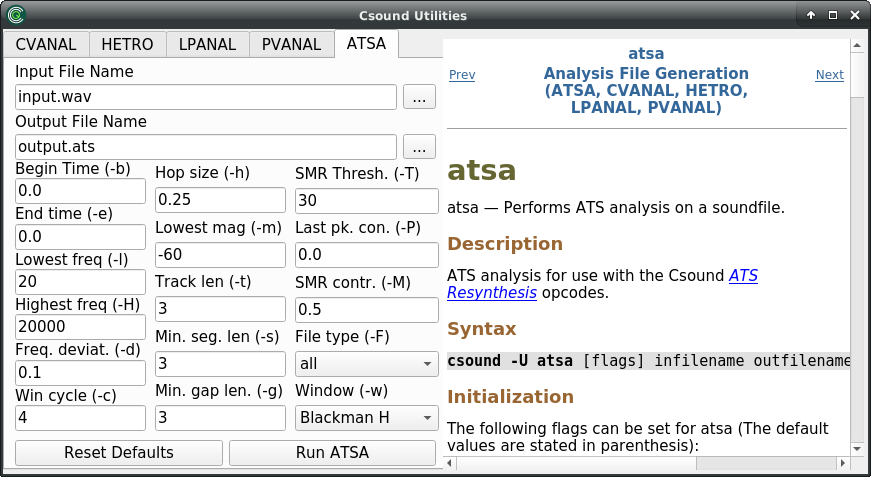

11 A. ANALYSIS
==============

Csound comes bundled with a variety of additional utility applications.
These are small programs that perform a single function, very often with
a sound file, that might be useful just before or just after working
with the main Csound program. Originally these were programs that were
run from the command line but many of Csound front-ends now offer direct
access to many of these utilities through their own utilities menus. It
is useful to still have access to these programs via the command line
though, if all else fails.

The standard syntax for using these programs from the command line is to
type the name of the utility followed optionally by one or more command
line flags which control various performance options of the program —
all of these will have useable defaults anyway — and finally the name of
the sound file upon which the utility will operate.

    utility_name [flag(s)] [file_name(s)]

If we require some help or information about a utility and don't want
to be bothered hunting through the Csound Manual we can just type the
the utility's name with no additional arguments, hit enter and the
commmand line response will give us some information about that utility
and what command line flags it offers. We can also run the utility
through Csound — perhaps useful if there are problems running the
utility directly — by calling Csound with the *-U* flag. The *-U* flag will
instruct Csound to run the utility and to interpret subsequent flags as
those of the utility and not its own.

    Csound -U utility_name [flag(s)] [file_name(s)]

Analysis Utilities
------------------

Although many of Csound's opcodes already operate upon commonly
encountered sound file formats such as *wav* and *aiff*, a number of
them require sound information in more specialised and pre-analysed
formats, and for this Csound provides the sound analysis utilities
[atsa](https://csound.com/docs/manual/UtilityAtsa.html),
[cvanal](https://csound.com/docs/manual/cvanal.html),
[hetro](https://csound.com/docs/manual/hetro.html),
[lpanal](https://csound.com/docs/manual/lpanal.html) and
[pvanal](https://csound.com/docs/manual/pvanal.html).

We will explain in the following paragraphs the background and usage of these five different sound analysis utilities. 

### atsa

Chapter [05 K](05-k-ats-resynthesis.md) gives some background about the *Analysis-Transformation-Synthesis* (ATS) method of spectral resynthesis. It requires the preceding analysis of a sound file. This is the job of the *atsa* utility.

The basic usage is simple:

    atsa [flags] infilename outfilename

where *infilename* is the sound file to be analyzed, and *outfilename* is the *.ats* file which is written as result of the *atsa* utility.

It can be said that the default values of the various *flags* are reasonable for a first usage. For a refinement of the analysis the [atsa manual page](https://csound.com/docs/manual/UtilityAtsa.html) provides all necessary information.

### cvanal

The *cvanal* utility analyses an impulse response for usage in the old [concolve](https://csound.com/docs/manual/convolve.html) opcode. Nowadays, convolution in Csound is mostly done with other opcodes which are described in the [Convolution](05-h-convolution.md) chapter of this book. More information about the *cvanal* utility can be found [here](https://csound.com/docs/manual/cvanal.html) in the Csound Manual.

### hetro

The hetrodyne filter analysis can be understood as simplified and adjustable Fourier Transform. Although this utility is originally designed for the usage in the [adsyn](https://csound.com/docs/manual/adsyn.html) opcode, it can be used to get data from any harmonic sound for additive synthesis. 

The usage of *hetro* follows the utility standard:

    hetro [flags] infilename outfilename

But the adjustment of some *flags* is crucial here depending on the desired usage of the analysis:

- **-f** *begfreq*: This is the estimated frequency of the fundamental. The default is 100 Hz, but it should be adjusted as good as possible to the real fundamental frequency as good as possible.  
- **-h** *partials*: This is the number of partials the utility will analyze and write in the output file. The default number of 10 is quite low and will usually result in a dull sound in the resynthesis.  
- **-n** *brkpts*: This is the number of breakpoints for the analysis. These breakpoints are initially evenly spread over the duration, and then reduced and adjusted by the algorithm. The default number of 256 is reasonable for most usage, but can be massively reduced for some sounds and usages.  
- **-m** *minamp*: The *hetro* utility uses the old Csound amplitude convention where 0 dB is set to 32767. This has to be considered here, where a minimal amplitude is set below which a partial is considered dormant. So the default 64 means -54 dB; other common values are 128 (-48 dB), 32 (-60 dB) or 0 (no thresholding).
 

### lpanal

### pvanal

This time as well as requiring an input sound file for analysis we will
need to provide a name (and optionally the full address) for the output
file. Using *pvanal's* command flags we can have full control over
typical FFT conversion parameters such as FFT size, overlap, window type
etc. as well as additional options that may prove useful such as the
ability to select a fragment of a larger sound file for the analysis. In
the following illustration we shall make use of just one flag, -s, for
selecting which channel of the input sound file to analyse, all other
flag values shall assume their default values which should work fine in
most situations.

     pvanal -s1 mysound.wav myanalysis.pvx

*pvanal* will analyse the first (left if stereo) channel of the input sound file *mysound.wav* (and in this case as no full address has been provided
it will need to be in either the current working directory or
[SSDIR](https://csound.com/docs/manual/CommandEnvironment.html)),
and a name has been provided for the output file *myanalysis.pvx*,
which, as no full address has been given, will be placed in the current
working directory. While *pvanal* is running it will print a running momentary and finally inform us once the process is complete.

If you use CsoundQt you can have direct access to *pvanal* with all its
options through the *utilities* button in the toolbar. Once opened it
will reveal a dialogue window looking something like this:

Especially helpful is the fact that we are also automatically provided
with *pvanal*'s manual page.
